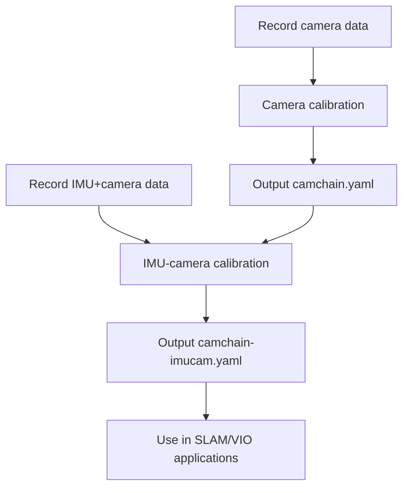

# Kalibr ROS2

**ROS2 Humble port of the Kalibr calibration toolbox - MIGRATION COMPLETE!**

---

## Project Status

**Current Status**: **All 34 packages successfully built and installed!**

### Completed Features (100%)
- All 34 C++ packages migrated and compiled
- All 7 Python binding packages (Boost.Python) working
- ROS2 bag reader adaptation (rosbag2_py)
- Main application (kalibr_imu_camera) ready
- Launch files and configuration examples
- Complete 10-layer dependency architecture preserved
- Build scripts and documentation
- **Single and multi-camera calibration**
- **Single and multi-IMU calibration**
- **Temporal calibration**

### Migration Statistics
- **Total Packages**: 34
- **Compilation Success**: 100%
- **Build Time**: ~10 seconds
- **Lines of Code**: 100k+ C++/Python

---

## Quick Start

### 1. Install Dependencies

#### System Dependencies
```bash
sudo apt install -y \
  libeigen3-dev \
  libboost-all-dev \
  libopencv-dev \
  libsuitesparse-dev \
  libtbb-dev \
  python3-numpy \
  python3-matplotlib \
  python3-scipy \
  python3-opencv
```

#### Python Dependencies
```bash
pip install python-igraph
```

### 2. Build Workspace

```bash
cd kalibr_ros2

# Build all packages in correct order
./build_workspace.sh

# Or build specific layer only
./build_workspace.sh --layer 1

# Or build from specific layer to end
./build_workspace.sh --from-layer 5

# If a package is not found, source and re-execute
source install/setup.bash
./build_workspace.sh

# Source the workspace
source install/setup.bash
```


---

## Features

### Camera Calibration
- Single camera intrinsic calibration
- Multi-camera system intrinsic and extrinsic calibration
- 7 camera models:
  - `pinhole-radtan` - Pinhole + radial-tangential distortion
  - `pinhole-equi` - Pinhole + equidistant (fisheye)
  - `pinhole-fov` - Pinhole + FOV distortion
  - `omni-none` - Omnidirectional camera
  - `omni-radtan` - Omni + radial-tangential
  - `eucm-none` - Extended unified camera model
  - `ds-none` - Double sphere model

### IMU-Camera Calibration
- Single IMU-camera calibration
- **Multi-IMU camera calibration**
- Spatial calibration (extrinsics)
- Temporal calibration (time offset)
- Inter-IMU time delay estimation
- 3 IMU models:
  - `calibrated` - Use manufacturer calibrated parameters
  - `scale-misalignment` - Calibrate scale and misalignment
  - `scale-misalignment-size-effect` - Additionally calibrate size effect

### Calibration Target Types
- Aprilgrid (recommended)
- Checkerboard
- Circle grid

### Other Features
- B-spline based continuous-time trajectory
- Outlier filtering and robust estimation
- Detailed PDF report generation

---

## Usage Guide

### Camera Calibration

#### Single Camera
```bash
# Record data
ros2 bag record /cam0/image_raw -o camera_bag

# Run calibration
ros2 run kalibr_imu_camera kalibr_calibrate_cameras \
  --bag camera_bag \
  --topics /cam0/image_raw \
  --models pinhole-radtan \
  --target aprilgrid.yaml \
  --show-extraction

# Or use launch file
ros2 launch kalibr_imu_camera calibrate_cameras.launch.py \
  bagfile:=camera_bag \
  topics:='/cam0/image_raw' \
  models:='pinhole-radtan' \
  target_yaml:=aprilgrid.yaml
```

#### Multi-Camera System
```bash
# Record data
ros2 bag record /cam0/image_raw /cam1/image_raw -o camera_bag

# Run calibration
ros2 run kalibr_imu_camera kalibr_calibrate_cameras \
  --bag camera_bag \
  --topics /cam0/image_raw /cam1/image_raw \
  --models pinhole-radtan pinhole-radtan \
  --target aprilgrid.yaml \
  --show-extraction
```

### IMU-Camera Calibration

#### Single IMU
```bash
# Record data
ros2 bag record /cam0/image_raw /imu0/data -o imu_camera_bag

# Run calibration
ros2 run kalibr_imu_camera kalibr_calibrate_imu_camera \
  --bag imu_camera_bag \
  --cams camchain.yaml \
  --imu imu.yaml \
  --target aprilgrid.yaml \
  --show-extraction

# Or use launch file
ros2 launch kalibr_imu_camera calibrate_imu_camera.launch.py \
  bagfile:=imu_camera_bag \
  camchain:=camchain.yaml \
  imu:=imu.yaml \
  target_yaml:=aprilgrid.yaml
```

#### Multi-IMU Calibration
```bash
# Record data
ros2 bag record /cam0/image_raw /imu0/data /imu1/data -o multi_imu_bag

# Run calibration
ros2 run kalibr_imu_camera kalibr_calibrate_imu_camera \
  --bag multi_imu_bag \
  --cams camchain.yaml \
  --imu imu0.yaml imu1.yaml \
  --imu-models calibrated calibrated \
  --imu-delay-by-correlation \
  --target aprilgrid.yaml \
  --show-extraction

# Or use launch file
ros2 launch kalibr_imu_camera calibrate_multi_imu.launch.py \
  bagfile:=multi_imu_bag \
  camchain:=camchain.yaml \
  imu0:=imu0.yaml \
  imu1:=imu1.yaml \
  target_yaml:=aprilgrid.yaml
```

---

## Package Structure

```
kalibr_ros2/
├── src/
│   ├── Layer 1: Base utilities
│   │   ├── sm_common, sm_random, sm_logging
│   │   ├── python_module
│   │   ├── aslam_time
│   │   ├── numpy_eigen (numpy-Eigen conversion)
│   │   └── ethz_apriltag2 (AprilTag detection)
│   ├── Layer 2-9: Core libraries
│   │   ├── sm_* (Schweizer-Messer utilities)
│   │   ├── aslam_* (ASLAM vision and optimization)
│   │   ├── bsplines* (B-spline libraries)
│   │   └── incremental_calibration* (Incremental calibration)
│   └── Layer 10: Application
│       └── kalibr_imu_camera (Main calibration package)
│           ├── scripts/ (Executable scripts)
│           │   ├── kalibr_calibrate_cameras (Multi-camera)
│           │   └── test_multi_imu.sh (Test script)
│           ├── launch/ (Launch files)
│           │   ├── calibrate_cameras.launch.py
│           │   ├── calibrate_imu_camera.launch.py
│           │   └── calibrate_multi_imu.launch.py
│           ├── config/ (Configuration examples)
│           │   ├── imu0_example.yaml, imu1_example.yaml
│           │   ├── example_cameras.yaml
│           │   └── target_april_example.yaml
│           └── python/ (Python libraries)
│               ├── kalibr_camera_calibration/
│               ├── kalibr_imu_camera_calibration/
│               └── kalibr_common/
├── build_workspace.sh (Dependency-ordered build script)
├── build_order.txt (Complete dependency hierarchy)
└── test_installation.sh (Installation test)
```

---

## Configuration Examples

### Aprilgrid Target
```yaml
target_type: 'aprilgrid'
tagCols: 6      # Number of columns
tagRows: 6      # Number of rows
tagSize: 0.088  # Tag size [m]
tagSpacing: 0.3 # Tag spacing (fraction of tagSize)
```

### Checkerboard Target
```yaml
target_type: 'checkerboard'
targetCols: 8   # Number of internal corner columns
targetRows: 6   # Number of internal corner rows
rowSpacingMeters: 0.025  # Row spacing [m]
colSpacingMeters: 0.025  # Column spacing [m]
```

### IMU Configuration
```yaml
# Accelerometer
accelerometer_noise_density: 0.006   # [m/s^2/sqrt(Hz)]
accelerometer_random_walk: 0.0002    # [m/s^3/sqrt(Hz)]

# Gyroscope
gyroscope_noise_density: 0.0004      # [rad/s/sqrt(Hz)]
gyroscope_random_walk: 4.0e-06       # [rad/s^2/sqrt(Hz)]

# IMU update rate
update_rate: 200.0                   # [Hz]

# IMU ROS topic
rostopic: /imu0/data
```

See example configuration files in `src/kalibr_imu_camera/config/`.

---

## Detailed Documentation

- [README.md](src/kalibr_imu_camera/README.md) - Package overview
- [CAMERA_CALIBRATION.md](src/kalibr_imu_camera/CAMERA_CALIBRATION.md) - Camera calibration guide
- [MULTI_IMU_CALIBRATION.md](src/kalibr_imu_camera/MULTI_IMU_CALIBRATION.md) - Multi-IMU calibration guide

---

## Complete Calibration Workflow

### Method 1: Step-by-step



**Steps:**

1. **Camera Calibration**
   ```bash
   # Record
   ros2 bag record /cam0/image_raw /cam1/image_raw -o camera_bag
   
   # Calibrate
   ros2 run kalibr_imu_camera kalibr_calibrate_cameras \
     --bag camera_bag \
     --topics /cam0/image_raw /cam1/image_raw \
     --models pinhole-radtan pinhole-radtan \
     --target aprilgrid.yaml \
     --show-extraction
   
   # Obtain: camchain-TIMESTAMP.yaml
   ```

2. **IMU-Camera Calibration**
   ```bash
   # Record
   ros2 bag record /cam0/image_raw /imu0/data -o imu_camera_bag
   
   # Calibrate
   ros2 run kalibr_imu_camera kalibr_calibrate_imu_camera \
     --bag imu_camera_bag \
     --cams camchain-TIMESTAMP.yaml \
     --imu imu.yaml \
     --target aprilgrid.yaml \
     --show-extraction
   
   # Obtain: camchain-imucam.yaml, imu.yaml
   ```

3. **Multi-IMU Calibration (Optional)**
   ```bash
   # Record
   ros2 bag record /cam0/image_raw /imu0/data /imu1/data -o multi_imu_bag
   
   # Calibrate
   ros2 run kalibr_imu_camera kalibr_calibrate_imu_camera \
     --bag multi_imu_bag \
     --cams camchain-TIMESTAMP.yaml \
     --imu imu0.yaml imu1.yaml \
     --imu-models calibrated calibrated \
     --imu-delay-by-correlation \
     --target aprilgrid.yaml \
     --show-extraction
   ```

---

## Test Dataset

### Download Test Data
Test datasets can be downloaded from the [official Kalibr Wiki](https://github.com/ethz-asl/kalibr/wiki/downloads).

### Convert ROS1 bag to ROS2
```bash
# Install conversion tool
pip install rosbags

# Convert
rosbags-convert --src xxx.bag --dst dst_path
```

---

## Key Changes from ROS1 Kalibr

### ROS2 Adaptations
1. **Bag Format**: Migrated from `rosbag` (ROS1) to `rosbag2_py` (ROS2 SQLite3 format)

2. **Message API**: Updated timestamp access from `secs/nsecs` to `sec/nanosec`

3. **Message Types**: Adapted to ROS2 message type system using `rosidl_runtime_py`

4. **Build System**: Converted from catkin to ament_cmake/ament_cmake_python

5. **Python**: Python 3 only (removed Python 2 compatibility)

6. **numpy_eigen Module**: Fixed module export and installation path

### Removed Dependencies
- No ROS1 rosbag support
- Removed `mv_cameras/ImageSnappyMsg` support (uncommon in ROS2)

---

## Known Issues and Solutions

### 1. Multithreading Issue
**Problem**: numpy_eigen module may have issues in multithreaded environment

**Solution**: Use `--show-extraction` flag to disable multithreading

### 2. Build Dependency Issue
**Problem**: Due to complex inter-package dependencies, first build may fail to find some packages

**Solution**: 
```bash
source install/setup.bash
./build_workspace.sh
# Repeat until all packages build successfully
```

### 3. Calibration Target Detection Failure
**Problem**: Cannot detect calibration target

**Solution**:
- Ensure good lighting conditions
- Check target configuration file
- Use `--show-extraction` to view detection process
- Slow down motion to avoid blur

---

## Contributing

Contributions are welcome! Please submit Issues or Pull Requests.

---

## License

BSD License - See individual package LICENSE files.

---

## Authors

### Original Kalibr Authors:
- Paul Furgale
- Hannes Sommer
- Jérôme Maye
- Jörn Rehder
- Thomas Schneider
- Luc Oth

### ROS2 Port:
- January 2026

---

## References

For technical details about the calibration approach, see:

1. J. Rehder et al. (2016). "Extending kalibr: Calibrating the extrinsics of multiple IMUs"
2. P. Furgale et al. (2013). "Unified Temporal and Spatial Calibration for Multi-Sensor Systems"
3. P. Furgale et al. (2012). "Continuous-Time Batch Estimation Using Temporal Basis Functions"

---

## Related Links

- [Original Kalibr Project](https://github.com/ethz-asl/kalibr)
- [Kalibr Wiki](https://github.com/ethz-asl/kalibr/wiki)
- [Camera Models](https://github.com/ethz-asl/kalibr/wiki/supported-models)
- [Calibration Targets](https://github.com/ethz-asl/kalibr/wiki/calibration-targets)
- [Test Data Downloads](https://github.com/ethz-asl/kalibr/wiki/downloads)
