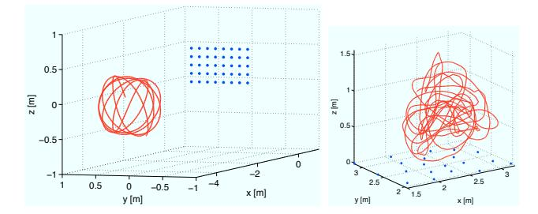
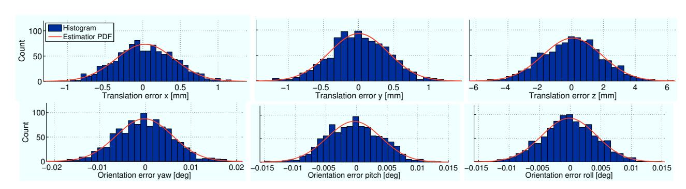
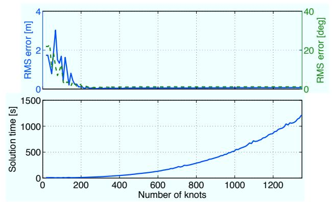

# Continuous-Time Batch Estimation using Temporal Basis Functions

Paul Furgale1 , Timothy D. Barfoot2 , and Gabe Sibley 3

*Abstract*— Roboticists often formulate estimation problems in discrete time for the practical reason of keeping the state size tractable. However, the discrete-time approach does not scale well for use with high-rate sensors, such as inertial measurement units or sweeping laser imaging sensors. The difficulty lies in the fact that a pose variable is typically included for every time at which a measurement is acquired, rendering the dimension of the state impractically large for large numbers of measurements. This issue is exacerbated for the simultaneous localization and mapping (SLAM) problem, which further augments the state to include landmark variables. To address this tractability issue, we propose to move the full maximum likelihood estimation (MLE) problem into continuous time and use temporal basis functions to keep the state size manageable. We present a full probabilistic derivation of the continuous-time estimation problem, derive an estimator based on the assumption that the densities and processes involved are Gaussian, and show how coefficients of a relatively small number of basis functions can form the state to be estimated, making the solution efficient. Our derivation is presented in steps of increasingly specific assumptions, opening the door to the development of other novel continuous-time estimation algorithms through the application of different assumptions at any point. We use the SLAM problem as our motivation throughout the paper, although the approach is not specific to this application. Results from a self-calibration experiment involving a camera and a high-rate inertial measurement unit are provided to validate the approach.

# I. INTRODUCTION

Recent decades have seen the probabilistic approach to robotics become the dominant paradigm, particularly for estimation problems [1]. However, in all but a few specialized cases, a discrete-time approach is taken. In particular, simultaneous localization and mapping (SLAM), a canonical mobile robotics problem [2], has been formulated in discrete time since its inception; from the early papers exploring the probabilistic fundamentals [3], [4] to recent survey and tutorial papers [2], [5], [6], SLAM is introduced in terms of a discrete sequence of robot poses. Although continuoustime estimation theory has existed for longer than SLAM [7], [8], researchers in robotics have generally avoided the use of continuous-time models; one notable exception is the amalgamation of a sequence of inertial measurements between two robot poses using continuous-time integration [9], [10]. While SLAM is a prevelant estimation problem in robotics, the tools derived in this paper generalize well beyond the SLAM problem. Still, we will use SLAM as the backdrop for the developments in this paper.

Roboticists typically use three common estimation tools [6]: (i) filtering1 , (ii) batch nonlinear optimization, and (iii) particle filtering methods. For many robot/sensor combinations, there is no drawback to using a discrete-time formulation for SLAM and any of the three paradigms are suitable. However, the existing solutions tend to be pushed to their limits under two problematic situations:

- 1) When a sensor is capturing data at a very high rate, such as an inertial measurement unit (IMU) [9], [11], [10], [12], and
- 2) When a ranging or imaging sensor is capturing continuously while a robot is in motion [13], [14].

The first situation—high-rate data capture—is quite naturally handled by filtering algorithms (at least from a computational-complexity perspective), as they only retain an estimate of the most recent robot pose in the state vector (following the Markov assumption). Particle filtering and batch methods break down in this situation for different reasons. Particle filters are well-suited for low-dimensional state vectors but become impractical for 6-degree-of-freedom pose estimation, or state vectors that include velocity, acceleration, or sensor biases [15]. On the other hand, batch optimization becomes intractable in the face of high-rate measurements because the error term associated with each measurement requires an estimate of the state at the measurement time; as the number of measurement times gets large, so does the number of state variables that the algorithm must estimate.

There are very few studies dealing with the second problematic situation. Bosse and Zlot [13] consider a continuously-spinning planar laser rangefinder and Ringaby and Forssen [14] consider a rolling-shutter camera. In both situations, the solutions are necessarily based on batch methods as a window of recent robot poses must be iteratively adjusted to correct the alignment of features extracted from the laser data [13] or images [14]. Furthermore, both papers use interpolation between poses to keep the size of the state vector tractable. The adjustment of several poses and the use of interpolation both preclude the use of filtering algorithms to solve these problems.

*Consequently, no single approach is able to handle both of the cases listed above.*

In recent years, there have been a number of capable SLAM algorithms developed that are based on batch estimation but are suitable for online use [16], [17], [18] in large, unstructured, three-dimensional environments. The flexibility of these algorithms to represent large maps, to delay loop-closing decisions, and to process loop closures in constant time, may be attributed to the underlying graph representation. Furthermore, Strasdat et al. [19] show that, when compared to filtering techniques, batch estimation provides greater accuracy per unit of computational effort, and avoids the accumulation of linearization errors by periodically relinearizing about the current estimate.

1ETH Zurich, ¨ Switzerland. 2University of Toronto, Canada, 3George Washington University, USA, paul.furgale@mavt.ethz.ch, tim.barfoot@utoronto.ca, gsibley@gwu.edu

1Here we are grouping extended Kalman filtering, unscented Kalman filtering, and information filtering.

To reconcile the interest in sensor fusion between visual and inertial sensors and to provide a theoretical framework on which to base new algorithms for mapping with continuouscapture imaging sensors, we seek an algorithm that exhibits the desirable characteristics of batch estimation, but is able to handle both problematic situations described above. We propose to do this by lifting the estimation framework into continuous time.

The contributions of this paper are as follows:

- 1) We introduce a novel continuous-time-state, discretetime-measurement batch estimation methodology.
- 2) We provide a derivation of the full SLAM problem in continuous time (CT-SLAM). To the best of our knowledge, this is the first presentation of this derviation.
- 3) We detail a realization of CT-SLAM using a weighted sum of known basis functions to represent the robot state.
- 4) We implement a CT-SLAM solution based on B-spline basis functions.
- 5) We evaluate the solution on a problem that has recently received a lot of attention: the calibration of a camera and an IMU [9], [10], [11], [12].

We have intentionally divided our derivation into steps representing increasingly specific assumptions—starting with the manipulation of the full posterior in Section III-A, assuming Gaussian densities/processes for the prior, measurement model, and continuous-time motion model in Section III-B, deriving the objective function for a maximum a posteriori estimator in Section III-C, describing a realization of this estimator in Section III-D by using a weighted sum of basis functions to represent the robot state, and finally outlining our use of the B-spline basis functions in Section III-E, which are then used within the experiments in Section IV.

Our hope is that, by dividing the derivation into steps, we encourage other researchers to devise novel solutions to the continuous-time, batch-estimation problem by making different assumptions at any point.

### II. RELATED WORK

Recent research has brought the approach of nonparametric estimation using Gaussian processes (GPs) [20] into robotics and computer vision. Although GPs are wellsuited to estimating continuous functions, they are most easily adapted for estimating distributions over outputs, such as sensor and process models [21]. Work addressing the more difficult problem of discovering a set of meaningful latent variables representing the robot poses is compelling [22] but preliminary and these techniques are only recently being applied to standard problems in robotics [23].

Most prior use of continuous functions to represent robot states is centered around the related idea of interpolation. Work in [24] presented a two-stage method of estimating a camera's trajectory with the help of an IMU by first estimating the orientation of the camera and then fitting a spline to the image and accelerometer data to recover the translation. This method was evaluated by [25] and found to be unsuitable for online applications. The difficult problem of estimating the trajectory of a spinning scanning laser rangefinder under continuous motion without using other sensors was addressed in [13]. The algorithm presented estimates a linearly interpolated trajectory by iteratively refining both the trajectory and the data associations. They impose a set of heuristic constraints to ensure the trajectory remains smooth—a heuristic version of the continuous-time motion model presented in Section III-B. A similar problem was addressed in [14], where they used interpolation between camera poses to correct the distortion of a sequence of images captured by a rolling shutter camera. They found that the accuracy of the distortion correction increased with the addition of extra poses. This agrees with the experimental results we present in Section IV-C.2.

The work that is most closely related to ours is that of Bibby et al. [26]. They derived a complete SLAM system capable of estimating the robot pose, building a map, and tracking dynamic obstacles in the scene. They used cubic splines to represent the trajectory of the robot and all dynamic obstacles. Unfortunately, they leave the derivation of SLAM in discrete time. However, this is an important paper as they highlight some of the key benefits to using basis functions as a state representation: (i) a smooth trajectory may be represented with fewer state variables than a discretetime formulation, and (ii) fusing information from sensors running at different rates becomes easy when the state representation is continuous.

Given this prior work, we believe that a clear derivation of the probabilistic form of continuous-time state estimation in robotics is a logical next step to push research forward in this area.

# III. CONTINUOUS-TIME SLAM

In this section we derive the probabilistic formulation for the full SLAM problem with a continuous-time robot state and discrete-time measurements. We closely follow the familiar discrete-time derivation (c.f. [27]) but use identities from Jazwinski [8], Chapter 5 when there are differences between the discrete- and continuous-time cases.

# *A. The Full SLAM Posterior*

Consider a mobile robot navigating through an unknown environment during the time interval  $T = [t_0, t_K]$ . Within this interval, we define the following quantities:

- **x**(*t*) : The robot state at time *t*, defined over *T*
- **u**(*t*) : The control input to the robot at time *t*, defined over *T*
- **m** : A column of parameters representing the time-invariant map
- **zi** : A measurement at time *t*i, 1 ≤ *i* ≤ *N*
- **z1:N** : The set of all measurements, {**z1**, ..., **zN**}

The probabilistic form of continuous-time SLAM seeks an estimate of the joint posterior density,  $p(\mathbf{x}(t), \mathbf{m}|\mathbf{u}(t), \mathbf{z}_{1:N})$ , of the robot state,  $\mathbf{x}(t)$ , over the interval,  $T$ , and the map,

**m**, given the control inputs, **u**(*t*), and measurements, **z**1:N2. We assume that the probability density of the robot’s initial state, *p*(**x**(*t*0)), is known. Following the standard derivation, Bayes’ rule is used to rewrite the posterior as

$$\frac{p(\mathbf{z}_{1:N}|\mathbf{x}(t), \mathbf{m}, \mathbf{u}(t)) p(\mathbf{x}(t), \mathbf{m}|\mathbf{u}(t))}{p(\mathbf{z}_{1:N}|\mathbf{u}(t))}. \quad (1)$$

Assuming that the measurements have no dependence on the control inputs, this becomes

$$\frac{p(\mathbf{z}_{1:N}|\mathbf{x}(t), \mathbf{m}) p(\mathbf{x}(t), \mathbf{m}|\mathbf{u}(t))}{p(\mathbf{z}_{1:N})}. \quad (2)$$

Next, we make the assumption that the measurements are independent of each other (given the robot trajectory and the map), to get

$$\frac{p(\mathbf{x}(t), \mathbf{m}|\mathbf{u}(t)) \prod_{i=1}^N p(\mathbf{z}_i|\mathbf{x}(t_i), \mathbf{m})}{p(\mathbf{z}_{1:N})}. \quad (3)$$

Finally, we assume that the map, **m**, is independent of the robot’s trajectory, **x**(*t*), and control inputs, **u**(*t*), resulting in

$$\frac{p(\mathbf{m}) p(\mathbf{x}(t)|\mathbf{u}(t)) \prod_{i=1}^N p(\mathbf{z}_i|\mathbf{x}(t_i), \mathbf{m})}{p(\mathbf{z}_1; N)}. \quad (4)$$

This expression represents the full SLAM posterior density that we would like to estimate.

# *B. The Gaussian Assumption*

Following common practice [27], we make the assumption that the quantities of interest in (4) are Gaussian. The probabilistic measurement model is thus

$$\mathbf{z}_i = \mathbf{h}(\mathbf{x}(t_i), \mathbf{m}) + \mathbf{n}_i, \quad \mathbf{n}_i \sim \mathcal{N}(\mathbf{0}, \mathbf{R}_i), \quad (5)$$

where  $\mathbf{h}(\cdot)$  is a deterministic measurement function and  $\mathbf{n}_i$  represents measurement noise drawn from a zero-mean Gaussian density with covariance  $\mathbf{R}_i$ . This implies that

$$p(\mathbf{z}_i|\mathbf{x}(t_i), \mathbf{m}) = \mathcal{N}(\mathbf{h}(\mathbf{x}(t_i), \mathbf{m}), \mathbf{R}_i). \quad (6)$$

Similarly, we assume that the prior beliefs for the map and initial state are Gaussian-distributed:

$$\mathbf{m} \sim \mathcal{N}(\hat{\mathbf{m}}, \mathbf{P}_{\mathbf{m}}), \quad \mathbf{x}(t_0) \sim \mathcal{N}(\hat{\mathbf{x}}_0, \mathbf{P}_{\mathbf{x}}) \quad (7)$$

In continuous time, the motion model,  $p(\mathbf{x}(t)|\mathbf{u}(t))$ , may be specified as a continuous stochastic dynamical system [8, p. 143] described formally by the differential equation

$$\dot{\mathbf{x}}(t) = \mathbf{f}(\mathbf{x}(t), \mathbf{u}(t)) + \mathbf{w}(t), \quad (8)$$

where the over-dot represents the time derivative,  $\mathbf{f}(\cdot)$  is a deterministic function, and  $\mathbf{w}(t)$  is a zero-mean, white Gaussian process, written  $\mathcal{GP}(\mathbf{0}, \mathbf{Q}\delta(t - t'))$ . The covariance function for this process is  $\mathbf{Q}\delta(t - t')$ , where  $\delta(\cdot)$  is Dirac's delta function. Hence, defining

$$\mathbf{e}_u(t) := \dot{\mathbf{x}}(t) - \mathbf{f}(\mathbf{x}(t), \mathbf{u}(t)), \quad (9)$$

we may write [8, p. 156]:

$$p(\mathbf{x}(t)|\mathbf{u}(t)) \propto p(\mathbf{x}(t_0)) \exp \left\{ -\frac{1}{2} \int_{t_0}^{t_K} \mathbf{e}_u(\tau)^T \mathbf{Q}^{-1} \mathbf{e}_u(\tau) d\tau \right\} \quad (10)$$

At this point, we have specified a form for all of the probability densities in (4) except  $p(\mathbf{z}_i)$ . This is usually left unspecified because it has no dependence on the unknown state variables.

# *C. Maximum A Posteriori Estimation*

Using (4) together with the Gaussian densities and processes specified in Section III-B, we may derive the objective function for a maximum a posteriori estimator of the robot state and the map. We want to find  $\mathbf{x}(t)^*$  and  $\mathbf{m}^*$ , the estimates that minimize the negative logarithm of the posterior likelihood,

$$\{\mathbf{x}(t)^*, \mathbf{m}^*\} = \operatorname{argmin}_{\mathbf{x}(t), \mathbf{m}} (-\log (p(\mathbf{x}(t), \mathbf{m}|\mathbf{u}(t), \mathbf{z}_{1:N}))). \quad (11)$$

Using (4), (6), (7), and (10), we can expand the negative log posterior into a quadratic form,

$$-\log (p(\mathbf{x}(t), \mathbf{m}|\mathbf{u}(t), \mathbf{z}_{:N}) = c + J_z + J_x + J_m + J_u, \quad (12)$$

where  $c$  is some constant that does not depend on  $\mathbf{x}(t)$  or  $\mathbf{m}$ , and

$$\mathbf{e}_{z_i} := \mathbf{z}_i - \mathbf{h}(\mathbf{x}(t_i), \mathbf{m}), \quad J_z := \frac{1}{2} \sum_{i=1}^N \mathbf{e}_{z_i}^T \mathbf{R}_{R_i}^{-1} \mathbf{e}_{z_i} \quad (13a)$$

$$\mathbf{e}_m := \mathbf{m} - \hat{\mathbf{m}}, \quad J_m := \frac{1}{2} \mathbf{e}_m^T \mathbf{P}_m^{-1} \mathbf{e}_m \quad (13b)$$

$$\mathbf{e}_x := \mathbf{x}(t_0) - \hat{\mathbf{x}}_0, \quad J_x := \frac{1}{2}\mathbf{e}_x^T \mathbf{P}_x^{-1} \mathbf{e}_x \quad (13c)$$

$$J_u := \frac{1}{2} \int_{t_0}^{t_K} \mathbf{e}_u(\tau)^T \mathbf{Q}^{-1} \mathbf{e}_u(\tau) \, d\tau. \quad (13d)$$

Dropping  $c$ , we define  $J(\mathbf{x}(t), \mathbf{m}) := J_z + J_x + J_m + J_u$ , and note that

$$\{\mathbf{x}(t)^*, \mathbf{m}^*\} = \operatorname{argmin}_{\mathbf{x}(t), \mathbf{m}} (J(\mathbf{x}(t), \mathbf{m})) \quad (14)$$

has the same solution as (11).

# *D. Basis Function Formulation*

At this point, it may be unclear what we have gained; although we have proposed an objective function, we have not demonstrated how it is possible to estimate  $\mathbf{x}(t)$ , an uncountably infinite number of states. One possibility is to approximate  $\mathbf{x}(t)$  as the weighted sum of a finite set of known temporal basis functions,

$$\Phi(t) := \left[ \phi_1(t) \quad \dots \quad \phi_M(t) \right], \quad \mathbf{x}(t) := \Phi(t)\mathbf{c}. \quad (15)$$

When  $\mathbf{x}(t)$  is  $D$ -dimensional, each individual basis function,  $\phi_j(t)$ , is also  $D$ -dimensional and the stacked basis matrix,  $\Phi(t)$ , is  $D \times M$ . Under the basis function formulation, our goal is to estimate the  $M \times 1$  column of coefficients,  $\mathbf{c}$ .

Using basis functions to represent the state turns our goal of solving (14) into a parametric estimation problem. Furthermore, as  $\Phi(t)$  is known, we may look up the state

2In the most general sense,  $\mathbf{x}(t)$  represents time-varying states and  $\mathbf{m}$  represents time-invariant states. Assigning these the labels “robot” and “map” is merely a common convention in robotics.

at any time of interest simply by evaluating (15) and time derivatives of the state are available as  $\dot{\mathbf{x}}(t) = \dot{\Phi}(t)\mathbf{c}$ .

Without specifying the exact basis functions, we may now derive an estimator, based on the Gauss-Newton algorithm, to solve (14). Defining  $\boldsymbol{\theta} := [\mathbf{c}^T \mathbf{m}^T]^T$ , a joint state vector, and starting with an initial guess,  $\bar{\boldsymbol{\theta}} = [\bar{\mathbf{c}}^T \bar{\mathbf{m}}^T]^T$ , we may linearize each error term ((13a), (13b), (13c), and (9)) with respect to a perturbation,  $\delta\boldsymbol{\theta} = [\delta\mathbf{c}^T \delta\mathbf{m}^T]^T$ , representing small changes in  $\boldsymbol{\theta}$  about  $\bar{\boldsymbol{\theta}}$ . Linearization of the error terms makes  $J$  exactly quadratic in  $\delta\boldsymbol{\theta}$ . To find the optimal update step,  $\delta\boldsymbol{\theta}^*$ , for a single iteration of Gauss-Newton, we look for the minimum of the quadratic objective function by setting  $\frac{\partial J}{\partial \delta\boldsymbol{\theta}}^T = \mathbf{0}$  and solving the resulting linear system of equations for  $\delta\boldsymbol{\theta}^*$ .

Terms in the objective function corresponding to the priors and measurement model are very similar to the discrete-time case so we will not derive their linearized forms here. However, the motion model term, (9), is unique to continuous time and so we expand it fully as

$$\begin{aligned} \mathbf{e}_u(t) &= \dot{\mathbf{x}}(t) - \mathbf{f}(\mathbf{x}(t), \mathbf{u}(t)) & (16a) \\ &= \dot{\Phi}(t)\mathbf{c} - \mathbf{f}(\Phi(t)\mathbf{c}, \mathbf{u}(t)) & (16b) \end{aligned}$$

$$= \Phi(t)\mathbf{c} - \mathbf{f}(\Phi(t)\mathbf{c}, \mathbf{u}(t)) \quad (16b)$$

$$
\begin{aligned}
\mathbf{e}_u(t)
&= \dot{\Phi}(t)\mathbf{c}
 - \mathbf{f}(\Phi(t)\mathbf{c},\mathbf{u}(t))
&& \text{(16b)} \\
&= \dot{\Phi}(t)(\bar{\mathbf{c}}+\delta\mathbf{c})
 - \mathbf{f}\!\left(
     \Phi(t)(\bar{\mathbf{c}}+\delta\mathbf{c}),
     \mathbf{u}(t)
   \right)
&& \text{(16c)} \\
&\approx \bar{\mathbf{e}}_u(t)
 + \left[
     \dot{\Phi}(t)-\mathbf{F}(t)\Phi(t)
   \right]\delta\mathbf{c}
&& \text{(16d)} .
\end{aligned}
$$

$$\approx \bar{\mathbf{e}}_u(t) + \mathbf{E}_u(t) \delta \boldsymbol{\theta}, \quad (16\text{d})$$

where

$$\bar{\mathbf{e}}_u(t) := \Phi(t)\bar{\mathbf{c}} - \mathbf{f}(\Phi(t)\bar{\mathbf{c}}, \mathbf{u}(t)), \quad (17)$$

and

$$\mathbf{E}_u(t) := \left[ \dot{\Phi}(t) - \frac{\partial \mathbf{f}}{\partial \mathbf{x}} \Big|_{\Phi(t) \bar{\mathbf{c}}, \mathbf{u}(t)} \Phi(t) \quad \mathbf{0} \right]. \quad (18)$$

$$\mathbf{E}_u(t) := \left[ \Phi(t) - \frac{\partial t}{\partial \mathbf{x}} \middle|_{\Phi(t) \bar{\mathbf{c}}, \mathbf{u}} \right]$$
$$J_u \approx \frac{1}{2} \int_{t_0}^{t_K} (\bar{\mathbf{e}}_u(\tau) + \mathbf{E}_u(\tau) \delta\boldsymbol{\theta})^T \mathbf{Q}^{-1} (\bar{\mathbf{e}}_u(\tau) + \mathbf{E}_u(\tau) \delta\boldsymbol{\theta}) d\tau. \quad (19)$$

Taking  $\frac{\partial J_u}{\partial \delta \theta} T$  gives us

$$\int_{t_0}^{t_K} \mathbf{E}_u(\tau)^T \mathbf{Q}^{-1} (\bar{\mathbf{e}}_u(\tau) + \mathbf{E}_u(\tau) \delta\boldsymbol{\theta}) d\tau, \quad (20)$$

which splits into two parts:

$$\underbrace{\int_{t_0}^{t_K} \mathbf{E}_u(\tau)^T \mathbf{Q}^{-1} \mathbf{E}_u(\tau) d\tau \delta\theta}_{=:\mathbf{A}_u} + \underbrace{\int_{t_0}^{t_K} \mathbf{E}_u(\tau)^T \mathbf{Q}^{-1} \bar{\mathbf{e}}_u(\tau) d\tau}_{=:\mathbf{b}_u}, \quad (21)$$

where we have defined  $\mathbf{A}_u$  and  $\mathbf{b}_u$  for compactness of notation. The difficulty of evaluating these integrals depends on the specific form of the functions  $\Phi(t)$ ,  $\mathbf{u}(t)$ , and  $\mathbf{f}(\cdot)$ .

Following a similar process for  $J_z$ ,  $J_m$ , and  $J_x$  results in the matrices  $\mathbf{A}_z$ ,  $\mathbf{A}_m$ , and  $\mathbf{A}_x$ , and the corresponding columns  $\mathbf{b}_z$ ,  $\mathbf{b}_m$ , and  $\mathbf{b}_x$ . Using these definitions, the Gauss-Newton update step equation for a single iteration becomes

$$\underbrace{\left[ \mathbf{A}_z + \mathbf{A}_m + \mathbf{A}_x + \mathbf{A}_u \right]}_{=:\mathbf{A}} \delta\theta^* = - \underbrace{\left[ \mathbf{b}_z + \mathbf{b}_m + \mathbf{b}_x + \mathbf{b}_u \right]}_{=:\mathbf{b}}. \quad (22)$$

Starting from an initial guess,  $\bar{\theta}$ , Gauss-Newton proceeds by repeatedly (i) evaluating and solving (22), and (ii) applying the update step,  $\bar{\theta} \leftarrow \bar{\theta} + \delta\theta^*$ , until convergence [28].

After Gauss-Newton has converged, we may recover  $\theta^*$ , the optimal point estimate, and the covariance of the estimate,

$$\theta^* = \begin{bmatrix} \mathbf{c}^* \\ \mathbf{m}^* \end{bmatrix}, \quad \begin{bmatrix} \Sigma_{cc} & \Sigma_{cm} \\ \Sigma_{cm}^T & \Sigma_{mm} \end{bmatrix} := \mathbf{A}^{-1}, \quad (23)$$

where  $\Sigma_{cc}$  and  $\Sigma_{mm}$  are the covariance matrices representing uncertainty of the estimates of, respectively, the basis function coefficients,  $\mathbf{c}$ , and the map,  $\mathbf{m}$ , and  $\Sigma_{cm}$  encodes correlations between these two.

If we write our uncertainty about the coefficients as

$$\mathbf{c} := \mathbf{c}^* + \delta \mathbf{c}, \quad \delta \mathbf{c} \sim \mathcal{N}(\mathbf{0}, \Sigma_{cc}), \quad (24)$$

it is clear that the resulting estimate for  $\mathbf{x}(t)$  is a Gaussian process with mean  $E[\Phi(t)(\mathbf{c}^* + \delta\mathbf{c})] = \Phi(t)\mathbf{c}^*$ , and covariance function  $E[(\Phi(t)\delta\mathbf{c})(\Phi(t')\delta\mathbf{c})^T] = \Phi(t)\Sigma_{cc}\Phi(t')^T$ , where  $E[\cdot]$  is the expectation operator. In the notation common for Gaussian processes [20], our estimate for the robot state may be written as

$$\mathbf{x}(t) \sim \mathcal{GP}(\Phi(t)\mathbf{c}^*, \Phi(t)\Sigma_{cc}\Phi(t')^T). \quad (25)$$

# *E. B-Spline State Representation*

The above derivation could be solved using any set of basis functions but, for our particular problem of state estimation in robotics, we would like the basis functions to satisfy some general properties:

1) *Local Support:* We would like the contribution of any single basis function to be local in time. With this property the modification of a single coefficient will have only local effects. This will enable the use of these methods in *local* batch optimization where only temporally or spatially local parameters are optimized in a single batch [16], [17].

**2) Simple Analytical Derivatives and Integrals:** The relationship between sensory inputs and the robot state is often based on derivatives or integrals of the state equations. Having access to simple analytical integrals and derivatives will allow us to evaluate error terms in the estimation equations analytically and avoid expensive numerical schemes.

Under these criteria, B-spline functions (Figure 1) become an attractive choice; for any time, a B-spline function is a simple polynomial that uses only a subset of temporally-local coefficients. Owing to space limitations, we are not able to present our complete B-spline derivations. For implementation we used the matrix formulation presented in [29] rather than the recurrence-relation approach popularized by de Boor [30], as we found the former more amenable to the linear-algebraic forms needed for state estimation.

If we asssume the robot pose in three-dimensional space is expressed in a world frame,  $\mathcal{F}_w$ , we can define a spline that encodes the parameters of the time-varying transformation,  $T_{w,i}(t)$ , that transforms points from a frame attached to the robot,  $\mathcal{F}_i(t)$ , to  $\mathcal{F}_w$ . The most straightforward way to do this is to choose a minimal rotation parameterization and

Fig. 1. A B-spline basis function of order  $O$  is a piecewise polynomial function of degree  $O - 1$  that is only nonzero over  $O$  time segments. The boundaries between time segments are called *knots*. In between each pair of knots, the basis function is defined by a polynomial known as the *segment basis polynomial*. By construction, two segment basis polynomials meeting at a knot share the same value for derivatives 0 through  $O - 2$ . When B-spline basis functions of order  $O$  are aligned with a non-decreasing knot sequence, only  $O$  basis functions are nonzero for any value of  $t$ . This plot shows a B-spline function (black, solid line) defined by the weighted sum of nine cubic B-spline basis functions defined on the knot sequence  $\{-3, \dots, 9\}$ . The curve is only defined where four basis functions are nonzero.

use three dimensions of the spline to encode rotation3 and the other three to encode translation. The spline is used to construct the transformation matrix,

$$\mathbf{T}_{w,i}(t) := \begin{bmatrix} \mathbf{C}(\varphi(t)) & \mathbf{t}(t) \\ \mathbf{0}^T & 1 \end{bmatrix}, \quad (26)$$

where  $\varphi(t) = \Phi(t)\mathbf{c}_\varphi$  is the B-spline function representing our rotation parameters,  $\mathbf{C}(\cdot)$  is a function that builds a rotation matrix from our parameters,  $\mathbf{t}(t) = \Phi(t)\mathbf{c}_t$  is the B-spline function representing our translation parameters, and  $\Phi(t)$  is a matrix of B-spline basis functions. Under this representation, the velocity,  $\mathbf{v}(t)$ , and acceleration,  $\mathbf{a}(t)$ , of the platform with respect to and expressed in the world frame are

$$\mathbf{v}(t) = \dot{\mathbf{t}}(t) = \dot{\Phi}(t)\mathbf{c}_t, \quad \mathbf{a}(t) = \ddot{\mathbf{t}}(t) = \ddot{\Phi}(t)\mathbf{c}_t. \quad (27)$$

For a given rotation parameterization, the relationship to angular velocity is of the form

$$\omega(t) = \mathbf{S}(\varphi(t))\dot{\varphi}(t) = \mathbf{S}(\Phi(t)\mathbf{c}_\varphi)\dot{\Phi}(t)\mathbf{c}_\varphi, \quad (28)$$

where  $\mathbf{S}(\cdot)$  is the standard matrix relating parameter rates to angular velocity4. For all experiments in this paper, we used the Cayley–Gibbs–Rodrigues parameterization [32] in which the column of parameters,  $\varphi = \mathbf{a} \tan \frac{1}{2}\varphi$ , defines rotation about the axis  $\mathbf{a}$  by an angle  $\varphi$ . This parameterization has simple algebraic forms for  $\mathbf{C}(\varphi)$  and  $\mathbf{S}(\varphi)$  [31],

$$\mathbf{C}(\varphi) := \mathbf{1} + \frac{2}{1 + \varphi^T \varphi} (\varphi^\times \varphi^\times - \varphi^\times), \quad (29a)$$

$$\mathbf{S}(\varphi) := \frac{2}{1 + \varphi^T \varphi} (\mathbf{1} - \varphi^\times), \quad (29b)$$

Fig. 2. The problem setup and experimental apparatus. In the IMU/camera calibration problem, the goal is to estimate the transformation between an IMU,  $\mathcal{F}_i$ , and a camera  $\mathcal{F}_c$  rigidly attached to the same sensor head. To do this, the sensor head is moved through the scene collecting IMU measurements while the camera observes a set of point landmarks,  $\{\mathbf{p}^j | j = 1 \dots N\}$ . As part of the estimation process, the time-varying pose of the IMU is estimated with respect to a fixed world frame,  $\mathcal{F}_w$ . In experiment 2 we used the wide-baseline (24cm) stereo cameras from a Point Grey Research Bumblebee XB3 and a MicroStrain 3DM-GX2 IMU. For evaluation, the sensor head was tracked using a Vicon motion capture system. The motion capture system recorded the trajectory of the sensor head and the positions of the landmarks.

where  $\mathbf{1}$  is the identity matrix and  $(\cdot)^\times$  is the skew-symmetric operator that may be used to implement the cross product,

$$\begin{bmatrix} x \\ y \\ z \end{bmatrix}^\times := \begin{bmatrix} 0 & -z & y \\ z & 0 & -x \\ -y & x & 0 \end{bmatrix}. \quad (30)$$

The expressiveness of this representation depends on the number and placement of knots, and the order of the B-spline function. In this paper, we restrict our analysis to cubic (order 4) B-spline functions with uniform knot sequences.

#### IV. BATCH CONTINUOUS-TIME SLAM FOR IMU/CAMERA CALIBRATION

In this section we apply our proposed continuous-time estimation framework to the well-studied problem of determining the rotation and translation between an IMU and camera that are rigidly mounted to a sensor head. There have been a host of recent papers addressing this problem and, because of the high-rate measurements produced by the IMU, the most common solution methods are based on recursive Gaussian filtering [9], [11], [12], [10]. Our estimator operates on the same type of data required by these algorithms: a dataset collected over a short time interval (up to 3 minutes) consisting of linear acceleration measurements, angular velocity measurements, and point landmark measurements derived from camera images.

##### A. Problem Setup

As depicted in Figure 2, this problem requires definition of several coordinate frames: a world coordinate frame,  $\mathcal{F}_w$ , that serves as the inertial frame for our estimation problem; the IMU coordinate frame,  $\mathcal{F}_i(t)$ , in which linear accelerations and angular velocities are measured; and the camera coordinate frame,  $\mathcal{F}_c(t)$ , situated at the camera’s optical center with the  $z$ -axis pointing down the optical axis. Our algorithm estimates time-invariant parameters for

3The drawback to this method is the same faced any time one must choose a rotation parameterization—rotation parameterizations are subject to singularities. However, for a particular problem, it is often possible to choose a parameterization with singularities in improbable or impossible positions with respect to the problem domain. Hence, we will proceed with a general exposition that covers all three-parameter rotation representations.

4The form of  $\mathbf{S}(\varphi)$  for many common rotation parameterizations may be found in Table 2.3 on page 31 of [31].

(i) gravity,  $\mathbf{g}_w$ , expressed in  $\underline{\mathcal{F}}_w$ , (ii) the locations of  $N$  landmarks,  $\{\mathbf{p}_w^j | j = 1 \dots N\}$  all expressed in  $\underline{\mathcal{F}}_w$ , and (iii) the transformation between the camera and the IMU,  $\mathbf{T}_{i,c}$ . It also estimates B-spline function coefficients for (iv) the pose of the IMU,  $\mathbf{T}_{w,i}(t)$ , and (v) the time-varying accelerometer  $(\mathbf{b}_a(t))$  and gyroscope  $(\mathbf{b}_w(t))$  biases. Following [10], we provide prior information constraining the positions of three landmarks to make the system observable.

Each a accelerometer measurement,  $\alpha_k$ , gyroscope measurement,  $\varpi_k$ , or landmark measurement,  $y_{j,k}$  is taken to be measured at an instant of time,  $t_k$ , and corrupted by zero-mean Gaussian noise,

$$\alpha_k := \mathbf{C}(\varphi(t_k))^T (\mathbf{a}(t_k) - \mathbf{g}_w) + \mathbf{b}_a(t_k) + \mathbf{n}_{ak}, \quad (31a)$$

$$\begin{aligned}\alpha_k &:= \mathbf{C}(\varphi(t_k)^T (\mathbf{a}(t_k) - \mathbf{g}_w) + \mathbf{b}_a(t_k) + \mathbf{n}_{ak}), & (31a) \\ \varpi_k &:= \mathbf{C}(\varphi(t_k)^T \omega(t_k) + \mathbf{b}_\omega(t_k) + \mathbf{n}_{\omega k}), & (31b)\end{aligned}$$

$$\mathbf{y}_{j,k} := \mathbf{g} \left( \mathbf{T}_{c,i} \mathbf{T}_{w,i} (t_k)^{-1} \mathbf{p}_w^j \right) + \mathbf{n}_{yk}, \quad (31c)$$

where each  $\mathbf{n}_{ik} \sim \mathcal{N}(\mathbf{0}, \mathbf{R}_{ik})$  is assumed to be statistically independent of the others,  $\mathbf{g}(\cdot)$  is a nonlinear perspective camera model, and there is no requirement that the measurements are captured synchronously or even periodically.

As the sensor head in this problem is manipulated by hand, we have no control signal to feed into a motion model, hence we model the time-varying components of the system as driven by zero-mean, white Gaussian processes,

$$\ddot{\mathbf{t}}(t) = \mathbf{w}_t(t), \quad \ddot{\varphi}(t) = \mathbf{w}_\varphi(t), \quad \dot{\mathbf{b}}_a(t) = \mathbf{w}_a(t), \quad \dot{\mathbf{b}}_\omega(t) = \mathbf{w}_\omega(t), \quad (32)$$

where each  $\mathbf{w}_i(t) \sim \mathcal{GP}(\mathbf{0}, \mathbf{Q}_i \delta(t - t'))$ . We assume the processes are statistically independent of each other5 and of the measurements in (31).

### *B. Estimator*

We estimate the five quantities defined above using the batch Gauss-Newton algorithm outlined in Section III-D. Error terms associated with the measurements, (31), are constructed as the difference between the measurement and the predicted measurement given the current state estimate (as in (13a)). Following Section III-D, we provide an example of the error term associated with one of the motion models defined in (32),  $\ddot{\mathbf{t}}(t) = \mathbf{w}_t(t)$ ,  $\mathbf{w}_t(t) \sim \mathcal{GP}(\mathbf{0}, \mathbf{Q}_t \delta(t - t'))$ . In this simple case, the mean function is zero, and so the error term from (16) collapses to

$$\mathbf{e}_u(t) = \ddot{\mathbf{t}}(t) = \ddot{\Phi}(t)\mathbf{c}_t \approx \underbrace{\ddot{\Phi}(t)\mathbf{c}_t}_{=:\mathbf{E}_u(t)} + \underbrace{\ddot{\Phi}(t)\delta\mathbf{c}_t}_{=:\mathbf{E}_u(t)}. \quad (33)$$

The integrals in (21) then become

$$\mathbf{A}_u = \int_{t_0}^{t_K} \Phi(\tau)^T \mathbf{Q}_t^{-1} \Phi(\tau) d\tau, \quad (34a)$$

$$\mathbf{b}_u = \int_{t_0}^{t_K} \dot{\Phi}(\tau)^T \mathbf{Q}_t^{-1} \dot{\Phi}(\tau) d\tau \bar{\mathbf{c}}_t. \quad (34b)$$

In the case of B-spline basis functions, the integral involved in computing  $\mathbf{A}_u$  may be evaluated in closed form and *exactly once* for each estimation problem.

Fig. 3. The trajectories taken by the sensor head (red, solid) and the landmarks (blue dots) used in our simulation experiment (left) and our evaluation on real data (right).

Starting from a dataset, our estimator proceeds as follows. As with any Gauss-Newton estimation algorithm, we require initial guesses for all quantities we are estimating. We initialize the IMU bias splines to zero and assume guesses are available a priori for gravity, the landmark positions, and the calibration transformation. For the position of the IMU,  $T_{w,i}(t)$ , we produce an initial guess by first computing a rough estimate of the camera position for each image that has enough landmark measurements—using either the eight-point method [33] from the OpenCV library in the monocular case, or Horn’s three-point method [34] in the stereo case—to compute  $T_{w,c}(t_k)$  for each image time,  $t_k$ . Applying the initial guess for the calibration transformation we build  $T_{w,i}(t_k) = T_{w,c}(t_k)T_{c,i}$ . Finally, we produce an initial set of spline coefficients by using the linear algorithm of Schoenberg and Reinsch (Chapter XIV of [30]). After generating the initial guesses, the Gauss-Newton algorithm is run to convergence, processing all measurements and motion models and iteratively refining the estimate. After convergence, the mean estimate and covariance are recovered using (23).

### *C. Experimental Evaluation*

The algorithm described above was evaluated in two experiments, (1) a simulation designed to test the ability of the estimator to find the calibration transformation and (2) an experiment using real data to highlight the ability of this state representation to represent large problems with fewer state variables.

1) *Simulation*: Because of the difficulty of obtaining accurate ground-truth data for the calibration transformation,  $T_{c,i}$ , we tested the algorithm in a simulation where the noise models and ground-truth values were known exactly. Anecdotally, we found that large accelerations and angular velocities made the estimate of  $T_{c,i}$  more accurate. This agrees with the observability analysis and the simulation experiments described in [10].

We generated a 60 second trajectory, shown in Figure 3, based on sinusoidal functions, which provide analytical derivatives used to produce the simulated accelerometer and gyroscope measurements. We ran 1000 trials in which we sampled the measurement noise (120 monocular images, 5950 IMU measurements) and IMU biases, initialized the pose spline (300 basis functions), and ran Gauss-Newton to convergence (3 or 4 iterations taking approximately 12

5This means that  $E [\mathbf{w}_i(t)\mathbf{w}_j(t')^T] = \mathbf{0}$  for all  $t, t'$ , where  $E[\cdot]$  is the expectation operator.

Fig. 4. A comparison of the uncertainty returned by the estimator (red, solid line) and a histogram of errors (blue bars) for the estimate of the components of the calibration matrix,  $\mathbf{T}_{c,i}$ , over 1000 simulation trials. When the noise properties of the system are known exactly, the uncertainty returned by the estimator is an excellent fit to the experimental results.

seconds). The main results of this experiment are shown in Figure 4. Over 1000 trials, the estimated uncertainty plotted as a Gaussian probability density function (PDF), is an excellent match for the histogram of errors computed during this simulation. The uncertainties returned by the estimator were remarkably stable over the 1000 trials; the spread (difference between the maximum and minimum) of standard deviations was less than 0.2% of the standard deviation value. Based on these results, we believe that, given a sufficiently smooth path of the sensor head and accurate knowledge of the noise models, our algorithm accurately estimates the calibration transformation,  $\mathbf{T}_{c,i}$ , and reports the correct uncertainty for the estimate.

2) *Real Data*: In the second experiment, we used a dataset collected at the University of Toronto Institute for Aerospace Studies in which the sensor head shown in Figure 2 was manipulated by hand over a set of point landmarks for approximately 2 minutes and 20 seconds. A Vicon motion capture system tracked the sensor head and the point landmarks. We believe the output of this system is accurate enough to use as ground-truth for this experiment.

During this experiment, the sensor head collected 1639 stereo images and 14211 IMU measurements. While it is clear from the related work that it is possible to process a dataset of this size using a Gaussian filter, the outlook for a discrete-time batch algorithm is much more grim; one must estimate the state at each measurement time. In terms of our 12 time-varying parameters (6 state and 6 bias), this would involve estimating  $12 \times 15850 = 190200$  state variables in addition to our time-invariant parameters in a single batch. While this may be possible using sparse matrix methods, it is certainly not ideal. In this experiment, we show that, using our method, we may estimate the trajectory of the sensor head in continuous time using far fewer parameters.

As the IMU biases are moving slowly, we fixed the number of knots in the bias spline at 15. For the pose spline encoding  $T_{w,i}(t)$ , we ran the estimator many times, varying the number of knots from 10 to 1350, increasing by 10 each time. For each setting we ran our estimator and evaluated the root-mean-square (RMS) error of both the translation and orientation parts of  $T_{w,i}(t)$  by comparing them to the track from the Vicon motion capture system. The estimator was limited to four iterations and timed on a MacBook Pro with

Fig. 5. Using a dataset with 1639 images and 14211 IMU measurements, the number of knots in the spline encoding  $\mathcal{T}_{w,i}(t)$  was varied from 10 to 1350 in steps of 10. For each setting we ran our estimator and evaluated the root-mean-square (RMS) error of both the translation and orientation parts of  $\mathcal{T}_{w,i}(t)$  by comparing them to the track from the Vicon motion capture system shown in Figure 2. The estimator was limited to four iterations and timed. The plots in this figure show that, when too few knots are used, the estimation errors can be very large but, as the number of knots is increased, the spline is able to represent the trajectory. For the dataset used in Section IV-C.2, between 200 and 300 knots is sufficient to accurately estimate the path of the sensor head but further knots only increase the execution time of the estimator. A strength of our approach is that it avoids overfitting as we increase the number of knots because of the term in (13d).

a 2.66GHz Core 2 Duo and 4GB of 1067MHz DDR3 RAM.

Figure 5 shows the main result of this experiment. When too few knots are used, the estimation errors can be very large but, as the number of knots is increased, the spline is able to represent the trajectory. For the dataset used in this section, between 200 and 300 knots is sufficient to accurately estimate the path of the sensor head but additional knots only serve to increase the execution time of the estimator. Iterating to convergence with 300 knots took approximately 26 seconds. This is far less than the length of the dataset (2 minutes and 20 seconds), and thus the approach holds promise for realtime implementation. In the timing plot of Figure 5, the execution time is dominated by the solution of the  $\mathbf{A} \delta \theta^* = -\mathbf{b}$  system in (22). We believe that the performance of this step may be greatly improved using sparse matrix methods but this implementation is left as future work; any speedup derived from this would only strengthen these results.

- V. CONCLUSION AND FUTURE WORK continuous-time estimators that make different assumptions. measurements [26]. REFERENCES [1] S. Thrun, W. Burgard, and D. Fox, *Probabilistic Robotics*. Cambridge, MA, USA: The MIT Press, 2001. [2] H. Durrant-Whyte and T. Bailey, "Simultaneous localization and mapping: part I," *Robotics & Automation Magazine, IEEE*, vol. 13, no. 2, pp. 99–110, June 2006. [3] R. C. Smith and P. Cheeseman, "On the representation and estimation of spatial uncertainty," *The International Journal of Robotics Research*, vol. 5, no. 4, pp. 56–68, 1986. [4] R. C. Smith, M. Self, and P. Cheeseman, "Estimating uncertain spatial relationships in robotics," in *Autonomous Robot Vehicles*, I. J. Cox and
- G. T. Wilfong, Eds. New York: Springer Verlag, 1990, pp. 167–193. [5] T. Bailey and H. Durrant-Whyte, "Simultaneous localization and mapping (SLAM): part II," *Robotics & Automation Magazine, IEEE*, vol. 13, no. 3, pp. 108–117, Sept. 2006. [6] S. Thrun and J. J. Leonard, "Simultaneous localization and mapping," in *Springer Handbook of Robotics*, B. Siciliano and O. Khatib, Eds. Springer Berlin Heidelberg, 2008, pp. 871–889. [7] R. Kalman and R. Bucy, "New results in linear filtering and prediction theory," *Transactions of the ASME. Series D, Journal of Basic Engineering*, vol. 83, pp. 95–107, 1961. [8] A. H. Jazwinski, *Stochastic Processes and Filtering Theory*. New York, NY, USA: Academic Press, Inc, 1970. [9] F. Mirzaei and S. Roumeliotis, "A kalman filter-based algorithm for imu-camera calibration: Observability analysis and performance evaluation," *Robotics, IEEE Transactions on*, vol. 24, no. 5, pp. 1143– 1156, October 2008. [10] J. Kelly and G. S. Sukhatme, "Visual-inertial sensor fusion: Localization, mapping and sensor-to-sensor self-calibration," *The International Journal of Robotics Research*, vol. 30, no. 1, pp. 56–79, 2011. [11] J. Hol, T. Schon, ¨ and F. Gustafsson, "Modeling and calibration of inertial and vision sensors," *The International Journal of Robotics Research*, vol. 29, no. 2–3, pp. 231–244, 2010. [12] E. S. Jones and S. Soatto, "Visual-inertial navigation, mapping and localization: A scalable real-time causal approach," *The International Journal of Robotics Research*, vol. 30, no. 4, pp. 407–430, 2011. [13] M. Bosse and R. Zlot, "Continuous 3d scan-matching with a spinning 2d laser," in *Proceedings of the 2009 IEEE international conference on Robotics and Automation*. Piscataway, NJ, USA: IEEE Press, May 2009, pp. 4244–4251. [14] E. Ringaby and P.-E. Forssen, ´ "Efficient video rectification and stabilisation for cell-phones," *International Journal of Computer Vision*, pp. 1–18, 2011, 10.1007/s11263-011-0465-8. [15] F. Gustafsson, "Particle filter theory and practice with positioning applications," *Aerospace and Electronic Systems Magazine, IEEE*, vol. 25, no. 7, pp. 53–82, July 2010. [16] G. Sibley, C. Mei, I. Reid, and P. Newman, "Vast-scale outdoor navigation using adaptive relative bundle adjustment," *The International Journal of Robotics Research*, vol. 29, no. 8, pp. 958–980, 2010. [17] K. Konolige, J. Bowman, J. Chen, P. Mihelich, M. Calonder, V. Lepetit, and P. Fua, "View-based maps," *The International Journal of Robotics Research*, vol. 29, no. 8, pp. 941–957, 2010. [18] F. Dellaert and M. Kaess, "Square Root SAM: Simultaneous localization and mapping via square root information smoothing," *Intl. J. of Robotics Research (IJRR)*, vol. 25, no. 12, pp. 1181–1204, Dec 2006. [19] H. Strasdat, J. Montiel, and A. Davison, "Real-time monocular SLAM: Why filter?" in *Robotics and Automation (ICRA), 2010 IEEE International Conference on*. Anchorage, Alaska, USA: IEEE, 2010, pp. 2657–2664. [20] C. E. Rasmussen and C. Williams, *Gaussian Processes for Machine Learning*. Cambridge, MA, USA: MIT Press, 2006. [21] C. Plagemann, K. Kersting, P. Pfaff, and W. Burgard, "Gaussian beam processes: A nonparametric Bayesian measurement model for range finders," in *Proceedings of Robotics: Science and Systems (RSS)*, Atlanta, GA, USA, 2007. [22] J. Ko and D. Fox, "Learning GP-BayesFilters via gaussian process latent variable models," *Autonomous Robots*, vol. 30, no. 1, pp. 3–23, January 2011. [23] C. H. Tong, P. T. Furgale, and T. D. Barfoot, "Gaussian process gauss-newton: Non-parametric state estimation," submitted to the *9th Canadian Conference on Computer and Robot Vision (CRV)*, on Jan 26, 2012. Manuscript # 14. [24] S.-H. Jung and C. Taylor, "Camera trajectory estimation using inertial sensor measurements and structure from motion results," in *Computer Vision and Pattern Recognition, 2001. CVPR 2001. Proceedings of the 2001 IEEE Computer Society Conference on*, vol. 2, 2001, pp. 732–737. [25] G. Nutzi, ¨ S. Weiss, D. Scaramuzza, and R. Siegwart, "Fusion of imu and vision for absolute scale estimation in monocular slam," *J. Intell. Robotics Syst.*, vol. 61, pp. 287–299, January 2011. [26] C. Bibby and I. Reid, "A hybrid slam representation for dynamic marine environments," in *Robotics and Automation (ICRA), 2010 IEEE International Conference on*, May 2010, pp. 257–264. [27] S. Thrun and M. Montemerlo, "The graph slam algorithm with applications to large-scale mapping of urban structures," *The International Journal of Robotics Research*, vol. 25, no. 5–6, pp. 403–429, 2006. [28] J. Nocedal and S. J. Wright, *Numerical Optimization*, 2nd ed. Springer, 2006. [29] K. Qin, "General matrix representations for B-splines," *The Visual Computer*, vol. 16, pp. 177–186, 2000. [30] C. de Boor, *A practical guide to splines*. New York, USA: Springer Verlag, 2001. [31] P. C. Hughes, *Spacecraft Attitude Dynamics*. New York: John Wiley & Sons, 1986. [32] O. Bauchau and L. Trainelli, "The vectorial parameterization of rotation," *Nonlinear dynamics*, vol. 32, no. 1, pp. 71–92, 2003. [33] Z. Zhang, "Determining the epipolar geometry and its uncertainty: A review," *International Journal of Computer Vision*, vol. 27, no. 2, pp. 161–195, 1998. [34] B. Horn, "Closed-form solution of absolute orientation using unit quaternions," *Journal of the Optical Society of America A*, vol. 4, no. 4, pp. 629–642, 1987.

In this paper, we have presented a derivation of the SLAM problem in continuous time. We showed how to derive an MAP estimator for this problem by first assuming the probability densities and processes involved are Gaussian, representing the state as a weighted sum of continuous temporal basis functions, and estimating the state and other parameters using the Gauss-Newton method. We then presented one possible implementation of this solution method using B-splines to represent the robot state and evaluated it by implementing a batch estimator addressing the calibration of a camera and IMU rigidly mounted to the same sensor head. To the best of our knowledge, this is the first derivation of this kind presented in robotics and we have made every attempt to present our work in steps of increasingly specific assumptions to encourage the development of different

There are many possible avenues of future work, both theoretical and practical. As another proof of the concepts presented in this paper, we would like to apply our Bspline state representation to the second problematic situation mentioned in our introduction—the estimation of the motion of a continuously scanning high-rate laser rangefinder. It will be important to explore the tradeoffs between state-of-the-art discrete-time estimators and continuous-time estimators both parametric as presented in this paper and non-parametric [23]—when applied to the canonical problems in robotics. There is also further work to be done on the use of temporal basis functions to represent robot states, especially on the choice of basis and knot sequence. Finally, we would like to see basis-function-formulated SLAM make the leap to an online algorithm (much the way bundle adjustment did [16], [17]) as we believe it presents many benefits in terms of reduced state variable size and easy handling of asynchronous