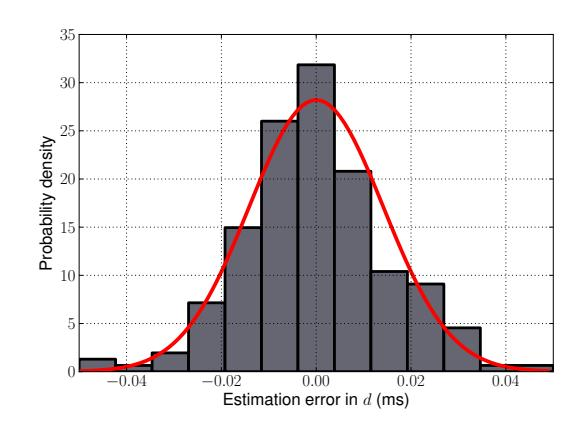
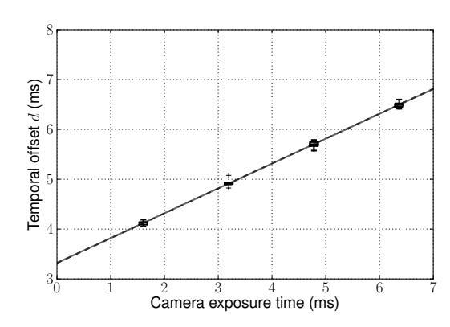
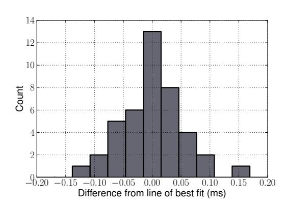
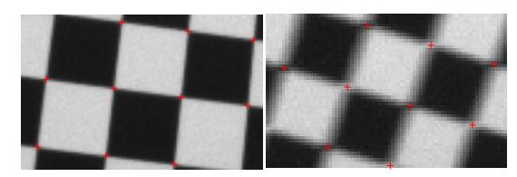
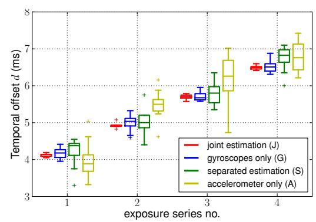

# Unified Temporal and Spatial Calibration for Multi-Sensor Systems

Paul Furgale, Joern Rehder, and Roland Siegwart

*Abstract*— In order to increase accuracy and robustness in state estimation for robotics, a growing number of applications rely on data from multiple complementary sensors. For the best performance in sensor fusion, these different sensors must be spatially and temporally registered with respect to each other. To this end, a number of approaches have been developed to estimate these system parameters in a two stage process, first estimating the time offset and subsequently solving for the spatial transformation between sensors.

In this work, we present on a novel framework for jointly estimating the temporal offset between measurements of different sensors and their spatial displacements with respect to each other. The approach is enabled by continuous-time batch estimation and extends previous work by seamlessly incorporating time offsets within the rigorous theoretical framework of maximum likelihood estimation.

Experimental results for a camera to inertial measurement unit (IMU) calibration prove the ability of this framework to accurately estimate time offsets up to a fraction of the smallest measurement period.

#### I. INTRODUCTION

Most methods for state estimation that fuse data from multiple sensors assume and require that the timestamps of all measurements are accurately known with respect to a single clock. Consequently, the time synchronization of sensors is a crucial aspect of building a robotic system.

The most desirable method of determining the timestamps of all measurements is with the support of hardware, using interrupts on a single processor to detect signal lines that change state at each measurement time. This is the method used for high-accuracy photogrammetry [1] but it requires specialized hardware and increases the complexity of integration.

When hardware support is not available, the next best option is to use software-supported time synchronization. For example, the mapping between clocks can be learned using the Network Time Protocol (NTP) [2] or the TICSync algorithm [3]. This mapping then allows one to resolve the device timestamps with respect to a common clock. However, these methods require software support on each device and very few (if any) off-the-shelf sensors provide this.

Our approach is targeted toward the majority of robotic systems, where individual sensors do not support the hardware or software synchronization methods described above. In such systems, a central unit either triggers or polls sensor readings or receives a continuous stream of fixed-rate measurements from a sensor. Using a single clock, the central unit timestamps this data either on arrival or when initiating a

The authors are from the Autonomous Systems Lab at ETH Zurich, Switzerland. {paul.furgale, joern.rehder} at mavt.ethz.ch, rsiegwart at ethz.ch

Fig. 1. This paper derives a unified framework for temporal and spatial calibration of multi-sensor systems such as this visual-inertial sensor used in the experiments.  $\mathcal{F}_w$  marks the inertial frame attached to a static calibration pattern, while  $\mathcal{F}_c$  and  $\mathcal{F}_i$  show the camera and the IMU frame respectively. By waving the sensor in front of the calibration pattern, our framework is capable of estimating the 6-degrees-of-freedom transformation between  $\mathcal{F}_c$  and  $\mathcal{F}_i$  as well as time offset between the two devices.

request. In this case, the delay between sensor measurements is determined by communication delays and the internal sensor delays—introduced either by filters or logic—as well as stochastic delays resulting from task scheduling. After removing stochastic effects on these fixed rate measurements using the approach of Moon et al. [4], it is sometimes possible to infer the delay from sensor data. This delay is constant and can therefore be determined in an offline calibration procedure.

Conventional discrete-time estimation techniques generally require a state at each measurement time. This makes the estimation of temporal offsets difficult as measurement times shift when the offsets are updated. This has led to the development of specialized algorithms just for estimating time offsets [5], [6], that are applied prior to spatial calibration of the sensors.

In contrast, the continuous-time batch estimation algorithm proposed by Furgale et al. [7] makes it easy to fold time offsets directly into a principled maximum-likelihood estimator. Although we agree with the authors of [6] that jointly estimating uncorrelated quantities may potentially impair results, we believe that, given accurate measurement models, the optimality implications of maximum likelihood estimation extend to our approach. Consequently, we can achieve the highest accuracy by incorporating *all* available information into a unified estimate.

The results presented in section V support this assumption, suggesting that the gain in accuracy from information provided by additional sensors outweighs the drawbacks of potential interferences of uncorrelated parameters.

The contributions of this paper are as follows:

- 1) we propose a unified method of determining fixed time offsets between sensors using batch, continuous-time, maximum-likelihood estimation;
- 2) we derive an estimator for the calibration of a camera and inertial measurement unit (IMU) that simultaneously determines the transformation *and* the temporal offset between the camera and IMU;
- 3) we evaluate the estimator on simulated and real data (from the setup depicted in Figure 1) and show that it is sensitive enough to determine temporal offsets up to a fraction of the period of the highest-rate sensor, including differences due to camera exposure time; and
- 4) we demonstrate that the time delay estimation significantly benefits from the additional information comprised in acceleration measurements—information that was not exploited in previous approaches ([5], [6]).

#### II. RELATED WORK

Early efforts in determining the spatial relationship between an IMU and a camera were made by Alves et al. [8]. By mounting a visual-inertial sensor onto a pendulum equipped with a high-resolution encoder, the authors of this study were able to estimate the relative rotation between camera and IMU as well as scale factors and axis misalignments in the IMU. In [9], orientation estimation was facilitated using a set of still images and a gravity aligned visual calibration pattern. Furthermore, the study extended previous work to further calibrate for the relative displacement of camera and IMU in a separate procedure which involved mounting the device on a turntable and aligning it in a way that the IMU is not affected by accelerations other than gravity.

More recently, recursive approaches were employed to jointly estimate relative rotation and translation from measurements acquired by dynamically moving a camera IMU combination in front of a calibration pattern [10], [11]. Both studies further address the question of the observability of the calibration, deriving that it can be determined when sufficient rotational velocity is present in the dataset. Other approaches estimate the transformation in a batch optimization over a set of inertial measurements and calibration pattern observations [12], [13]. Among those, our algorithm is most similar to [13] in that it also employs B-splines to parameterize the motion of the device.

All these studies have in common that they assume that IMU and camera have been temporally calibrated in a separate, preceding step and that any offset in the timing of their measurements has been compensated for. In [5], a variation of the iterative closest point algorithm (ICP) was used to determine a fixed time offset by aligning orientation curves sensed by the camera and gyroscopes individually. However, the algorithm makes simplifying assumptions about the bias in inertial measurements and it remains unclear how this approach extends to other sensors than the ones presented on especially as it does not make any use of the acceleration measurements provided by the IMU. In [6], an estimate of the time offset is established either by temporally aligning the frame independent absolute rotational velocity or by determining the phase shift of common frequencies in frequency domain, thus avoiding the joint estimation of the time offset and the relative orientation of the sensors with respect to each other. Obviously, relative orientation and time offset are uncorrelated quantities, and by separating their estimation, the approach neatly avoids cases in which inaccuracies in one parameter affect the estimate of the other. However, the work demonstrates the separation only for gyroscope measurements, and it is not immediately clear how to achieve separation for other types of sensors. Like [5], this approach disregards the information comprised in the accelerometer readings. In contrast, our work suggests that the temporal calibration benefits more from additional measurements than from the rigorous separation of uncorrelated parameters in the estimation.

## III. THEORY

In this section we consider the problem of determining the relative time offset between a pair of sensors. It is straightforward to extend the results to multiple sensors.

# *A. Estimating Time Offsets using Basis Functions*

Throughout this section, we follow the basis function approach for batch continuous-time state estimation presented in Furgale et al. [7]. Time-varying states are represented as the weighted sum of a finite number of known analytical basis functions. For example, a  $D$ -dimensional state,  $\mathbf{x}(t)$ , may be written as

$$\Phi(t) := [\phi_1(t) \quad \dots \quad \phi_B(t)], \quad \mathbf{x}(t) := \Phi(t)\mathbf{c}, \quad (1)$$

where each  $\phi_b(t)$  is a known  $D \times 1$  analytical function of time and  $\Phi(t)$  is a  $D \times B$  stacked basis matrix. To estimate  $\mathbf{x}(t)$ , we simply estimate  $\mathbf{c}$ , the  $B \times 1$  column of coefficients. When estimating time offsets from measurement data, we

When estimating time offsets from measurement data, we will encounter error terms such as

$$\mathbf{e}_j := \mathbf{y}_j - \mathbf{h}(\mathbf{x}(t_j + d)), \quad (2)$$

where  $\mathbf{y}_j$  is a measurement that arrived with timestamp  $t_j$ ,  $\mathbf{h}(\cdot)$  is a measurement model that produces a predicted measurement from  $\mathbf{x}(\cdot)$ , and  $d$  is the unknown time offset. Using basis functions, this becomes

$$\mathbf{e}_j = \mathbf{y}_j - \mathbf{h}(\Phi(t_j + d)\mathbf{c}), \quad (3)$$

which is easy to evaluate for different values of  $d$  as in changes during optimization. The analytical Jacobian of the error term, needed for nonlinear least squares estimation, is derived by linearizing (3) about a nominal value,  $\bar{d}$ , with respect to small changes,  $\Delta d$ . This results in the expression

$$\mathbf{e}_j \approx \mathbf{y}_j - \mathbf{h}(\Phi(t_j + \bar{d})\mathbf{c}) - \mathbf{H}\dot{\Phi}(t_j + \bar{d})\mathbf{c}\Delta d, \quad (4)$$

where the over dot represents a time derivative and

$$\mathbf{H} := \frac{\partial \mathbf{h}}{\partial \mathbf{x}} \Big|_{\mathbf{x}(\Phi(t_j + \bar{d})\mathbf{c})}. \quad (5)$$

In (4),  $\Phi(t)$  is a known function and we assume its time derivative,  $\Phi(t)$ , is available analytically.

This approach has two clear benefits. Firstly, it allows us to treat the problem of estimating time offsets within the rigorous theoretical framework of maximum likelihood estimation. Secondly, it allows us to leave the problem in continuous time so that the delayed measurement equations and their Jacobians can be evaluated analytically.

In short, estimating the time offsets in a principled way becomes easy.

#### *B. An Example: Camera/IMU Calibration*

Rather than delving further into the general case, we will proceed with the specific example of calibrating a camera and IMU. The goal of calibration is to determine the relative rotation, translation, and time offset between the sensors.

To perform calibration, we collect a set of data over a short time interval,  $T = [t_1, t_K]$  (typically 1–2 minutes), as the sensor head is waved in front of a static calibration pattern. Figure 1 shows the basic problem setup. Estimation is performed with respect to an inertial world coordinate frame,  $\underline{F}_w$ . The linear acceleration and angular velocity are measured in the IMU frame,  $\underline{F}_i(t)$ . The camera coordinate frame,  $\underline{F}_c(t)$ , is placed at the camera's optical center with the  $z$ -axis pointing down the optical axis.

1) *Quantities Estimated:* Our algorithm estimates time-invariant parameters for (i) the gravity direction,  $\mathbf{g}_w$ , expressed in  $\mathcal{F}_w$ , (ii) the transformation between the camera and the IMU,  $\mathbf{T}_{c,i}$ , and (iii) the offset between camera time and IMU time,  $d$ . It also estimates time-varying states: (iv) the pose of the IMU,  $\mathbf{T}_{w,i}(t)$ , and (v) the accelerometer ( $\mathbf{b}_a(t)$ ) and gyroscope ( $\mathbf{b}_\omega(t)$ ) biases.

2) *Parameterization of Time-Varying States:* Time-varying states are represented by B-spline functions. B-splines produce simple analytical functions of time with good representational power. Please see [14] for a thorough introduction.

The IMU pose is parameterized as a  $6 \times 1$  spline, using three degrees of freedom for orientation and three for translation. The transformation that takes points from the IMU frame to the world frame at any time  $t$  can be built as

$$\mathbf{T}_{w,i}(t) := \begin{bmatrix} \mathbf{C}(\varphi(t)) & \mathbf{t}(t) \\ \mathbf{0}^T & 1 \end{bmatrix}, \quad (6)$$

where  $\varphi(t) := \Phi_\varphi(t)\mathbf{c}_\varphi$  encodes the orientation parameters,  $\mathbf{C}(\cdot)$  is a function that builds a rotation matrix from our parameters, and  $\mathbf{t}(t) := \Phi_t(t)\mathbf{c}_t$  encodes the translation. The velocity,  $\mathbf{v}(t)$ , and acceleration,  $\mathbf{a}(t)$ , of the platform with respect to and expressed in the world frame are

$$\mathbf{v}(t) = \dot{\mathbf{t}}(t) = \dot{\Phi}_t(t)\mathbf{c}_t, \quad \mathbf{a}(t) = \ddot{\mathbf{t}}(t) = \ddot{\Phi}_t(t)\mathbf{c}_t. \quad (7)$$

For a given rotation parameterization, the relationship to angular velocity is of the form

$$\omega(t) = \mathbf{S}(\varphi(t))\dot{\varphi}(t) = \mathbf{S}(\Phi(t)\mathbf{c}_\varphi)\dot{\Phi}(t)\mathbf{c}_\varphi, \quad (8)$$

where  $\mathbf{S}(\cdot)$  is the standard matrix relating parameter rates to angular velocity [15]. In this paper we used the axis/angle parameterization of rotation where  $\varphi(t)$  represents rotation by the angle  $\varphi(t) = \sqrt{\varphi(t)^T \varphi(t)}$  about the axis  $\varphi(t)/\varphi(t)$ .

### *3) Measurement and Process Models:* Each accelerome-

ter measurement,  $\alpha_k$ , and gyroscope measurement,  $\varpi_k$ , is sampled at time  $t_k$ , where  $k = 1 \dots K$ . The pixel location of landmark,  $\mathbf{p}_w^m$ , seen at time  $t_j + d$  is denoted  $\mathbf{y}_{mj}$ , where  $t_j$  is the image timestamp,  $d$  is the unknown time offset, and  $j = 1 \dots J$  indexes the images. We use the standard, discrete-time IMU and camera measurement equations,

$$\alpha_k := \mathbf{C}(\varphi(t_k))^T (\mathbf{a}(t_k) - \mathbf{g}_w) + \mathbf{b}_a(t_k) + \mathbf{n}_{a_k}, \quad (9a)$$

$$\varpi_k := \mathbf{C} (\varphi(t_k))^T \boldsymbol{\omega}(t_k) + \mathbf{b}_{\boldsymbol{\omega}}(t_k) + \mathbf{n}_{\boldsymbol{\omega}_k}, \quad (9b)$$

$$\mathbf{y}_{mj} := \mathbf{h} \left( \mathbf{T}_{c,i} \mathbf{T}_{w,i} (t_j + d)^{-1} \mathbf{p}_w^m \right) + \mathbf{n}_{y_{mj}}, \quad (9c)$$

where each  $\mathbf{n} \sim \mathcal{N}(\mathbf{0}, \mathbf{R})$  is assumed to be statistically independent of the others,  $\mathbf{h}(\cdot)$  may be any nonlinear camera model, and there are  $M$  landmarks,  $\{\mathbf{p}_w^m | m = 1 \dots M\}$ . We have written these error terms as if the image measurements are delayed with respect to the IMU measurements. This assumption is only for convenience as it is easier to write out and implement delayed image error terms. Nothing is lost as  $d$  can be negative.

We model the IMU biases as driven by zero-mean white Gaussian processes:

$$\mathbf{b}_a(t) = \mathbf{w}_a(t) \quad \mathbf{w}_a(t) \sim \mathcal{GP}(\mathbf{0}, \mathbf{Q}_a \delta(t - t')) \quad (10a)$$

$$\dot{\mathbf{b}}_\omega(t) = \mathbf{w}_\omega(t) \quad \mathbf{w}_\omega(t) \sim \mathcal{GP}(\mathbf{0}, \mathbf{Q}_\omega \delta(t - t')) \quad (10b)$$

We assume the processes are statistically independent so that  $E[\mathbf{w}_a(t)\mathbf{w}_\omega(t')^T] = \mathbf{0}$  for all  $t, t'$ , where  $E[\cdot]$  is the expectation operator.

4) *The Estimator:* We estimate the five quantities defined in Section III-B.1. Error terms associated with the measurements are constructed as the difference between the measurement and the predicted measurement given the current state estimate. The continuous-time process models for the IMU biases give rise to integral error terms (refer to [7] for more details). Altogether, our objective function is built from the following components:

$$\mathbf{e}_{y_{mj}} := \mathbf{y}_{mj} - \mathbf{h}(\mathbf{T}_{c,i}\mathbf{T}_{w,i}(t_j + d)^{-1}\mathbf{p}_w^m) \quad (11a)$$

$$J_y := \frac{1}{2} \sum_{j=1}^J \sum_{m=1}^M \mathbf{e}_{y_{mj}}^T \mathbf{R}_{y_{mj}}^{-1} \mathbf{e}_{y_{mj}} \quad (11b)$$

$$\mathbf{e}_{\alpha_k} := \alpha_k - \mathbf{C}(\varphi(t_k))^T (\mathbf{a}(t_k) - \mathbf{g}_w) + \mathbf{b}_a(t_k) \quad (11c)$$

$$J_\alpha := \frac{1}{2} \sum_{k=1}^K \mathbf{e}_{\alpha_k}^T \mathbf{R}_{\alpha_k}^{-1} \mathbf{e}_{\alpha_k} \quad (11d)$$

$$\mathbf{e}_{\omega_k} := \varpi_k - \mathbf{C}(\varphi(t_k))^T \boldsymbol{\omega}(t_k) + \mathbf{b}_{\omega}(t_k) \quad (11e)$$

$$J_\omega := \frac{1}{2} \sum_{k=1}^K \mathbf{e}_{\omega_k}^T \mathbf{R}_{\omega_k}^{-1} \mathbf{e}_{\omega_k} \quad (11\text{f})$$

$$\mathbf{e}_{b_a}(t) := \dot{\mathbf{b}}_a(t) \quad (11\text{g})$$

$$J_{b_a} := \frac{1}{2} \int_{t_1}^{t_K} \mathbf{e}_{b_a}(\tau)^T \mathbf{Q}_a^{-1} \mathbf{e}_{b_a}(\tau) d\tau \quad (11h)$$

$$\mathbf{e}_{b_\omega}(t) := \dot{\mathbf{b}}_\omega(t) \quad (11i)$$

$$J_{b_w} := \frac{1}{2} \int_{t_1}^{t_K} \mathbf{e}_{b_w}(\tau)^T \mathbf{Q}_w^{-1} \mathbf{e}_{b_w}(\tau) d\tau \quad (11j)$$

The Levenberg-Marquardt (LM) algorithm [16] is used to minimize  $J := J_y + J_\alpha + J_\omega + J_{b_a} + J_{b_w}$  to find the maximum likelihood estimate of all unknown parameters at once.

# IV. IMPLEMENTATION

This section describes the implementation details of the estimator. We make the following assumptions:

- the camera intrinsic calibration is known;
- the IMU noise and bias models are known;
- - we have a guess for the gravity in  $\underline{\mathcal{F}}_w$ ,
  - we have a guess for the calibration matrix
- we have a guess for the calibration matrix,  $\mathbf{T}_{c,i}$ ;
- the geometry of the calibration pattern is known so that we can express the position of each point landmark,  $\mathbf{p}_w^m$ , in the world coordinate frame,  $\mathcal{F}_w$ ; and
  we know the data association between an image point,
- we know the data association between an image point,  $\mathbf{y}_{mj}$ , and the corresponding point on the calibration pattern,  $\mathbf{p}_w^m$ .

We set the initial guess for the time offset to zero. For the position of the IMU,  $\mathbf{T}_{w,i}(t)$ , we produce an initial guess by first computing a rough estimate of the camera position,  $\mathbf{T}_{w,c}(t_j)$ , for each image using the perspective n-point algorithm from the Bouget camera calibration toolbox1. This is transformed into an initial guess for the position of the IMU at this time,  $\mathbf{T}_{w,i}(t_j) = \mathbf{T}_{w,c}(t_j)\mathbf{T}_{c,i}$ . Finally, the pose spline is initialized using the linear solution of Schoenberg and Reinsch (Chapter XIV of [17]).

The IMU pose is encoded as a sixth-order B-spline (a piecewise fifth-degree polynomial). This high-order representation encodes acceleration as a cubic polynomial. We found this was necessary to accurately capture the dynamic motion of the sensor head during calibration. The biases are represented by cubic B-splines. Note that not only the order of the splines, but also the number of knots has to reflect the systems dynamics, requiring a greater number of knots for faster varying quantities. The algorithm allows for regularization terms, which are modeled as random walk processes (see [7]) that constrain the temporal evolution of estimates over periods with insufficiently constraining measurements. These terms correspond to physical constraints imposed onto the motion of the sensor system by its finite inertia and the limiting dynamics of the system actuating the sensors.

Due to the order of the B-spline used to represent the state and depending on the number of knots used, the system of equations that must be solved at each iteration of LM can be very large. However, the matrix is sparsely populated, primarily due to the compact support of B-spline basis functions. A sixth-order B-spline basis function is nonzero over exactly six intervals. The result is that the primary diagonal of the LM information matrix is block six diagonal (scalar  $6 \times 6 = 24$ ) in the section associated with the pose spline,  $\mathbf{T}_{w,i}(t)$ . An example matrix for 0.1 seconds of data is shown in Figure 2. The CHOLMOD sparse matrix library is used to solve the resulting system at each iteration [18].

Fig. 2. A visualization of the sparsity pattern of the symmetric information matrix built during each iteration of Levenberg-Marquardt. To enhance the visibility of the matrix structure, only 0.1 seconds of data was used to generate this plot. The time-varying pose spline parameters produce a block diagonal (i) corresponding to  $\mathbf{T}_{w,i}(t)$ . The width of this diagonal depends on the spline order as well as the temporal padding. The diagonal blocks associated with the bias splines (ii) contain information from the bias motion model, (10). The parameters of the gyro bias spline,  $\mathbf{b}_\omega(t)$ , show striped correlation with the pose spline (iii) because they are only coupled with the IMU orientation through (11e). The parameters of the accelerometer bias,  $\mathbf{b}_a(t)$  are correlated with orientation (iv), position (iv), and gravity (v) through (11c). Finally,  $\mathbf{g}_w$ ,  $\mathbf{T}_{c,i}$  and the time offset,  $d$ , are all correlated with the  $\mathbf{T}_{w,i}(t)$  (vi) through (11a).

The optimimization problem seems well-posed. Figure 3 shows the cost function evaluated in the neighborhood of the minimum on 40 real datasets from Section V-B. The figure clearly shows that the cost function in the neighborhood of the minimum is convex and steep with respect to changes in  $d$ .

Fig. 3. The cost function evaluated for different values of the time offset,  $d$ , in the neighborhood of the minimum,  $\bar{d}$ , on 40 real datasets from Section V-B. In this neighborhood, the cost function is convex.

During optimization, error terms associated with the delayed image measurements may move across knot boundaries of the spline. This can cause the sparsity pattern of the linear system to change each iteration. It is significantly less computationally expensive to solve each iteration when the sparsity pattern does not change as we can cache a symbolic matrix factorization and preallocate our sparse matrix data structures. Consequently, the Jacobians of each image error term, (11a), are extended by additional columns to account for possible dependence on the parameters of neighboring b-spline coefficients. To this end, the code accepts a *temporal padding* value in seconds that limits the extent of this neighborhood and hence constrains the time delay to lie within the boundaries of its magnitude. Note that choosing this value to be too large results in increased processing time.

1Available at t [http://www.vision.caltech.edu/bouguetj/calib\\_doc/](http://www.vision.caltech.edu/bouguetj/calib_doc/)as the number of potentially non-zero entries increases, while choosing it too small results in a failure of the optimization routine. For the experiments in this paper, we used a time padding of 0.04 seconds.

### V. EXPERIMENTS

In this section, we will briefly demonstrate the accuracy and stability of our calibration framework by presenting results from 500 simulated and 40 real calibration datasets. For both simulated and real data, we fixed the inertial measurement rate to 200 Hz and the camera frame rate to 20 Hz. We determined the internal noise parameters of our IMU using Allan Variance analysis [19], [20]. The camera was calibrated intrinsically using the equidistant model and it was assumed that the landmark measurements seen in the images were subject to isotropic, zero-mean Gaussian distributed noise with a standard deviation of 0.5 pixels. The simulations were generated with the same sensor models as the real data.

In order to represent the pose and bias curves, 50 basis functions per second were used. This number was found to be necessary to enable the pose spline to accurately capture the dynamics of the platform. It remains future work to automatically select the minimal number of basis functions for a given motion.

The resulting sparse linear system of equations that must be solved at each iteration of LM is very large. A dataset of approximately 80 seconds corresponds to a system of over 12,400 vector-valued design variables and 144,000 error terms. The sparse matrix associated with the linear system is about  $50,000 \times 50,000$  with 3,550,000 non-zero entries. Each of these iterations requires approximately 18 seconds to build the linear system and 0.2 seconds to solve it using CHOLMOD on a MacBook Pro with a 2.4 GHz Intel Core i7 and 8GB of RAM. Hence, the limiting factor is the number of error terms (which determines the amount of time it takes to build the linear system) and not the number of basis functions used (which determines how long it takes to solve the linear system). For the processed datasets, the algorithm converged to a solution in 3 to 15 iterations, which translates into a maximum time of 5 minutes for a single dataset.

# *A. Simulation*

For ther the simulation, we used sums of sinusoidal functions of time for position and orientation in order to create a sensor trajectory of about 90 seconds. The average absolute angular velocity of  $37^\circ \text{ s}^{-1}$  and average absolute acceleration of about  $0.59 \text{ m/s}^2$  in the simulation roughly resembled values found for real calibration sequences. For each of five time offsets, spaced equally between  $-8\text{ms}$  and  $8\text{ms}$ , we generated 100 realizations of this experiment by corrupting perfect inertial sensor measurements with random noise and an additive bias modelled as a random walk process. We simulated a camera rotated by  $180^\circ$  about the optical axis and displaced by  $\mathbf{t} = [103 \quad -15 \quad -10]^T \text{ mm}$  with respect to the IMU. The initial guess for the relative orientation was accurate up to a few of degrees, while an initial displacement

of  $\mathbf{t}_{\text{init}} = [0 \quad 0 \quad 0]^T$  mm was provided. Figure 4 depicts a histogram of errors in time offset estimation overlaid with the marginal uncertainty returned by the estimator and plotted as a Gaussian probability density function (PDF). The plot shows that, given the correct noise models, the approach is capable of accurately estimating the time offset and returning a reasonable uncertainty of the estimate. The displacement of camera and IMU was estimated as  $\tilde{\mathbf{t}}_{\text{est}} = [103.73 \quad -15.18 \quad -9.98]^T$  mm with standard deviations of  $\sigma_t = [0.38 \quad 0.98 \quad 0.17]^T$ . Yaw, pitch and roll were estimated as  $\bar{\varphi}_{\text{est}} = [179.9999^\circ \quad -0.0098^\circ \quad 0.0003^\circ]^T$  with  $\sigma_\varphi = [0.0032^\circ \quad 0.0086^\circ \quad 0.0072^\circ]^T$ .

Fig. 4. A histogram of the error in the estimated time offset over 500 simulation trials with the time offset varying between –8ms and 8ms. The marginal uncertainty returned by the estimator is plotted as a Gaussian probability density function (solid red). The results clearly show that, if the correct noise models are known, this method is able to estimate the time offset between the two devices and return a reasonable uncertainty of the estimate.

#### *B. Real Data*

For this experiment, we used a custom-made sensor, consisting of multiple Aptina MT9V034 global shutter image sensors and a tactical grade IMU (Analog Devices ADIS16488). We routed all sensor data streams through an FPGA, recording the timestamps at the moment the image sensors were triggered and an IMU data request was initialized. Note that while using an FPGA for data acquisition helps with avoiding stochastic delays introduced by rescheduling tasks on a processor, it does not tackle the issue of logic and filter delays inside the sensors, and in our setup does not account for communication delays introduced when polling measurements.

For each of four fixed exposure times, we collected ten datasets by moving the sensor in front of the calibration pattern for about 90 seconds per dataset. To render all quantities of the calibration observable, we ensured sufficient rotational velocity was present in the motion [10], maintaining an average absolute angular velocity of about  $55^\circ \text{ s}^{-1}$  and an average absolute acceleration of  $1.1\text{m/s}^2$  over all datasets.

Figure 5 depicts the key results for the temporal calibration as a comparison between estimated time offsets and fixed exposure times. The middle of the exposure time constitutes the ideal point to timestamp an image [1] and Figure 6

(a) Estimation incorporating camera, gyroscopes and accelerometer

(b) Difference of offset estimation to the line of best fit.

Fig. 5. The key results from our experiments. Figure 5(a) depicts the time offset estimated for four different, fixed exposure times and ten datasets per exposure setting. The estimation made use of all inertial sensors available in the IMU. The slope of the line of best fit (drawn as a solid gray line) is estimated as 0.498, which compares well with its theoretical value of 0.5 (marked by the dashed gray line). Figure 5(b) shows a histogram of the difference between the estimates and the line of best fit for all 40 experiments. For all datasets, the difference stays within a domain of  $\pm 0.2$  *ms*, which constitutes just 4% of the shortest measurement period in the experiment.

Fig. 6. Images of the checkerboard may be blurred due to the motion of the camera. This figure shows details from two images taken from one of the datasets. The corner finding algorithm used in this paper performs well for images taken with a static camera (left) as well as under motion blur (right), returning the location of the corner near the middle of the exposure time for the vast majority of motions.

illustrates this; each corner point extracted from an image in the presence of motion blur resembles the position of the projection of the corresponding world point in the middle of the exposure time. In this experiment, we expected the time offset to account for fixed communication and filter delays *plus half the exposure time* as the images are timestamped at the start of the exposure time. Hence, we expect that a plot of temporal offset versus exposure time should show a linear relationship with slope 0.5. Note that by extrapolating the line for an exposure time of zero, one may estimate the communication and filter delay for the IMU. However, this only holds true under the assumption that the trigger pulse immediately initiates exposure. In case the internal logic of the image sensor adds additional delays to the trigger pulse, only the difference in delays can be observed. As the true delays are unavailable for our experiments, we use the deviation in slope of the line of best fit from the theoretical value as well as the RMS error with respect to a line of slope 0.5, fitted in a least squares sense to evaluate the results.

Figure 5(a) shows that our framework is capable of reproducing the inter-sensor time delay up to high accuracy, estimating a slope of 0.498. Figure 5(b) shows the differences of the estimates to the line of best fit, which are all below 0.2 ms. This suggests that the method is accurate to a fraction of the IMU sampling period of 5 ms. The spatial calibration between camera and IMU was determined to be  $\bar{\mathbf{t}}_{\text{est}} = [74.5374 \quad -8.6751 \quad 12.3919]_T^T$  mm with standard

deviations of  $\sigma_t = [1.6081 \quad 0.9051 \quad 0.7609]^T$  for displacement and  $\bar{\varphi}_{\text{est}} = [180.7531^\circ \quad 0.1784^\circ \quad -0.1648^\circ]^T$  with  $\sigma_\varphi = [0.0206^\circ \quad 0.0599^\circ \quad 0.0417^\circ]^T$  for yaw, pitch and roll.

Figure 7 visualizes a comparison of our method, using all available sensors in camera IMU calibration as well as only subsets with a reference implementation of the separate calibration based on the frame independent absolute angular velocity as proposed in [6]. The estimated slopes are 0.498 for the joint calibration using all sensors, 0.531 for the separate estimation of the time delay, and 0.493 and 0.553 for the approach using only angular velocities or accelerations in addition to images. The RMS errors are 0.054ms, 0.344ms, 0.165ms and 0.572ms respectively. The results suggest that incorporating measurements from all available sensors into a continuous-time batch optimization yields significantly more accurate and consistent results compared to calibrations that only make use of a subset of the measurements at hand. In our experiments, the gain from the additional information comprised in the accelerometer readings appears to outweigh possible drawbacks of jointly estimating parameters that could be separated otherwise.

Note that the temporal-spatial calibration solely based on camera and accelerometer readings, though less accurate, marks an extension in camera IMU calibration to a previously not considered combination of sensors. In this configuration and with constrained dynamics of the sensor, the spatial transformation between camera and IMU is fully observable. Due to the lack of frequent feedback about the sensor's orientation or the change of it respectively, a regularizing term on the orientation was introduced. Using a single dataset, we empirically identified the parameters of the random walk model employed in our approach and applied these settings to the evaluation of all datasets. The fact that our algorithm converged to reasonable values for time delay and inter-sensor transformation suggests that the significance of this approach is not limited to camera IMU calibration but presumably extends to other sensor setups as well.

|       | J       | G       | S       | A       |
|-------|---------|---------|---------|---------|
| slope | 0.498   | 0.493   | 0.531   | 0.503   |
| RMS   | 0.054ms | 0.165ms | 0.344ms | 0.572ms |

Fig. 7. Comparison of approaches for determining the time delay. The joint estimation incorporating all sensor information available results in significantly reduced variance in the estimates and the most consistent results. Using a subset of all sensors results—either only the gyroscopes or only the accelerometer in addition to the camera—yields less accurate estimates. In our experiments, a separation of temporal and spatial calibration as proposed in [6] resulted in less accurate estimates, suggesting that the calibration may benefit more from additional measurements than from the separation of uncorrelated parameters.

# VI. CONCLUSION AND FUTURE WORK

In this study, we presented a novel approach to jointly calibrate for temporal offsets and spatial transformations between multiple sensors. Using a continuous state representation allows us to treat the problem of estimating temporal offsets within the rigorous theoretical framework of maximum likelihood estimation.

For the case of camera IMU calibration, we showed that it was beneficial to calibrate for time offsets and inter-sensor transformations in a single estimator, rather than determining these quantities in separate procedures. We believe that this holds true for all multi-sensor systems where the estimated quantities are well observable.

However, further questions need to be addressed in future work. For sensor setups without a common clock, the time offset may be different from start up to start up and subject to drift over longer periods of time, hence requiring continuous estimation of the offset in operation and in the absence of a known visual calibration target.

Furthermore, we strongly believe that the application domain of this framework extends to sensor combinations other than camera and IMU and future work will include experiments with a broader spectrum of sensors and setups.

# ACKNOWLEDGMENT

The authors would like to thank Elmar Mair for helpful discussions and valuable contributions on the issue of temporal calibration, as well as Janosch Nikolic and Michael Burri for providing the visual-inertial sensor that enabled the experiments, and Faraz Mirzaei, Stefan Weiss, Stefan Leutenegger, Margarita Chli, and Jonathan Kelly for their inputs on cameras and inertial sensors. This work was supported by the EU project V-Charge (FP7-269916). The development of the visual-inertial sensor was supported by CTI project 13394.1 PFFLE-NM.

#### REFERENCES

[1] D. F. Maune, Ed., *Digital elevation model technologies and applications : the DEM user manual, 2nd. edition*. Bethesda, Maryland, USA: American Society for Photogrammetry and Remote Sensing, 2007. [2] D. Mills, "Network time protocol version 4: Protocol and algorithms specification," RFC 5905, Fremont, California, USA, 2010. [Online]. Available: http://www.ietf.org/rfc/rfc5905.txt [3] A. Harrison and P. Newman, "TICSync: Knowing when things happened," in *Proc. IEEE International Conference on Robotics and Automation (ICRA2011)*, Shanghai, China, May 2011, 05. [4] S. Moon, P. Skelly, and D. Towsley, "Estimation and removal of clock skew from network delay measurements," in *INFOCOM'99. Eighteenth Annual Joint Conference of the IEEE Computer and Communications Societies. Proceedings. IEEE*, vol. 1. IEEE, 1999, pp. 227–234. [5] J. Kelly and G. S. Sukhatme, "A general framework for temporal calibration of multiple proprioceptive and exteroceptive sensors," in *12th International Symposium on Experimental Robotics, 2010*, Delhi, India, Dec 2010. [6] E. Mair, M. Fleps, M. Suppa, and D. Burschka, "Spatio-temporal initialization for IMU to camera registration," in *Robotics and Biomimetics (ROBIO), 2011 IEEE International Conference on*. IEEE, 2011, pp. 557–564. [7] P. T. Furgale, T. D. Barfoot, and G. Sibley, "Continuous-time batch estimation using temporal basis functions," in *Proceedings of the IEEE International Conference on Robotics and Automation (ICRA)*, St. Paul, MN, 14-18 May 2012, pp. 2088–2095. [8] J. Alves, J. Lobo, and J. Dias, "Camera-inertial sensor modelling and alignment for visual navigation," in *Int. Conf. on Advanced Robotics*, 2003, pp. 1693–1698. [9] J. Lobo and J. Dias, "Relative pose calibration between visual and inertial sensors," *The International Journal of Robotics Research*, vol. 26, no. 6, pp. 561–575, 2007. [10] F. Mirzaei and S. Roumeliotis, "A kalman filter-based algorithm for IMU-camera calibration: Observability analysis and performance evaluation," *Robotics, IEEE Transactions on*, vol. 24, no. 5, pp. 1143– 1156, 2008. [11] J. Kelly and G. Sukhatme, "Visual-inertial sensor fusion: Localization, mapping and sensor-to-sensor self-calibration," *The International Journal of Robotics Research*, vol. 30, no. 1, pp. 56–79, 2011. [12] F. M. Mirzaei and S. I. Roumeliotis, "IMU-camera calibration: Bundle adjustment implementation," Department of Computer Science and Engineering, University of Minnesota, Tech. Rep., August 2007. [13] M. Fleps, E. Mair, O. Ruepp, M. Suppa, and D. Burschka, "Optimization based IMU camera calibration," in *Intelligent Robots and Systems (IROS), 2011 IEEE/RSJ International Conference on*. IEEE, 2011, pp. 3297–3304. [14] R. H. Bartels, J. C. Beatty, and B. A. Barsky, *An Introduction to Splines for use in Computer Graphics and Geometric Modeling*. Los Altos, California, USA: Morgan Kaufmann Publishers Inc., 1987. [15] P. C. Hughes, *Spacecraft Attitude Dynamics*. New York: John Wiley & Sons, 1986. [16] J. Nocedal and S. J. Wright, *Numerical Optimization*, 2nd ed. Springer, 2006. [17] C. de Boor, *A practical guide to splines*. New York, USA: Springer Verlag, 2001. [18] Y. Chen, T. Davis, W. Hager, and S. Rajamanickam, "Algorithm 887: CHOLMOD, supernodal sparse Cholesky factorization and update/downdate," *ACM Transactions on Mathematical Software (TOMS)*, vol. 35, no. 3, p. 22, 2008. [19] IEEE Aerospace and Electronic Systems Society. Gyro and Accelerometer Panel and Institute of Electrical and Electronics Engineers, *IEEE Standard Specification Format Guide and Test Procedure for Single-axis Interferometric Fiber Optic Gyros*, ser. IEEE (std.). IEEE, 1998. [20] ——, *IEEE Standard Specification Format Guide and Test Procedure for Linear, Single-axis, Nongyroscopic Accelerometers*, ser. IEEE (std.). IEEE, 1999.