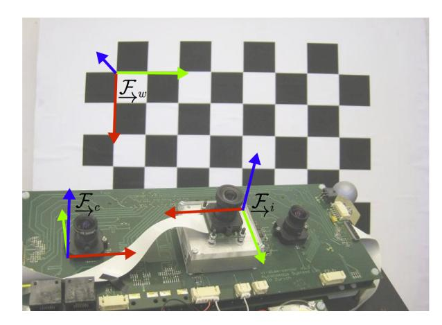
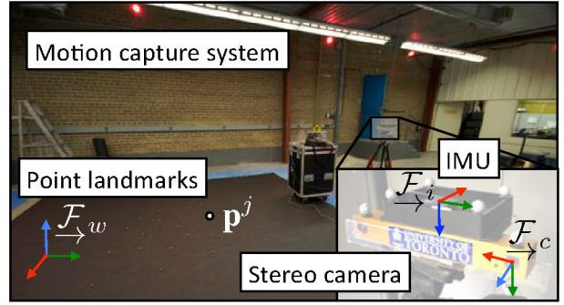
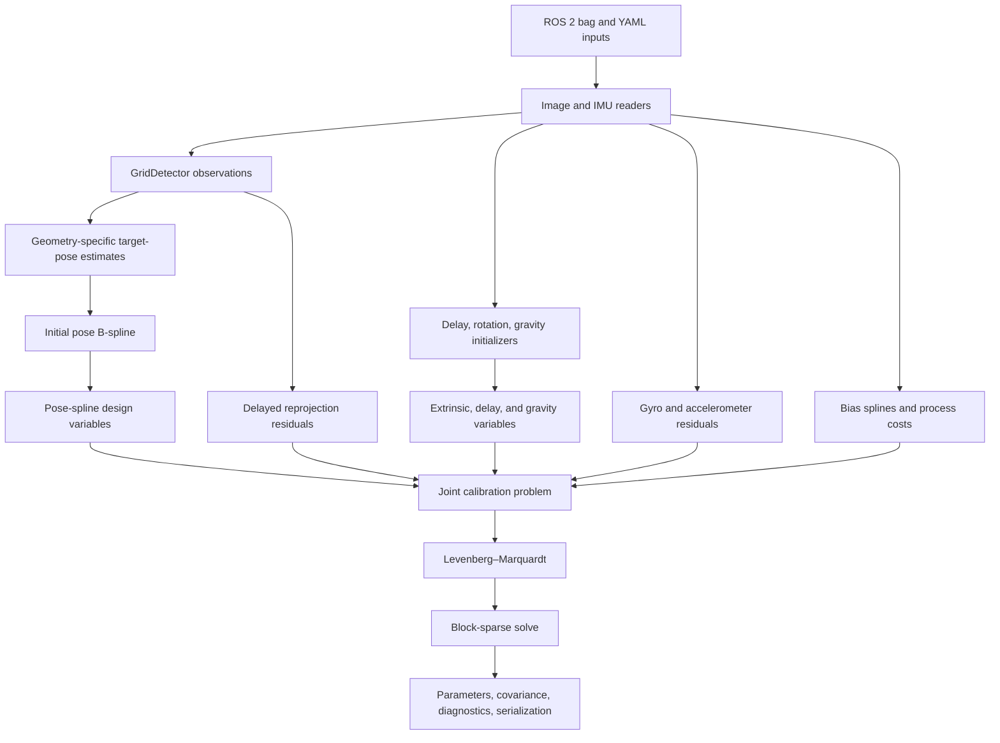
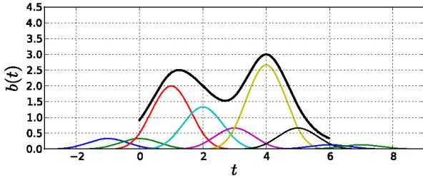
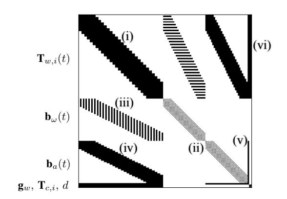
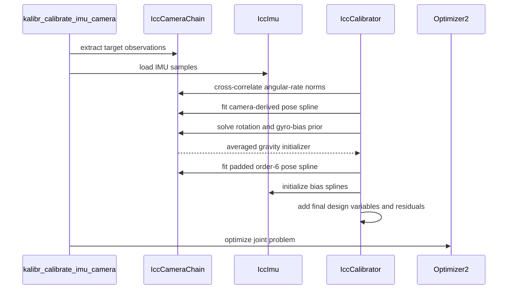
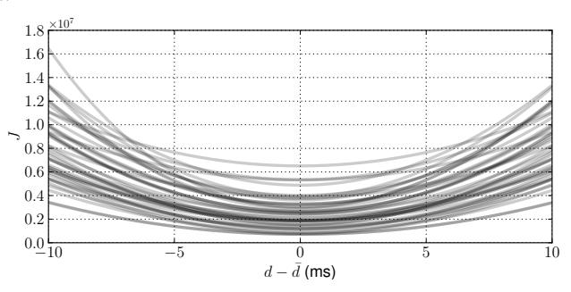

# Annotated Camera–IMU Calibration Algorithm

## Purpose and scope

This document maps the camera–IMU calibration theory in the two papers bundled with this repository to the active `kalibr_calibrate_imu_camera` implementation. Each M1–M14 entry puts a paper equation immediately beside the code that realizes it, or explicitly identifies an initialization, extension, divergence, or context-only equation.

The two paper sources are:

- [`Continuous-time_batch_estimation_using_temporal_basis_functions.md`](Continuous-time_batch_estimation_using_temporal_basis_functions/Continuous-time_batch_estimation_using_temporal_basis_functions.md)
- [`Unified_temporal_and_spatial_calibration_for_multi-sensor_systems.md`](Unified_temporal_and_spatial_calibration_for_multi-sensor_systems/Unified_temporal_and_spatial_calibration_for_multi-sensor_systems.md)

Primary implementation sources:

- [`kalibr_calibrate_imu_camera`](../src/kalibr_imu_camera/python/kalibr_calibrate_imu_camera): executable workflow
- [`IccCalibrator.py`](../src/kalibr_imu_camera/python/kalibr_imu_camera_calibration/IccCalibrator.py): batch-problem assembly and optimization
- [`IccSensors.py`](../src/kalibr_imu_camera/python/kalibr_imu_camera_calibration/IccSensors.py): camera, target, IMU, initialization, and residual construction
- [`BSplineExpressions.cpp`](../src/aslam_splines/src/BSplineExpressions.cpp): time-shifted pose expressions and analytic Jacobians
- [`BSplineMotionError.hpp`](../src/aslam_splines/include/aslam/backend/implementation/BSplineMotionError.hpp): continuous-time process costs
- [`ReprojectionError.hpp`](../src/aslam_cv_error_terms/include/aslam/backend/implementation/ReprojectionError.hpp): camera residual and projection Jacobian
- [`BlockCholeskyLinearSystemSolver.cpp`](../src/aslam_backend/src/BlockCholeskyLinearSystemSolver.cpp): sparse normal-equation construction and CHOLMOD solve

The document follows the active `kalibr_calibrate_imu_camera` path. Legacy or alternative residual classes are mentioned only where they clarify the active expression graph.

---

## 1. Algorithm at a glance

### 1.1 Physical setup from the papers



The unified paper’s Figure 1 places a rigid camera frame $\mathcal F_c$ and IMU frame $\mathcal F_i$ on one moving sensor head. A static calibration target defines the inertial/world frame $\mathcal F_w$. During calibration, the operator waves the rigid sensor head in front of the target. Target corners constrain camera pose, while the IMU measures angular velocity and specific force. Sufficient rotational and translational excitation allows the batch estimator to recover the six-degree-of-freedom camera–IMU transform and their fixed timestamp offset while simultaneously refining the continuous trajectory, gravity direction, and time-varying biases.



The earlier paper uses the same physical setup and continuous trajectory, but its camera–IMU example focuses on spatial self-calibration without the later paper’s explicit temporal-offset variable. Its role in this repository is foundational: it derives the continuous-time MAP estimator, basis-function state, process integrals, and sparse normal equations that the unified estimator extends.

### 1.2 Repository data flow



### 1.3 Estimated quantities and conventions

The unified paper lists five groups of unknowns. The active implementation realizes them as follows:

| Paper quantity | Meaning | Repository representation | Default state |
|---|---|---|---|
| $\mathbf T_{w,i}(t)$ | Continuous pose of the reference IMU/body in the target/world frame | `BSplinePose` wrapped by `BSplinePoseDesignVariable` | Active |
| $\mathbf T_{c,i}$ | Rigid IMU0-to-camera transform | `TransformationDv` on camera 0 | Active |
| $d$ | Camera-to-IMU time offset | cross-correlation prior plus active `Scalar` correction | Active unless `--no-time-calibration` |
| $\mathbf g_w$ | Gravity direction in the target/world frame | `EuclideanDirection` | Active; magnitude fixed by initialization |
| $\mathbf b_a(t)$ | Accelerometer bias | `EuclideanBSplineDesignVariable` | Active |
| $\mathbf b_\omega(t)$ | Gyroscope bias | `EuclideanBSplineDesignVariable` | Active |

For multiple cameras, fixed or optionally recomputed camera-chain baselines compose with $\mathbf T_{c_0,i}$. For multiple IMUs, IMU0 is the body/reference frame and additional IMU rotations, lever arms, and optional relative timing quantities can be estimated. M1–M14 use the one-camera, one-reference-IMU reduction first and label these additions as extensions.

The paper and code use compatible transforms but different variable names:

| Concept | Paper notation | Active code notation |
|---|---|---|
| Body/IMU pose in world | $\mathbf T_{w,i}(t)$ | `T_w_b`; body `b` is IMU0 |
| World-to-body transform | $\mathbf T_{w,i}(t)^{-1}$ | `T_b_w = T_w_b.inverse()` |
| Body/IMU-to-camera transform | $\mathbf T_{c,i}$ | `T_cN_b`, output as `T_ci` |
| Target/world landmark | $\mathbf p_w^m$ | homogeneous `targetPoint` |
| Camera measurement time | $t_j+d$ | image stamp + correlation prior + optimized scalar |
| World-frame linear acceleration | $\mathbf a_w(t)$ | `poseSplineDv.linearAcceleration(tk)` |
| Code-defined body-frame angular rate | convention-qualified in M2/M7 | `angularVelocityBodyFrame(tk)` |

The output convention is

$$
t_{\mathrm{imu}}=t_{\mathrm{cam}}+d.
$$
**Context statement —** this is an output convention, implemented by `getResultTimeShift()` as the sum of the initialization prior and optimized scalar:

```python
def getResultTimeShift(self, camNr):
    return self.camList[camNr].cameraTimeToImuTimeDv.toScalar() + self.camList[camNr].timeshiftCamToImuPrior
```

Thus the reported delay is

$$
d=d_{\mathrm{corr,prior}}+\Delta d_{\mathrm{optimized}}.
$$
**Context statement —** M3 traces both terms to the exact timestamp expression and analytic delay Jacobian.
---

## 2. Traceability index and mapping-status legend

**Mapping-status legend**

- **DIRECT** — the adjacent code evaluates the stated equation under the explicitly stated code convention.
- **COMPOSED** — no single excerpt implements the whole equation; the mapping enumerates the adjacent expression/residual chain in execution order.
- **EXTENSION** — code adds behavior beyond the paper. The paper-equivalent reduction is shown first, followed by the added behavior.
- **DIVERGENCE** — paper and code differ. The text identifies the difference and does not imply equivalence.
- **IMPLEMENTATION INITIALIZATION** — a pre-solve initializer only; it is not a term in the final joint objective.

| ID | Paper concept | Status | Principal implementation anchor |
|---|---|---|---|
| M1 | Finite basis representation | DIRECT | `BSpline.cpp::evalD` |
| M2 | Pose and derivatives | DIRECT per translation pair; convention-qualified for angular rate | `BSplinePose.cpp` |
| M3 | Delayed measurement/Jacobian | COMPOSED | scalar → time → spline → projection |
| M4 | Target-pose and spline initialization | COMPOSED / IMPLEMENTATION INITIALIZATION | `GridDetector.cpp`, `IccSensors.py` |
| M5 | Reprojection model and cost | COMPOSED | transform chain + `ReprojectionError` |
| M6 | Accelerometer model | DIRECT reduction + EXTENSION | `addAccelerometerErrorTerms` |
| M7 | Gyroscope model | COMPOSED | `BSplinePose` conversion + IMU residual |
| M8 | Bias random-walk cost | DIRECT; order DIVERGENCE noted | `BSplineMotionError.hpp` |
| M9 | Extrinsic, gravity, delay variables | DIRECT / COMPOSED | design-variable registration |
| M10 | Unified objective | COMPOSED | `buildProblem` |
| M11 | LM sparse solve | COMPOSED | optimizer → Hessian → solve |
| M12 | Initialization | IMPLEMENTATION INITIALIZATION / DIVERGENCE | correlation, alignment, averaging |
| M13 | Temporal padding | COMPOSED | padded domain → buffered DVs → zero blocks |
| M14 | Covariance and outputs | COMPOSED + rank-aware EXTENSION | solver → estimator → Python consumer |

---

## 3. M1 — Continuous state as a finite B-spline

The papers represent a continuous state by finite coefficients:

$$
\Phi(t)=\begin{bmatrix}\phi_1(t)&\cdots&\phi_M(t)\end{bmatrix},
\qquad
\mathbf x(t)=\Phi(t)\mathbf c.
\tag{CT-15 / U-1}
$$
**DIRECT —** `BSpline::evalD(t, 0)` is the exact matrix evaluation; derivative orders replace the monomial vector by its corresponding derivative:

Source: `src/bsplines/src/BSpline.cpp`.

`u` is just the percentage of progress through the current knot interval. Kalibr uses it to calculate how much influence each nearby control point should have.

```cpp
Eigen::VectorXd BSpline::evalD(double t, int derivativeOrder) const
{
  SM_ASSERT_GE(Exception, derivativeOrder, 0, "To integrate, use the integral function");
  // Returns the normalized u value and the lower-bound time index.
  std::pair<double,int> ui = computeUAndTIndex(t);
  Eigen::VectorXd u = computeU(ui.first, ui.second, derivativeOrder);

  int bidx = ui.second - splineOrder_ + 1;

  // Evaluate the spline (or derivative) in matrix form.
  //
  // [c_0 c_1 c_2 c_3] * B^T * u
  // spline coefficients

  Eigen::VectorXd rv = coefficients_.block(0,bidx,coefficients_.rows(),splineOrder_) * basisMatrices_[bidx].transpose() * u;

  return rv;
}
```

Term by term:

1. `computeUAndTIndex(t)` finds the active time segment and normalized local coordinate.
2. `computeU(..., derivativeOrder)` constructs the local polynomial vector $\mathbf u^{(q)}(t)$ for derivative order $q$.
3. `bidx` selects the first active coefficient and matching local basis matrix.
4. `coefficients_.block(...)` is the local coefficient matrix $[\mathbf c_{b},\ldots,\mathbf c_{b+O-1}]$.
5. `basisMatrices_[bidx].transpose()` converts the polynomial vector into the $O$ nonzero B-spline basis weights.
6. Their product is the local-support form of $\Phi^{(q)}(t)\mathbf c$.



**Call-site note — IMPLEMENTATION INITIALIZATION, not evidence for the evaluation equation.** `initPoseSplineFromCamera()` creates and fits the coefficients later consumed by `evalD`:

```python
pose = bsplines.BSplinePose(splineOrder, sm.RotationVector() )
seconds = times[-1] - times[0]
knots = int(round(seconds * poseKnotsPerSecond))
pose.initPoseSplineSparse(times, curve, knots, 1e-4)
```

`BSplinePoseDesignVariable` then exposes those fitted coefficient blocks to optimization.

---

## 4. M2 — Pose and analytic inertial derivatives

M2 is split into four equation-to-exact-snippet pairs. This avoids treating translation derivatives and angular-rate frame conversion as one operation.

### M2.1 Transform

$$
\mathbf T_{w,i}(t)=
\begin{bmatrix}
\mathbf C(\boldsymbol\varphi(t)) & \mathbf t(t)\\
\mathbf 0^T & 1
\end{bmatrix}.
\tag{U-6 / CT-26}
$$
**DIRECT —** spline value first, pose conversion second:

```cpp
Eigen::Matrix4d BSplinePose::transformation(double tk) const
{
  return curveValueToTransformation(eval(tk));
}
```

### M2.2 Linear velocity

$$
\mathbf v_w(t)=\dot\Phi_t(t)\mathbf c_t.
\tag{U-7 / CT-27, first derivative}
$$
**DIRECT —** this method returns the first three derivative components without a frame rotation:

```cpp
Eigen::Vector3d BSplinePose::linearVelocity(double tk) const
{
  return evalD(tk,1).head<3>();
}
```

### M2.3 Linear acceleration

$$
\mathbf a_w(t)=\ddot\Phi_t(t)\mathbf c_t.
\tag{U-7 / CT-27, second derivative}
$$
**DIRECT —** this method returns the first three second-derivative components:

```cpp
Eigen::Vector3d BSplinePose::linearAcceleration(double tk) const
{
  return evalD(tk,2).head<3>();
}
```

### M2.4 Angular velocity and the code convention

The paper writes a parameter-rate conversion:

$$
\boldsymbol\omega(t)=
\mathbf S(\boldsymbol\varphi(t))\dot{\boldsymbol\varphi}(t).
\tag{U-8 / CT-28}
$$
**Convention-qualified mapping —** the repository has two explicitly signed/frame-qualified methods. The method used by IMU residuals is `angularVelocityBodyFrame`; its source comment names it $\omega^b_{w,b}$, “angular velocity of the world frame as seen from the body frame, expressed in the body frame,” and the implementation includes the minus sign and $\mathbf C_{w,b}^T$:

`S` is the Jacobian that converts the time derivative of the Rodrigues parameters into physical angular velocity.

``` cpp
S(phi) =
    I
    - ((1 - cos(theta)) / theta²) * Phi
    + ((theta - sin(theta)) / theta³) * Phi²
```

```cpp
// \omega_b_{w,b} (angular velocity of the world frame as seen from the body frame, expressed in the body frame)
Eigen::Vector3d BSplinePose::angularVelocityBodyFrame(double tk) const
{
  Eigen::Vector3d omega;
  Eigen::VectorXd r = evalD(tk,0);
  Eigen::VectorXd v = evalD(tk,1);
  Eigen::Matrix3d S;
  Eigen::Matrix3d C_w_b = rotation_->parametersToRotationMatrix(r.tail<3>(), &S);

  // \omega = S(\bar \theta) \dot \theta
  omega = -C_w_b.transpose() * S * v.tail<3>();
  return omega;
}
```

Therefore the code expression is

$$
\boldsymbol\omega^b_{w,b}
=-\mathbf C_{w,b}^{T}\mathbf S(\boldsymbol\varphi)\dot{\boldsymbol\varphi}.
$$
**DIRECT to the adjacent code; not silently identified with U-8.** U-8 and this method are equivalent only after adopting the repository’s transform direction and angular-velocity naming/sign convention. M7 traces where this body-frame value enters the gyroscope prediction.

---

## 5. M3 — Time offset as an optimizable delayed measurement

The unified paper evaluates a measurement at a shifted time:

$$
\mathbf e_j=\mathbf y_j-\mathbf h\!\left(\Phi(t_j+d)\mathbf c\right).
\tag{U-2 / U-3}
$$
**COMPOSED — chain 1→3 below constructs the shifted state before the reprojection error.**

1. **Scalar delay design variable**

```python
self.cameraTimeToImuTimeDv = aopt.Scalar(0.0)
self.cameraTimeToImuTimeDv.setActive( not noTimeCalibration )
problem.addDesignVariable(self.cameraTimeToImuTimeDv, CALIBRATION_GROUP_ID)
```

2. **`Scalar` → effective `frameTime`**

```python
frameTime = self.cameraTimeToImuTimeDv.toExpression() + obs.time().toSec() + self.timeshiftCamToImuPrior
```

3. **`frameTime` → `transformationAtTime` → inverse/body-to-camera chain → `ReprojectionError`**

```python
T_w_b = poseSplineDv.transformationAtTime(frameTime, timeOffsetPadding, timeOffsetPadding)
T_b_w = T_w_b.inverse()
T_c_w = T_cN_b  * T_b_w
```

The delayed-time linearization uses

$$
\frac{\partial\mathbf e_j}{\partial d}
=-\mathbf H\,\dot\Phi(t_j+d)\mathbf c
$$
**COMPOSED — chain 4→5 evaluates the spline time derivative and applies the downstream reprojection/transform chain rule.**

4. **`transformationAtTime` → `evalD(order 1)`**

```cpp
Eigen::VectorXd Phi_dot_c = _spline->spline().evalD(observationTime,1); // phi_dot * c (t_0)
```

5. **Projection chain rule → transform Jacobian `JT` → time expression (`Scalar`)**

```cpp
_time.evaluateJacobians(outJacobians, applyChainRule * JT * Phi_dot_c );
```

In order, the full implementation chain is:

`Scalar` → `frameTime` → `transformationAtTime` → `evalD(observationTime, 1)` → transform/inverse/point expressions → reprojection Jacobian. `applyChainRule` carries the downstream point and projection derivatives; `JT * Phi_dot_c` supplies the pose-with-respect-to-time factor. The residual minus sign originates in `ReprojectionError`, which propagates `-J` for the predicted pixel.

---

## 6. M4 — Calibration-target observations and trajectory initialization

The papers initialize sampled camera poses, compose an initial camera–IMU transform, and fit the pose spline:

$$
\mathbf T_{w,i}(t_j)=\mathbf T_{w,c}(t_j)\mathbf T_{c,i}.
$$
**COMPOSED / IMPLEMENTATION INITIALIZATION —** the concrete geometry determines how the target pose is estimated; the generic call shown here does not establish that every geometry uses PnP.

First, `GridDetector.cpp` performs geometry-specific target-pose estimation and stores the result:

```cpp
// calculate trafo cam-target
if (success) {
  // also estimate the transformation:
  success = _geometry->estimateTransformation(outObservation, trafo);

  if (success)
    outObservation.set_T_t_c(trafo);
  else
    SM_DEBUG_STREAM("estimateTransformation() failed");
}
```

Then `IccCamera.initPoseSplineFromCamera()` composes samples and fits coefficients:

```python
T_c_b = self.T_extrinsic.T()
pose = bsplines.BSplinePose(splineOrder, sm.RotationVector() )

times = np.array([obs.time().toSec()+self.timeshiftCamToImuPrior for obs in self.targetObservations ])
curve = np.matrix([ pose.transformationToCurveValue( np.dot(obs.T_t_c().T(), T_c_b) ) for obs in self.targetObservations]).T
seconds = times[-1] - times[0]
knots = int(round(seconds * poseKnotsPerSecond))
pose.initPoseSplineSparse(times, curve, knots, 1e-4)
```

Ordered chain: detected target corners → `_geometry->estimateTransformation` → `set_T_t_c` → `obs.T_t_c()` → transpose/composition with initial `T_c_b` → six-parameter curve samples → `initPoseSplineSparse`. This is initialization only; the stored per-image transform is not a final-objective residual.

**Concrete active initialization values —** the executable calls `buildProblem(splineOrder=6, poseKnotsPerSecond=100, ...)`. Therefore the pose curve is an order-6, piecewise degree-5 spline with

$$
N_{\mathrm{pose}}=\operatorname{round}(100\,T_{\mathrm{padded}})
$$

knots over the padded duration in seconds. `initPoseSplineSparse(..., 1e-4)` uses a fit regularization/tolerance argument of $10^{-4}$. Before fitting, each rotation vector is unwrapped by testing seven equivalent aliases, $s=-3,\ldots,3$, of the form $\mathbf a(\theta+2\pi s)$ and retaining the alias nearest the preceding sample. These are current implementation constants, not values prescribed by the papers. The unified paper used order 6 but reported 50 basis functions/s in its experiments; the earlier continuous-time paper used uniform cubic/order-4 splines.

---

## 7. M5 — Camera reprojection residual

The unified paper predicts and scores a target point as

$$
\widehat{\mathbf y}_{mj}
=\mathbf h\!\left(
\mathbf T_{c,i}\mathbf T_{w,i}(t_j+d)^{-1}\mathbf p_w^m
\right),
\qquad
\mathbf e_{y_{mj}}=\mathbf y_{mj}-\widehat{\mathbf y}_{mj}.
\tag{U-9c / U-11a}
$$
**COMPOSED —** the transform-chain snippet and `ReprojectionError` snippet together implement U-9c/U-11a.

Transform and point chain in `IccCamera.addCameraErrorTerms()`:

```python
T_w_b = poseSplineDv.transformationAtTime(frameTime, timeOffsetPadding, timeOffsetPadding)
T_b_w = T_w_b.inverse()
T_c_w = T_cN_b  * T_b_w
```

```python
targetPoint = np.insert( targetCornerPoints.transpose()[pidx], 3, 1)
p = T_c_w *  aopt.HomogeneousExpression( targetPoint )
rerr = error_t(frame, pidx, p)
problem.addErrorTerm(rerr)
```

Projection, residual sign, and weighted cost in `ReprojectionError.hpp`:

```cpp
Eigen::Vector4d p = _point.toHomogeneous();
measurement_t hat_y;
cam.homogeneousToKeypoint(p, hat_y);

parent_t::setError(_y - hat_y);

return parent_t::error().dot(parent_t::invR() * parent_t::error());
```

Its projection Jacobian is likewise direct:

```cpp
cam.homogeneousToKeypoint(p, hat_y, J);

_point.evaluateJacobians(_jacobians, -J);
_camera.evaluateJacobians(_jacobians, p);
```

The camera cost is

$$
J_y=\frac12\sum_{j,m}\mathbf e_{y_{mj}}^T\mathbf R_{y_{mj}}^{-1}\mathbf e_{y_{mj}}.
\tag{U-11b}
$$
**DIRECT per error term; COMPOSED for the sum —** each `ReprojectionError` returns the weighted quadratic above without the conventional constant factor $1/2$, and `problem.addErrorTerm(rerr)` makes the optimizer sum the terms. The omitted constant factor does not change the minimizer. Camera geometry supplies $\mathbf h$ and its Jacobian.

**Concrete current weighting —** `--reprojection-sigma` defaults to $\sigma_y=1.0$ px, and the code constructs

$$
\mathbf R_y=\sigma_y^2\mathbf I_2=1.0\,\mathbf I_2\ \mathrm{px}^2.
$$

The unified-paper experiments instead assumed isotropic image noise with $\sigma_y=0.5$ px; that is a historical experiment setting, not this executable’s default. Optional Blake–Zisserman weighting is an **EXTENSION** beyond the base Gaussian model. The executable passes `blakeZisserCam=-1`; because the policy is enabled only for values greater than zero, $-1$ means disabled.

---

## 8. M6 — Accelerometer measurement and residual

For the reference IMU at the body origin, the paper predicts

$$
\widehat{\boldsymbol\alpha}_k
=\mathbf C_{b,w}(t_k)\left(\mathbf a_w(t_k)-\mathbf g_w\right)+\mathbf b_a(t_k).
\tag{U-9a / U-11c prediction}
$$
**DIRECT after the reference-IMU reduction shown below.** The active code is:

```python
C_b_w = poseSplineDv.orientation(tk).inverse()
a_w = poseSplineDv.linearAcceleration(tk)
b_i = self.accelBiasDv.toEuclideanExpression(tk,0)
w_b = poseSplineDv.angularVelocityBodyFrame(tk)
w_dot_b = poseSplineDv.angularAccelerationBodyFrame(tk)
C_i_b = self.q_i_b_Dv.toExpression()
r_b = self.r_b_Dv.toExpression()
a = C_i_b * (C_b_w * (a_w - g_w) + \
             w_dot_b.cross(r_b) + w_b.cross(w_b.cross(r_b)))
aerr = ket.EuclideanError(im.alpha, im.alphaInvR * weight, a + b_i)
```

The reference-IMU design variables are fixed to identity/zero:

```python
self.q_i_b_Dv = aopt.RotationQuaternionDv(self.q_i_b_prior)
problem.addDesignVariable(self.q_i_b_Dv, HELPER_GROUP_ID)
self.q_i_b_Dv.setActive(False)
self.r_b_Dv = aopt.EuclideanPointDv(np.array([0., 0., 0.]))
problem.addDesignVariable(self.r_b_Dv, HELPER_GROUP_ID)
self.r_b_Dv.setActive(False)
```

With $\mathbf C_{i,b}=\mathbf I$ and $\mathbf r_b=\mathbf0$, the active prediction reduces to

$$
\mathbf a+\mathbf b_i
=\mathbf C_{b,w}(\mathbf a_w-\mathbf g_w)+\mathbf b_a,
$$
**DIRECT —** this is U-9a under the code’s `C_b_w` naming.

For a secondary IMU, the prediction is

$$
\mathbf C_{i,b}\!\left[
\mathbf C_{b,w}(\mathbf a_w-\mathbf g_w)
+\dot{\boldsymbol\omega}_b\times\mathbf r_b
+\boldsymbol\omega_b\times(\boldsymbol\omega_b\times\mathbf r_b)
\right]+\mathbf b_a.
$$
**EXTENSION —** `C_i_b` rotates from the body axes to the secondary IMU axes; the tangential and centripetal terms model its lever arm. These terms vanish in the paper-equivalent reference-IMU reduction.

`EuclideanError` stores `predicted - measurement`, opposite to the paper’s `measurement - prediction`. This is a residual-sign difference, not a cost difference:

$$
(-\mathbf e)^T\mathbf R^{-1}(-\mathbf e)=\mathbf e^T\mathbf R^{-1}\mathbf e.
$$
**Context statement —** no additional implementation is needed for this algebraic identity; it explains why the sign convention has the same weighted least-squares optimum.

**Concrete current weighting —** the executable uses `accelNoiseScale=1.0`, so the YAML-derived inverse covariance is not rescaled. It passes `huberAccel=-1`; Huber weighting is activated only when the width is greater than zero, so the default accelerometer residual is the unmodified Gaussian quadratic.

---

## 9. M7 — Gyroscope measurement and residual

The paper’s gyro model is

$$
\widehat{\boldsymbol\varpi}_k
=\boldsymbol\omega^b_{w,b}(t_k)+\mathbf b_\omega(t_k).
\tag{U-9b / U-11e}
$$
**COMPOSED —** frame conversion occurs inside `BSplinePose::angularVelocityBodyFrame`, before `IccImu` rotates the result into secondary-IMU axes and constructs the residual.

1. **Pose-parameter rate → code-defined body-frame angular velocity**

```cpp
Eigen::Vector3d BSplinePose::angularVelocityBodyFrame(double tk) const
{
  Eigen::Vector3d omega;
  Eigen::VectorXd r = evalD(tk,0);
  Eigen::VectorXd v = evalD(tk,1);
  Eigen::Matrix3d S;
  Eigen::Matrix3d C_w_b = rotation_->parametersToRotationMatrix(r.tail<3>(), &S);

  omega = -C_w_b.transpose() * S * v.tail<3>();
  return omega;
}
```

2. **Body-frame value → IMU axes → bias → weighted residual**

```python
w_b = poseSplineDv.angularVelocityBodyFrame(tk)
b_i = self.gyroBiasDv.toEuclideanExpression(tk,0)
C_i_b = self.q_i_b_Dv.toExpression()
w = C_i_b * w_b
gerr = ket.EuclideanError(im.omega, im.omegaInvR * weight, w + b_i)
problem.addErrorTerm(gerr)
```

For reference IMU0, `C_i_b` is fixed identity, so the predicted measurement is the repository’s $\omega^b_{w,b}$ plus bias. This document does not silently rename it as body-with-respect-to-world angular velocity: the exact method convention and minus sign are those shown in M2. For secondary IMUs, `C_i_b` is an **EXTENSION** that estimates axis alignment. The `EuclideanError` residual-sign note from M6 also applies.

The weighted gyro cost is

$$
J_\omega=\frac12\sum_k\mathbf e_{\omega_k}^T\mathbf R_{\omega_k}^{-1}\mathbf e_{\omega_k}.
\tag{U-11f}
$$
**DIRECT per term; COMPOSED for the sum —** `im.omegaInvR * weight` supplies the inverse covariance, each `EuclideanError` supplies one quadratic, and `problem.addErrorTerm(gerr)` adds it to the objective; the conventional $1/2$ factor is absent globally and does not change the minimizer.

**Concrete current weighting —** the executable uses `gyroNoiseScale=1.0`, leaving the YAML-derived inverse covariance unchanged. It passes `huberGyro=-1`; because Huber weighting is used only for a positive width, the current default is no robust gyro loss.

---

## 10. M8 — Bias splines and random-walk process costs

### M8.1 Bias initialization is not the process cost

**IMPLEMENTATION INITIALIZATION —** these calls only choose initial spline coefficients:

```python
self.gyroBias = bsplines.BSpline(splineOrder)
self.gyroBias.initConstantSpline(start,end,knots, self.GyroBiasPrior )

self.accelBias = bsplines.BSpline(splineOrder)
self.accelBias.initConstantSpline(start,end,knots, np.zeros(3))
```

They do not implement the random-walk integral.

### M8.2 Process cost

The paper uses first-derivative random walks:

$$
J_b=\frac12\int\dot{\mathbf b}(t)^T\mathbf Q_b^{-1}\dot{\mathbf b}(t)\,dt.
\tag{U-11h / U-11j; CT-32}
$$
**DIRECT —** `errorTermOrder=1` selects $\dot{\mathbf b}$, and the weight is inverse random-walk covariance:

```python
Wgyro = np.eye(3) / (self.gyroRandomWalk * self.gyroRandomWalk)
Waccel =  np.eye(3) / (self.accelRandomWalk * self.accelRandomWalk)
gyroBiasMotionErr = asp.BSplineEuclideanMotionError(self.gyroBiasDv, Wgyro, 1)
problem.addErrorTerm(gyroBiasMotionErr)
accelBiasMotionErr = asp.BSplineEuclideanMotionError(self.accelBiasDv, Waccel, 1)
problem.addErrorTerm(accelBiasMotionErr)
```

For $\mathbf b(t)=\Phi(t)\mathbf c$, the integral is the coefficient quadratic

$$
\int\dot{\mathbf b}^T\mathbf W\dot{\mathbf b}\,dt
=\mathbf c^T\left(\int\dot\Phi^T\mathbf W\dot\Phi\,dt\right)\mathbf c
=\mathbf c^T\mathbf Q\mathbf c.
$$
**DIRECT —** `curveQuadraticIntegralSparse` constructs $\mathbf Q$, then the active error evaluates $\mathbf c^T\mathbf Q\mathbf c$:

```cpp
sbm_t Qsp = _splineDV->spline().curveQuadraticIntegralSparse(_W, errorTermOrder);
Qsp.cloneInto(_Q);
```

```cpp
_Q.multiply(&Qc, c);

return c.transpose() * (Qc);
```

`buildHessianImplementation` inserts `_Q` directly into the sparse Hessian and `_Q c` into the right-hand side.

**DIVERGENCE — current spline order and density.** The unified paper describes cubic/order-4 bias splines and reports 50 basis functions/s. The active executable also uses 50 bias knots/s, but it passes `splineOrder=6` to `buildProblem`, and `initBiasSplines(poseSpline, splineOrder, biasKnotsPerSecond)` reuses that pose order. Thus

$$
N_{b}=\operatorname{round}(50\,T_{\mathrm{pose}})
$$

for both gyro- and accelerometer-bias splines, and both are order 6 in the current executable. The first-derivative random-walk process model and the numerical density match the unified-paper experiment; the basis order does not. The earlier continuous-time paper instead fixed 15 bias knots in its approximately 140 s real-data experiment.

---

## 11. M9 — Spatial extrinsics, gravity, and delay variables

The paper’s time-invariant calibration state contains $\mathbf T_{c,i}$, gravity direction, and delay.

**DIRECT / COMPOSED — ordered registration chain:** the camera-chain caller assigns camera 0’s transform to the calibration group; `IccCamera.addDesignVariables()` registers transform and delay DVs; `initDesignVariables()` registers gravity in the helper group; measurement expressions later reference all three.

The caller selects the group for the camera–IMU transform:

```python
if camNr == 0:
    noExtrinsics = False
    baselinedv_group_id = CALIBRATION_GROUP_ID
else:
    noExtrinsics = noChainExtrinsics
    baselinedv_group_id = HELPER_GROUP_ID
cam.addDesignVariables(problem, noExtrinsics, noTimeCalibration,
                       baselinedv_group_id=baselinedv_group_id)
```

`IccCamera.addDesignVariables()` registers the transform and delay:

```python
active = not noExtrinsics
self.T_c_b_Dv = aopt.TransformationDv(self.T_extrinsic, rotationActive=active, translationActive=active)
for i in range(0, self.T_c_b_Dv.numDesignVariables()):
    problem.addDesignVariable(self.T_c_b_Dv.getDesignVariable(i), baselinedv_group_id)

self.cameraTimeToImuTimeDv = aopt.Scalar(0.0)
self.cameraTimeToImuTimeDv.setActive( not noTimeCalibration )
problem.addDesignVariable(self.cameraTimeToImuTimeDv, CALIBRATION_GROUP_ID)
```

`IccCalibrator.initDesignVariables()` registers gravity:

```python
if estimateGravityLength:
    self.gravityDv = aopt.EuclideanPointDv(initialGravityEstimate)
else:
    self.gravityDv = aopt.EuclideanDirection(initialGravityEstimate)

self.gravityExpression = self.gravityDv.toExpression()
self.gravityDv.setActive(True)
problem.addDesignVariable(self.gravityDv, HELPER_GROUP_ID)
```

`EuclideanDirection` preserves the initialized gravity magnitude while optimizing direction. Camera 0’s transform and each camera delay are in `CALIBRATION_GROUP_ID`; helper trajectory, biases, and gravity are marginalized for calibration covariance. For camera chains, transforms compose in order:

```python
if camNr == 0:
    T_chain = cam.T_c_b_Dv.toExpression()
else:
    T_chain = cam.T_c_b_Dv.toExpression() * T_chain
```

Multi-camera composition is an **EXTENSION** beyond the one-camera core equations.

---

## 12. M10 — Unified batch objective

The unified paper minimizes

$$
J=J_y+J_\alpha+J_\omega+J_{b_a}+J_{b_\omega}.
\tag{U-11 total}
$$
**COMPOSED — ordered chain:** initialize/register shared DVs → add all camera terms → add accelerometer terms → add gyro terms → add both bias process terms to the same `CalibrationOptimizationProblem`.

```python
problem = inc.CalibrationOptimizationProblem()

self.initDesignVariables(problem, poseSpline, noTimeCalibration, noChainExtrinsics, initialGravityEstimate = estimatedGravity)

self.CameraChain.addCameraChainErrorTerms(problem, self.poseDv, blakeZissermanDf=blakeZisserCam, timeOffsetPadding=timeOffsetPadding)

for imu in self.ImuList:
    imu.addAccelerometerErrorTerms(problem, self.poseDv, self.gravityExpression, mSigma=huberAccel, accelNoiseScale=accelNoiseScale)
    imu.addGyroscopeErrorTerms(problem, self.poseDv, mSigma=huberGyro, gyroNoiseScale=gyroNoiseScale, g_w=self.gravityExpression)

    if doBiasMotionError:
        imu.addBiasMotionTerms(problem)
```

This is one joint solve, not sequential final calibrations. The M12 procedures supply initial values only. An optional pose-motion prior exists, but the executable calls `buildProblem(doPoseMotionError=False)`, so it is absent from the default objective.

---

## 13. M11 — Levenberg–Marquardt and block-sparse solution

The continuous-time paper’s undamped local system is

$$
\mathbf A\,\delta\boldsymbol\theta=-\mathbf b.
\tag{CT-22}
$$
**COMPOSED —** `buildHessian()` constructs the block-sparse $\mathbf A$ and $\mathbf b$, after which the trust-region policy adds implementation-specific LM damping and invokes the sparse solver.

Optimizer configuration:

```python
options.doLevenbergMarquardt = True
options.levenbergMarquardtLambdaInit = 10.0
options.trustRegionPolicy = aopt.LevenbergMarquardtTrustRegionPolicy(options.levenbergMarquardtLambdaInit)
options.linearSolver = aopt.BlockCholeskyLinearSystemSolver()
```

The final optimizer’s concrete defaults are:

| Setting | Active value | Meaning |
|---|---:|---|
| `--max-iter` / `maxIterations` | 30 | Maximum final LM iterations |
| `levenbergMarquardtLambdaInit` | 10.0 | Initial conditioner passed to the solver |
| `convergenceDeltaX` | $10^{-5}$ | Parameter-update convergence threshold |
| `convergenceDeltaJ` | $10^{-2}$ | Cost-change convergence threshold |
| `nThreads` | $\max(1,N_{\mathrm{CPU}}-1)$ | Error/Jacobian worker count; the block Cholesky solve itself is not multithreaded |

These are current implementation defaults, not paper experiment settings. M12.2 documents the different, looser settings used only by the preliminary rotation/bias initializer.

Each error contributes Hessian and right-hand-side blocks:

```cpp
for (; it != it_end; ++it) {
  (*it)->buildHessian(_H._M, _rhs, useMEstimator);
}
```

The LM policy passes its current conditioner to the solver:

```cpp
_solver->setConstantConditioner(_lambda);
bool success = _solver->solveSystem(_dx);
outDx = _dx;
```

`LinearSystemSolver.hpp` states that the conditioner is squared before being added. `BlockCholeskyLinearSystemSolver` performs that operation explicitly:

```cpp
Eigen::VectorXd d = _diagonalConditioner.cwiseProduct(_diagonalConditioner);
for (int i = 0; i < _H._M.bRows(); ++i) {
  Eigen::MatrixXd& block = *_H._M.block(i, i, true);
  block.diagonal() += d.segment(rowBase, block.rows());
  rowBase += block.rows();
}
```

Therefore this concrete block-Cholesky path solves

$$
\left(\mathbf A+\lambda^2\mathbf I\right)
\delta\boldsymbol\theta=-\mathbf b,
$$
**DIRECT to the adjacent damping code.** Here `_lambda` is the conditioner passed by the LM policy; it is not silently identified with a paper symbol that might use a different damping convention. At initialization, the current value $\lambda=10.0$ therefore adds $\lambda^2=100$ to every diagonal entry in this concrete solver convention; subsequent accepted/rejected steps update the conditioner.

The default block solver is CHOLMOD-backed:

```cpp
_solver.reset(new sparse_block_matrix::LinearSolverCholmod<Eigen::MatrixXd>());
```

and computes the update with

```cpp
bool solutionSuccess =
    _solver->solve(_H._M, &outDx[0], &_rhs[0]);
```



B-spline local support limits pose/bias coupling to local coefficient blocks. Global calibration parameters couple to many observations. M13 keeps the delayed-camera block pattern invariant while the scalar delay changes.

---

## 14. M12 — Initialization sequence

The procedures below are explicitly **IMPLEMENTATION INITIALIZATION / DIVERGENCE** from the paper’s zero-delay or assumed-prior initialization. They initialize variables only and are not residual families in the final objective of M10. M12.1–M12.3 cover the camera–reference-IMU path; M12.4 is a multi-IMU extension.

### M12.1 Cross-correlation delay initializer

The code correlates angular-rate norms:

```python
corr = np.correlate(omega_predicted_norm, omega_measured_norm, "full")
discrete_shift = corr.argmax() - (np.size(omega_measured_norm) - 1)

times = [im.stamp.toSec() for im in imu.imuData]
dT = np.mean(np.diff( times ))
shift = -discrete_shift*dT

self.timeshiftCamToImuPrior = shift
```

**IMPLEMENTATION INITIALIZATION / DIVERGENCE —** the unified paper states that delay may start at zero; this implementation instead initializes a discrete delay by full cross-correlation. There is no explicit lag bound in this coarse search. Its resolution is the mean IMU sampling interval

$$
dT=\operatorname{mean}(t_{k+1}-t_k),
\qquad d_0=-n_{\mathrm{shift}}dT.
$$

For a 200 Hz IMU, such as the executable’s example YAML and the unified-paper experiments, $dT=5$ ms; this is an example resolution, not a hard-coded rate. The final objective contains no cross-correlation term and optimizes a continuous scalar correction around $d_0$ through reprojection residuals. The $0.03$ s padding in M13 constrains the later spline-expression neighborhood, not this initial full-correlation search.

### M12.2 Gyro-alignment rotation and bias initializer

```python
omega_predicted = R_i_c * aopt.EuclideanExpression( np.matrix( poseSpline.angularVelocityBodyFrame( tk ) ).transpose() )
omega_measured = im.omega

gerr = ket.GyroscopeError(omega_measured, im.omegaInvR, omega_predicted, bias)
problem.addErrorTerm(gerr)
```

**IMPLEMENTATION INITIALIZATION / DIVERGENCE —** the papers assume an initial calibration transform; this preliminary problem estimates only a rotation and constant gyro-bias prior. It is discarded as a separate objective before the final joint problem. Angular velocity alone does not initialize translation.

This preliminary optimizer is deliberately distinct from final LM: it uses 2 threads, `convergenceDeltaX=1e-4`, `convergenceDeltaJ=1`, and at most 50 iterations. Its camera-derived pose spline is fit with order 6, 100 knots/s, and the $10^{-4}$ fit argument documented in M4. These values initialize the solve; they do not change M11’s final thresholds.

### M12.3 Gravity averaging initializer

```python
a_w.append(np.dot(poseSpline.orientation(tk), np.dot(R_i_c, - im.alpha)))
mean_a_w = np.mean(np.asarray(a_w).T, axis=1)
self.gravity_w = mean_a_w / np.linalg.norm(mean_a_w) * 9.80655
```

**IMPLEMENTATION INITIALIZATION / DIVERGENCE —** the papers treat gravity as an assumed prior/initial quantity; the implementation averages rotated accelerometer samples and normalizes to $9.80655\,\mathrm{m/s^2}$. This average is not a final-objective term; the resulting direction initializes the active gravity variable.

M12.3 rotates all overlapping accelerometer samples into the world frame, averages them, normalizes the result to 9.80655 m/s², and uses that only as the initial gravity direction. This assumes random motion hence

```
mean(true linear acceleration in world) ≈ 0
mean(accelerometer bias) ≈ 0
```

### M12.4 Secondary-IMU initializer extension

For each non-reference IMU, the optional initializer uses an order-3 angular-rate spline at 50 knots/s, then solves relative orientation with 2 threads, `convergenceDeltaX=1e-4`, `convergenceDeltaJ=1`, and at most 50 iterations. If `--imu-delay-by-correlation` is enabled, the discrete correlation estimate is refined by Nelder–Mead with `maxiter=100`. These values belong only to the multi-IMU **EXTENSION**, not the camera–IMU scalar-delay path.

### M12.5 Initialization order


The flow is:

```
Target corner detections
    -> estimate one camera pose per image
    -> fit an initial continuous camera pose spline
    -> use gyro to initialize camera–IMU rotation
    -> use accelerometer average to initialize gravity
    -> compose camera poses with the extrinsic prior
    -> fit the final initial body/IMU pose spline
    -> jointly optimize
```

---

## 15. M13 — Temporal padding and invariant sparsity

Changing delay can cross knot boundaries, changing the active coefficients. The paper pads each delayed residual’s potential coefficient neighborhood.

**Concrete values —** `--timeoffset-padding` defaults to $p=0.03$ s in the current executable; the unified-paper experiments used $p=0.04$ s. The initializer extends the sampled spline domain by $2p$ at each end, so the current default adds $0.06$ s before the first and after the last shifted image sample. The nearby source comment saying “2 seconds” is stale: the executable statement is multiplication by `timeOffsetPadding * 2.0`, not a fixed two-second extension.

**COMPOSED — ordered chain:** extend the initialized spline domain → compute left/right buffered segments once → register all potentially active coefficient DVs → emit true blocks for the current segment and zero blocks elsewhere → reject times outside the buffer.

Padded initialization domain:

```python
times = np.hstack((times[0] - (timeOffsetPadding * 2.0), times, times[-1] + (timeOffsetPadding * 2.0)))
curve = np.hstack((curve[:,0], curve, curve[:,-1]))
```

Buffered segment range:

```cpp
if(bufferTmax + initTime > _spline->spline().t_max())
  _bufferRight = _spline->spline().numValidTimeSegments()-1;
else
  _bufferRight = _spline->spline().segmentIndex(initTime + bufferTmax);

if(initTime - bufferTmin < _spline->spline().t_min())
  _bufferLeft = 0;
else
  _bufferLeft = _spline->spline().segmentIndex(initTime - bufferTmin);
```

Fixed potential coefficient set:

```cpp
int l = leftCoeff(0);
int r = rightCoeff(rightCoeff.size() -1);
_localCoefficientIndices = Eigen::VectorXi(r - l + 1);
for(int i = l; i <= r; i++)
  _localCoefficientIndices(i-l) = i;
```

Current true/zero Jacobian blocks:

```cpp
if(_localCoefficientIndices[i] >= minIdx && _localCoefficientIndices[i] <= maxIdx ) {
  outJacobians.add(_spline->designVariable(_localCoefficientIndices[i]), applyChainRule * J.block<6,6>(0,(j)*6) );
  j++;
}
else {
  outJacobians.add(_spline->designVariable(_localCoefficientIndices[i]), applyChainRule * Eigen::Matrix<double, 6,6>::Zero());
}
```

The runtime bound check is the enforcement point:

```cpp
SM_ASSERT_GE_LT(aslam::Exception, observationTime, _bufferTmin, _bufferTmax, "Spline Coefficient Buffer Exceeded. Set larger buffer margins!");
```

Padding too small can trigger this assertion; excessive padding enlarges the registered sparse neighborhood.

---

## 16. M14 — Covariance, residual diagnostics, and outputs

### M14.1 Rank-aware covariance

The continuous-time paper identifies covariance with inverse information:

$$
\boldsymbol\Sigma=\mathbf A^{-1}.
\tag{CT-23}
$$
**Paper-equivalent reduction —** if $\mathbf A=\mathbf V\boldsymbol\Lambda\mathbf V^T$ is full rank, then $\mathbf A^{-1}=\mathbf V\boldsymbol\Lambda^{-1}\mathbf V^T$.

The implementation retains only rank-$r$ observable directions:

$$
\boldsymbol\Sigma_r=\mathbf V_r\boldsymbol\Lambda_r^{-1}\mathbf V_r^T.
$$
**COMPOSED + rank-aware EXTENSION —** `LinearSolver::getCovariance()` computes the truncated inverse, `IncrementalEstimator` assigns it, and Python consumes its diagonal.

Exact `LinearSolver.cpp` implementation:

```cpp
Eigen::MatrixXd LinearSolver::getCovariance() const {
  if (_svdRank != -1 && _svdRank <= _matrixV.cols())
    return _matrixV.leftCols(_svdRank) *
      _singularValues.head(_svdRank).asDiagonal().inverse() *
      _matrixV.leftCols(_svdRank).adjoint();
  else
    return Eigen::MatrixXd(0, 0);
}
```

Exact `IncrementalEstimator.cpp` assignment:

```cpp
_sigma2Theta = linearSolver->getCovariance();
_sigma2ThetaObs = linearSolver->getRowSpaceCovariance();
_singularValues = linearSolver->getSingularValues();
_svdTolerance = linearSolver->getSVDTolerance();
_rankTheta = linearSolver->getSVDRank();
_rankThetaDeficiency = linearSolver->getSVDRankDeficiency();
```

Exact Python consumer:

```python
estimator = inc.IncrementalEstimator(CALIBRATION_GROUP_ID)
rval = estimator.addBatch(self.problem, True)
est_stds = np.sqrt(estimator.getSigma2Theta().diagonal())

self.std_trafo_ic = np.array(est_stds[0:6])
self.std_times = np.array(est_stds[6:])
```

`V_r` is `_matrixV.leftCols(_svdRank)` and $\Lambda_r$ is `_singularValues.head(_svdRank)`. Rank truncation excludes null-space directions rather than pretending a full inverse exists. In a full-rank marginal system this reduces to CT-23; otherwise it is a rank-aware extension.



### M14.2 Residual reporting is separate from covariance

```python
e2 = np.array([
    np.linalg.norm(rerr.error())
    for reprojectionErrors in cam.allReprojectionErrors
    for rerr in reprojectionErrors])
```

This reports physical residual norms before/after optimization. It neither constructs nor serializes covariance.

### M14.3 Serialization is separate from covariance and reporting

Exact executable calls:

```python
yamlFilename = bagtag + "-camchain-imucam.yaml"
iCal.saveCamChainParametersYaml(yamlFilename)

yamlFilename = bagtag + "-imu.yaml"
iCal.saveImuSetParametersYaml(yamlFilename)

resultFileTxt = bagtag + "-results-imucam.txt"
util.saveResultTxt(iCal, filename=resultFileTxt)

reportFile = bagtag + "-report-imucam.pdf"
util.generateReport(iCal, filename=reportFile, showOnScreen=not parsed.dontShowReport)
```

The camera YAML receives `T_ci` and, when enabled, the summed delay through `setTimeshiftCamImu`. The text/PDF consumers report parameters and diagnostics. Optional pose CSV export evaluates the optimized spline at every in-range IMU0 measurement timestamp—not at an independently generated fixed rate—writes time as integer nanoseconds via `1e9 * time` with zero decimal places, and writes position/quaternion components with six decimal places. Separately, diagnostic trajectory plots sample at 10 Hz; that plotting cadence is not the CSV export cadence. Covariance, residual statistics, serialization, and plotting are separate execution responsibilities.

---

## 17. End-to-end execution path

This section connects the exact M1–M14 mappings into the procedure an operator actually runs.

### Step 1 — Prepare inputs and invoke the calibrator

Required inputs are a ROS bag, a camera-chain YAML, one or more IMU YAML files, and a target YAML. A representative invocation is:

```bash
kalibr_calibrate_imu_camera \
  --bag calibration.bag \
  --cams camchain.yaml \
  --imu imu.yaml \
  --target aprilgrid.yaml
```

Temporal calibration is enabled by default. The active executable—not merely the `buildProblem()` method signature—uses these concrete defaults:

| Control | Active value |
|---|---:|
| Pose spline | order 6; 100 knots/s |
| Gyro- and accelerometer-bias splines | order 6; 50 knots/s each |
| Camera–IMU correction padding | 0.03 s |
| Maximum final LM iterations | 30 |
| Reprojection sigma | 1.0 px |
| Pose process prior | disabled |
| Both bias process priors | enabled, derivative order 1 |
| Camera Blake–Zisserman / accelerometer Huber / gyro Huber | `-1` / `-1` / `-1`, all disabled |
| Covariance recovery | disabled unless `--recover-covariance` is supplied |

Important controls include `--no-time-calibration`, `--timeoffset-padding`, `--max-iter`, `--reprojection-sigma`, `--recover-covariance`, bag time/frequency filters, target-extraction visualization, and optional pose export. The topics themselves come from the camera and IMU YAML files. The API fallbacks in `IccCalibrator.buildProblem()` differ—70 pose knots/s, 70 bias knots/s, 20 iterations, and 0.02 s padding—so they must not be reported as behavior of this CLI entry point.

### Step 2 — Load asynchronous measurements

`BagImageDatasetReader` and `BagImuDatasetReader` preserve each measurement’s timestamp. The estimator does not first resample camera and IMU data onto a common discrete timeline; both sensor types evaluate the shared continuous pose spline at their own times. Optional dataset synchronization is a separate preprocessing option, not the optimized scalar delay in M3.

### Step 3 — Construct known sensor and noise models

Camera intrinsics and distortion come from `camchain.yaml`; target geometry comes from the target YAML; IMU noise densities, random walks, and update rate come from `imu.yaml`. Each loaded IMU sample stores diagonal discrete covariances:

```python
Rgyro = np.eye(3) * self.gyroUncertaintyDiscrete * self.gyroUncertaintyDiscrete
Raccel = np.eye(3) * self.accelUncertaintyDiscrete * self.accelUncertaintyDiscrete
```

For either sensor, a YAML noise density $n$ and update rate $f_s$ are converted to per-sample standard deviation and covariance as

$$
\sigma_{\mathrm{discrete}}
=\frac{n}{\sqrt{1/f_s}}
=n\sqrt{f_s},
\qquad
\mathbf R=\sigma_{\mathrm{discrete}}^2\mathbf I_3.
$$

Their inverses become the $\mathbf R_\omega^{-1}$ and $\mathbf R_a^{-1}$ weights used in M6 and M7. The executable applies noise-scale multipliers of 1.0, so those inverse covariances are unchanged. Bias random walks $r_a$ and $r_\omega$ separately produce $\mathbf W_a=\mathbf I_3/r_a^2$ and $\mathbf W_\omega=\mathbf I_3/r_\omega^2$ for M8; measurement density and bias drift are not interchangeable parameters.

There is no universal built-in IMU noise default: positive values are required from YAML. The CLI help text gives only an **example** ADIS16448 configuration—accelerometer density $0.006\,\mathrm{m/s^2/\sqrt{Hz}}$, accelerometer random walk $0.0002\,\mathrm{m/s^3/\sqrt{Hz}}$, gyro density $0.0004\,\mathrm{rad/s/\sqrt{Hz}}$, gyro random walk $4.0\times10^{-6}\,\mathrm{rad/s^2/\sqrt{Hz}}$, and update rate 200 Hz. At 200 Hz, the example densities imply per-sample standard deviations of approximately $0.08485\,\mathrm{m/s^2}$ and $0.005657\,\mathrm{rad/s}$; these derived values are examples, not defaults.

### Step 4 — Detect the calibration target

`GridDetector` supports checkerboard, circle-grid, and AprilGrid configurations. A successful observation contains:

- image timestamp;
- detected image corners;
- corresponding known target-frame points;
- target geometry;
- a geometry-specific target-to-camera transform used only for trajectory initialization.

Corner outlier filtering is enabled. A corner is marked inactive when its reprojection error exceeds the board mean by more than $2.0$ standard deviations, and filtering is applied only above a $0.2$ px minimum reprojection error. Checkerboards use adaptive thresholding, image normalization, quad filtering, no fast check, subpixel refinement, and a 5-pixel refinement window. AprilGrid observations require at least $\max(\text{tagRows},\text{tagCols})+1$ detected tags; inherited defaults enable subpixel refinement, cap squared subpixel displacement at $1.5\,\mathrm{px}^2$, require 4.0 px image-border clearance, and use a 2-pixel black tag border. These are implementation extraction thresholds, not measurement-noise sigmas.

The CLI help’s AprilGrid is again only an example: $6\times6$ tags, 0.088 m tag size, and spacing ratio 0.3. M4 traces the pose initializer; M5 traces the final per-corner residuals.

### Step 5 — Initialize delay, rotation, gravity, trajectory, and biases

The implementation performs the initialization-only sequence documented in M12:

1. fit a camera-derived pose spline;
2. correlate camera-spline and IMU angular-rate norms for a coarse delay;
3. solve a preliminary camera–IMU rotation and constant gyro-bias problem;
4. average rotated accelerometer samples for gravity direction;
5. refit the padded order-6 pose spline at shifted image times;
6. initialize gyro and accelerometer bias splines as constants.

These steps choose a nonlinear starting point. They do not replace the final joint objective and their preliminary errors are not retained as extra residual families.

### Step 6 — Register the optimization state

For one reference IMU and one camera, the active state is

$$
\boldsymbol\theta=
\left\{
\mathbf c_T,
\mathbf c_{b_a},
\mathbf c_{b_\omega},
\mathbf g_w,
\mathbf T_{c,i},
\Delta d
\right\}.
$$
**Context statement —** this is an inventory rather than a new implementation equation. M1 traces $\mathbf c_T$; M8 traces the bias coefficients; M9 traces gravity, extrinsics, and delay; M10 shows their registration in one problem.

Calibration and helper grouping matters: camera–IMU transform and camera delays are calibration variables; pose, biases, and gravity are helper variables that are included during optimization and marginalized during calibration covariance recovery.

### Step 7 — Add measurement and process terms

The problem contains:

- one 2-D reprojection error for every accepted target corner;
- one 3-D accelerometer error for every IMU sample inside the pose-spline interval;
- one 3-D gyroscope error for every in-range IMU sample;
- one global first-derivative process cost for each accelerometer-bias spline;
- one global first-derivative process cost for each gyro-bias spline;
- optionally, a pose-motion regularizer, disabled by the executable’s default call.

Out-of-range IMU measurements are counted and skipped. Delayed camera measurements must remain inside the buffered interval from M13.

### Step 8 — Solve jointly

`Optimizer2` repeatedly:

1. evaluates current residuals;
2. evaluates analytic expression Jacobians;
3. assembles the block-sparse Hessian and right-hand side;
4. applies the current LM conditioner;
5. solves with the CHOLMOD-backed block solver;
6. accepts or rejects the update and adjusts damping;
7. stops on iteration, parameter-change, or cost-change criteria.

The camera, gyro, accelerometer, bias, gravity, trajectory, spatial extrinsic, and temporal correction are refined together—not as separate final calibrations.

### Step 9 — Inspect and serialize results

Before and after optimization, the tool reports normalized and physical-unit residual statistics for every camera and IMU. It then writes:

- `*-camchain-imucam.yaml`: camera-chain baselines, IMU-to-camera transforms, and enabled camera–IMU shifts;
- `*-imu.yaml`: IMU configuration and calibrated multi-IMU quantities;
- `*-results-imucam.txt`: detailed parameters and residual statistics;
- `*-report-imucam.pdf`: calibration plots and text report;
- optional `*-poses-imucam-imu0.csv`: optimized IMU0 trajectory samples.

With `--recover-covariance`, M14’s rank-aware covariance path also reports transform and delay standard deviations.

---

## 18. Paper-to-code parameter comparison

### 18.1 Current executable values versus paper settings

| Item | Paper statement | Current executable | Mapping consequence |
|---|---|---|---|
| Pose spline order | Unified: order 6 (degree 5) | order 6 (degree 5) | DIRECT |
| Earlier pose order | Continuous: cubic/order 4 | order 6 | DIVERGENCE from earlier experiment |
| Pose knot/basis rate | Unified experiments: 50/s | 100 knots/s | DIVERGENCE in tuning |
| Bias knot/basis rate | Unified experiments: 50/s | 50 knots/s | Numerical match |
| Bias spline order | Unified: cubic/order 4 | order 6 | DIVERGENCE; M8 |
| Pose-spline fit argument | Not specified as this code constant | $10^{-4}$ | IMPLEMENTATION INITIALIZATION |
| Delay initializer | Unified text permits zero | full correlation at mean-IMU-period resolution | IMPLEMENTATION INITIALIZATION / DIVERGENCE |
| Temporal padding | Unified experiment: 0.04 s | 0.03 s; domain extension 0.06 s per side | DIVERGENCE in tuning |
| Reprojection sigma | Unified experiments: 0.5 px | 1.0 px | DIVERGENCE in weighting |
| Final iteration limit | Paper reports 3–15 iterations empirically | maximum 30 | Current stopping cap |
| Final LM conditioner | LM named without this convention | initial $\lambda=10.0$, hence $\lambda^2=100$ diagonal addition | Implementation detail |
| Final convergence thresholds | Not specified | $\Delta x=10^{-5}$; $\Delta J=10^{-2}$ | Implementation detail |
| Pose process prior | Described | available; disabled | DIVERGENCE in default objective |
| Bias process prior | First-derivative random walk | enabled; derivative order 1 | DIRECT |
| Robust losses | Outside base Gaussian objective | BZ/accel-Huber/gyro-Huber all `-1`, disabled | Optional EXTENSION |
| Landmark state | Earlier paper may estimate landmarks | fixed target geometry | DIVERGENCE from broader earlier model |
| Delay model | Fixed scalar | fixed scalar per camera | DIRECT core; multi-camera EXTENSION |

The executable overrides matter. Calling `IccCalibrator.buildProblem()` directly without CLI arguments instead falls back to 70 pose knots/s, 70 bias knots/s, 20 iterations, and 0.02 s padding. Those API defaults are not the behavior of `kalibr_calibrate_imu_camera`, which explicitly supplies 100/s, 50/s, 30, and 0.03 s.

The extracted unified-paper Markdown around its bias equation is inconsistent with its own objective. The implementation and the earlier paper use

$$
\dot{\mathbf b}(t)=\mathbf w(t).
$$
**Context statement —** M8 directly traces this first-derivative interpretation to `errorTermOrder=1` and `curveQuadraticIntegralSparse`.

### 18.2 Unified temporal-and-spatial paper: published experiment numbers

These are historical values reported by the paper, not defaults or performance guarantees for this ROS 2 port.

| Protocol or scale quantity | Published value |
|---|---:|
| Typical calibration collection | 1–2 min |
| Evaluation corpus | 500 simulated + 40 real datasets |
| IMU / camera rates | 200 Hz / 20 Hz |
| Assumed image-noise sigma | 0.5 px isotropic Gaussian |
| Pose / bias representation density | 50 basis functions/s for each |
| Pose / bias spline forms | order 6 (degree 5) / cubic (order 4) |
| Temporal padding | 0.04 s |
| Representative dataset duration | approximately 80 s |
| Vector-valued design variables / error terms | more than 12,400 / 144,000 |
| Linear-system size / nonzeros | approximately $50{,}000\times50{,}000$ / 3,550,000 |
| Per-iteration build / CHOLMOD solve | approximately 18 s / 0.2 s |
| Convergence | 3–15 iterations; at most about 5 min |
| Paper-era machine | 2.4 GHz Intel Core i7, 8 GB RAM |

The simulation used about 90 s of sinusoidal motion, mean absolute angular velocity $37^\circ/\mathrm{s}$, and mean absolute acceleration $0.59\,\mathrm{m/s^2}$. Five true delays were spaced evenly from $-8$ to $+8$ ms, with 100 trials per delay. The simulated camera had a $180^\circ$ optical-axis rotation and translation $[103,-15,-10]^T$ mm; translation was initialized at $[0,0,0]^T$ mm and orientation within a few degrees. Reported aggregate spatial estimates were:

| Quantity | Estimate | Reported standard deviation |
|---|---|---|
| Translation [mm] | $[103.73,-15.18,-9.98]^T$ | $[0.38,0.98,0.17]^T$ |
| Yaw/pitch/roll [deg] | $[179.9999,-0.0098,0.0003]^T$ | $[0.0032,0.0086,0.0072]^T$ |

The real-data study used four fixed exposure times and ten approximately 90 s datasets per exposure setting. Mean absolute angular velocity was about $55^\circ/\mathrm{s}$ and mean absolute acceleration was $1.1\,\mathrm{m/s^2}$. The estimated delay-versus-exposure slope was 0.498 against the theoretical mid-exposure slope 0.5. Every deviation from the fitted line was below 0.2 ms—4% of the 5 ms IMU sample period. Reported spatial estimates were:

| Quantity | Estimate | Reported standard deviation |
|---|---|---|
| Translation [mm] | $[74.5374,-8.6751,12.3919]^T$ | $[1.6081,0.9051,0.7609]^T$ |
| Yaw/pitch/roll [deg] | $[180.7531,0.1784,-0.1648]^T$ | $[0.0206,0.0599,0.0417]^T$ |

The paper’s method comparison reported joint all-sensor slope/RMS 0.498/0.054 ms, gyro-subset 0.493/0.165 ms, and separate calibration 0.531/0.344 ms. For the accelerometer subset, the RMS is 0.572 ms, but the bundled source is internally inconsistent: the prose gives slope 0.553 while Figure 7’s table gives 0.503. This document preserves the conflict rather than silently choosing one value.

### 18.3 Earlier continuous-time paper: published experiment numbers

The earlier paper used uniform cubic/order-4 splines and described calibration collections up to 3 min. Its real apparatus used a 24 cm wide-baseline stereo camera pair.

| Experiment | Published values |
|---|---|
| Simulation duration and trials | 60 s; 1,000 trials |
| Simulation observations | 120 monocular images; 5,950 IMU measurements |
| Simulation representation and convergence | 300 basis functions; 3–4 Gauss–Newton iterations; approximately 12 s |
| Uncertainty repeatability | standard-deviation spread below 0.2% over 1,000 trials |
| Real-data duration | approximately 2 min 20 s |
| Real-data observations | 1,639 stereo images; 14,211 IMU measurements |
| Discrete-state comparison | 15,850 measurement times × 12 time-varying parameters = 190,200 state variables |
| Bias representation | fixed at 15 knots |
| Pose-knot sweep | 10–1,350 knots in increments of 10; four-iteration limit |
| Sufficient pose representation | approximately 200–300 knots |
| Converged 300-knot run | approximately 26 s |
| Paper-era machine | 2.66 GHz Core 2 Duo, 4 GB 1067 MHz DDR3 |

These knot-sweep results explain why knot density is an empirical motion-bandwidth choice rather than a universal constant: too few knots underfit the trajectory, while additional knots beyond the useful range increase computation without improving the reported trajectory error.

---

## 19. Observability and collection implications

The papers and implementation assume that the dataset excites every parameter being estimated. A successful target detector is necessary but not sufficient: a sequence can contain many corners and still provide weak spatial or temporal calibration.

### Rotation

Camera-derived angular velocity and gyroscope angular velocity constrain relative orientation. Motion around only one axis leaves other axes weakly constrained and increases correlation with timing and bias. Rotate around all three sensor axes and vary both direction and rate.

### Translation

The camera–IMU lever arm becomes observable through rotationally induced acceleration. Translation calibration therefore benefits from changing angular velocity and angular acceleration, not only pure translation or slow constant rotation. The secondary-IMU terms in M6 make this mechanism explicit through tangential and centripetal acceleration.

### Time offset

Delay changes where an image samples the continuous trajectory. Static motion, constant pose, and long constant-rate intervals produce little temporal curvature, so nearby offsets predict nearly the same measurements. Varying angular rate and linear acceleration steepens the cost around the optimum and improves delay precision. The correlation initializer also requires overlapping camera and IMU motion with visible angular-rate structure.

### Gravity and accelerometer bias

Changing sensor orientation separates the gravity direction from accelerometer bias. Holding one orientation for most of the sequence makes these quantities strongly correlated. Include orientations that expose each accelerometer axis to different gravity components.

### Target geometry and visibility

The camera initializer requires enough successful target observations to fit a smooth pose spline. Keep the target at multiple positions and image depths, avoid repeatedly viewing it from one fronto-parallel pose, and retain enough margin that corner extraction remains stable during motion.

### Noise and process parameters

Camera reprojection sigma weights every 2-D corner residual. IMU noise density/update rate determine discrete accelerometer and gyroscope covariance. IMU random walks determine bias-process weights. Unrealistic values can force the spline to explain sensor noise as motion, or force bias splines to absorb real dynamics.

### Temporal padding

`--timeoffset-padding` bounds the coefficient neighborhood registered for delayed image expressions. It should exceed the expected optimized correction *after* cross-correlation. Too little padding triggers a buffer assertion; excessive padding increases sparse fill and processing time.

### Exposure timing and motion blur

The unified paper observes that a corner detected in a motion-blurred image often corresponds approximately to its mid-exposure projection. If the image timestamp marks exposure start, the estimated constant delay can absorb roughly half the exposure duration plus fixed sensor, logic, communication, and polling delays. This does not make blur harmless: severe blur still degrades extraction and reprojection accuracy.

### Practical collection checklist

1. **Warm up and configure the sensors first.** Use the same camera exposure, frame rate, IMU rate, digital filters, and trigger/polling mode that will be used after calibration; these settings can change fixed delays.
2. **Verify camera and IMU time overlap.** The correlation initializer and final objective need a shared interval. Check topic names, message counts, timestamp monotonicity, and bag start/end times before collecting a long sequence. The unified paper describes 1–2 min as typical and used approximately 90 s real sequences, but usable overlap and excitation matter more than matching a duration exactly.
3. **Keep the complete target visible frequently.** Partial or failed detections reduce camera-pose samples and can make spline initialization fragile. Move through different target distances and viewing angles rather than circling one pose.
4. **Rotate around all three axes with varying rates.** Include reversals and nonconstant angular velocity. Avoid only yawing or executing one repeated periodic motion.
5. **Include moderate linear accelerations.** Translate along multiple axes and combine translation with rotation so gravity, accelerometer bias, trajectory acceleration, and lever arm are distinguishable.
6. **Avoid long stationary, constant-velocity, or constant-rate intervals.** Brief stationary periods are acceptable for inspection, but they provide weak time-offset and extrinsic information if they dominate the dataset.
7. **Balance excitation against image quality.** Move fast enough to excite inertial dynamics but slowly enough that the target detector still returns accurate corners. Shorter exposure can help, but changing exposure can change the estimated delay.
8. **Supply realistic uncertainty values.** Use an IMU noise/random-walk characterization appropriate to the configured sensor and choose a reprojection sigma consistent with target extraction quality. The CLI default is 1.0 px; the unified-paper experiments used 0.5 px, but neither value should override sensor-specific characterization.
9. **Choose temporal padding deliberately.** The CLI default is 0.03 s and the unified-paper experiments used 0.04 s. Start above the expected residual offset after correlation; increase it if optimization exceeds the buffer, but do not make it arbitrarily large.
10. **Inspect residuals and uncertainty, not only the transform.** Compare before/after reprojection, gyro, and accelerometer statistics; check skipped samples, estimated delay, covariance/rank information, and consistency across repeated datasets.
11. **Repeat the calibration.** Similar transforms and delays across independently excited sequences are stronger evidence than one low-cost run.
12. **Do not use this model for rolling-shutter timing without qualification.** The active path assigns one timestamp to the entire image; row-dependent exposure requires a different residual model.

---

## 20. Limitations relative to the papers’ broader discussion

### Time-varying clock drift

Only one scalar offset per camera is modeled:

$$
t_{\mathrm{imu}}=t_{\mathrm{cam}}+d.
$$
**DIRECT model statement —** M3 traces `d` to `cameraTimeToImuTimeDv`; there is no skew variable or offset spline.

The following richer clock models are not directly implemented in this executable:

$$
t_{\mathrm{imu}}=a\,t_{\mathrm{cam}}+d,
\qquad d=d(t).
$$
**Explicit no-direct-implementation statement —** the active camera–IMU path has neither affine skew $a$ nor time-varying delay $d(t)$.

### Offline rather than online estimation

Both papers motivate continuous-time state estimation more broadly, but `kalibr_calibrate_imu_camera` is an offline batch executable. It loads a bounded bag interval, builds one optimization problem, solves it, and writes results. It does not maintain calibration online as new measurements arrive.

### Fixed target geometry

The earlier continuous-time formulation can include landmark positions among the estimated time-invariant variables. The active camera–IMU calibration instead loads checkerboard, circle-grid, or AprilGrid geometry from YAML and treats those target coordinates as known. There are no active landmark design variables in this path.

### Whole-frame camera timing

Each target observation has one image timestamp and one scalar camera delay. Row-dependent rolling-shutter timing is not represented. A separate rolling-shutter package exists in the repository, but its model is not silently part of this executable.

### Fixed knot rates

The executable chooses fixed rates—currently 100 pose knots/s and 50 bias knots/s—rather than selecting knot density automatically from motion bandwidth, residual analysis, or cross-validation. Too few knots underfit dynamics; unnecessary knots increase design variables and computation. Bias order also differs from the cubic representation described by the unified paper, as documented in M8 and Section 18.

### Initialization is heuristic, not probabilistic evidence

Cross-correlation, preliminary gyro alignment, and gravity averaging provide starting values. They are not retained as extra terms in the final likelihood. A poor initializer can still place the final nonlinear solve outside a useful basin of attraction.

### Intrinsics, target dimensions, and IMU noise are assumed known

The final problem does not jointly re-estimate camera intrinsics, target geometry, or base IMU noise parameters. Errors in those inputs can bias spatial and temporal calibration even when residuals appear numerically small.

### Constant rigidity and timestamp semantics

The model assumes the camera, IMU, and target are rigid during collection and that every timestamp has a stable physical meaning. Mechanical flex, moving target geometry, auto-exposure-dependent latency, changing IMU filter settings, dropped/reordered messages, or clock resets violate those assumptions.

---

## 21. Modification guide

### Change the trajectory representation

Relevant locations:

- `kalibr_calibrate_imu_camera`: arguments passed to `buildProblem`
- `IccSensors.py::initPoseSplineFromCamera`: spline construction and knot count
- `BSpline.cpp::evalD`: local matrix evaluation
- `BSplinePose.cpp`: pose and derivative conversion

Any order change must preserve enough differentiability for acceleration. An order-$O$ spline is piecewise degree $O-1$; acceleration is piecewise degree $O-3$.

### Change the time model

Relevant locations:

- `IccCamera.addDesignVariables`: scalar time variable
- `IccCamera.addCameraErrorTerms`: effective timestamp
- `TransformationTimeOffsetExpressionNode`: derivative and buffered coefficient registration
- `IccCameraChain.getResultTimeShift`: output convention

A skew or drift model needs a richer time expression, its Jacobian, bounds/padding semantics, and updated serialization.

### Change an IMU model

Relevant locations:

- `IccImu.addAccelerometerErrorTerms`
- `IccImu.addGyroscopeErrorTerms`
- scaled/misaligned subclasses in `IccSensors.py`
- `kalibr_errorterms` for reusable C++ residuals

Preserve explicit frame conventions and verify the reference-IMU reduction before adding secondary-IMU extensions.

### Change bias regularization

Relevant locations:

- `IccImu.initBiasSplines`
- `IccImu.addBiasMotionTerms`
- `BSplineMotionError.hpp`

Changing `errorTermOrder` changes the penalized derivative. The weight must remain consistent with the corresponding continuous-time process covariance.

### Change camera projection or target type

Camera geometry selects `reprojectionErrorType`, $\mathbf h$, and its Jacobian. Target types are configured in `IccCamera.setupCalibrationTarget`. Do not describe `_geometry->estimateTransformation` as a specific pose algorithm unless the concrete geometry implementation is also traced.

### Add robust losses

The camera path supports Blake–Zisserman and IMU paths support Huber policies. Enabling them is an extension from the papers’ base Gaussian costs and changes effective residual weighting.

---

## 22. Compact mathematical reconstruction of the implemented estimator

This section is a compact synthesis for readers who want the complete estimator in one place. It does not replace the exact evidence above: every state, prediction, process term, and Jacobian is traced to code in M1–M14.

For one reference IMU and one camera, the active state is

$$
\boldsymbol\theta
=
\left
\{
\mathbf c_T,
\mathbf c_a,
\mathbf c_\omega,
\mathbf g_w,
\mathbf T_{c,i},
\Delta d
\right
\}.
$$

The effective delay is

$$
d=d_0+\Delta d,
$$

where $d_0$ is the angular-rate cross-correlation prior.

The trajectory and biases are

$$
\mathbf T_{w,i}(t)=\mathcal T(\Phi_T(t)\mathbf c_T),
$$

$$
\mathbf b_a(t)=\Phi_a(t)\mathbf c_a,
\qquad
\mathbf b_\omega(t)=\Phi_\omega(t)\mathbf c_\omega.
$$

For corner $m$ in image $j$,

$$
\widehat{\mathbf y}_{mj}
=
\mathbf h\!\left(
\mathbf T_{c,i}
\mathbf T_{w,i}(t_j+d)^{-1}
\mathbf p_w^m
\right).
$$

For reference-IMU sample $k$,

$$
\widehat{\boldsymbol\alpha}_k
=
\mathbf C_{b,w}(t_k)
\left(\mathbf a_w(t_k)-\mathbf g_w\right)
+
\mathbf b_a(t_k),
$$

$$
\widehat{\boldsymbol\varpi}_k
=
\boldsymbol\omega^b_{w,b}(t_k)
+
\mathbf b_\omega(t_k).
$$

Here $\boldsymbol\omega^b_{w,b}$ intentionally uses the repository convention documented in M2 and M7; it is not silently relabeled as the opposite relative angular velocity. For IMU0, $\mathbf C_{i,b}=\mathbf I$ and $\mathbf r_b=\mathbf0$. M6 and M7 show the secondary-IMU rotation and lever-arm extensions separately.

With the implementation’s residual sign convention,

$$
\mathbf r_y=\mathbf y-\widehat{\mathbf y},
\qquad
\mathbf r_a=\widehat{\boldsymbol\alpha}-\boldsymbol\alpha,
\qquad
\mathbf r_\omega=\widehat{\boldsymbol\varpi}-\boldsymbol\varpi.
$$

The optimized cost is equivalent to

$$
\begin{aligned}
J(\boldsymbol\theta)
={}&
\frac12\sum_{j,m}
\|\mathbf r_{y_{mj}}\|_{\mathbf R_y^{-1}}^2
+
\frac12\sum_k
\|\mathbf r_{a_k}\|_{\mathbf R_a^{-1}}^2\\
&+
\frac12\sum_k
\|\mathbf r_{\omega_k}\|_{\mathbf R_\omega^{-1}}^2
+
\frac12\int
\|\dot{\mathbf b}_a(t)\|_{\mathbf Q_a^{-1}}^2dt\\
&+
\frac12\int
\|\dot{\mathbf b}_\omega(t)\|_{\mathbf Q_\omega^{-1}}^2dt.
\end{aligned}
$$

Here $\|\mathbf e\|_{\mathbf W}^2=\mathbf e^T\mathbf W\mathbf e$. The default executable does not add the optional pose-acceleration prior.

At each LM iteration, expression nodes provide analytic Jacobians, including

$$
\frac{\partial\mathbf T(t_j+d)}{\partial d}
=
\frac{\partial\mathbf T}{\partial(\Phi\mathbf c)}
\dot\Phi(t_j+d)\mathbf c,
$$

and the block-sparse system is solved for a joint update to trajectory, biases, gravity, extrinsics, and delay.

---
## 23. Traceability summary

The central paper algorithm is implemented, but not every neighboring helper is itself evidence for a paper equation:

1. M1 directly evaluates $\Phi^{(q)}(t)\mathbf c$ in `BSpline::evalD`; spline fitting is only its call-site initializer.
2. M2 directly evaluates transform and translation derivatives, while angular velocity is explicitly qualified by the repository’s body-frame/sign convention.
3. M3, M5, M7, M10, M11, M13, and M14 are composed chains whose ordered links are now enumerated.
4. M4 and M12 are initialization paths, not final-objective residuals.
5. M6 first reduces to the paper’s reference-IMU model, then labels secondary-IMU rotation and lever-arm behavior as extensions.
6. M8 directly realizes the process integral as $\mathbf c^T\mathbf Q\mathbf c$, separately from bias initialization; current bias spline order is a documented divergence.
7. M14 computes $\mathbf V_r\boldsymbol\Lambda_r^{-1}\mathbf V_r^T$, assigns it in the estimator, and only then exposes standard deviations to Python; diagnostics and serialization remain separate.

The principal implementation extensions are multi-camera/multi-IMU support, correlation/alignment initializers, optional robust losses, secondary-IMU lever arms, and rank-aware covariance. Principal limitations are fixed scalar clock offsets, offline batch execution, fixed target geometry, whole-frame timing, and fixed knot rates.
