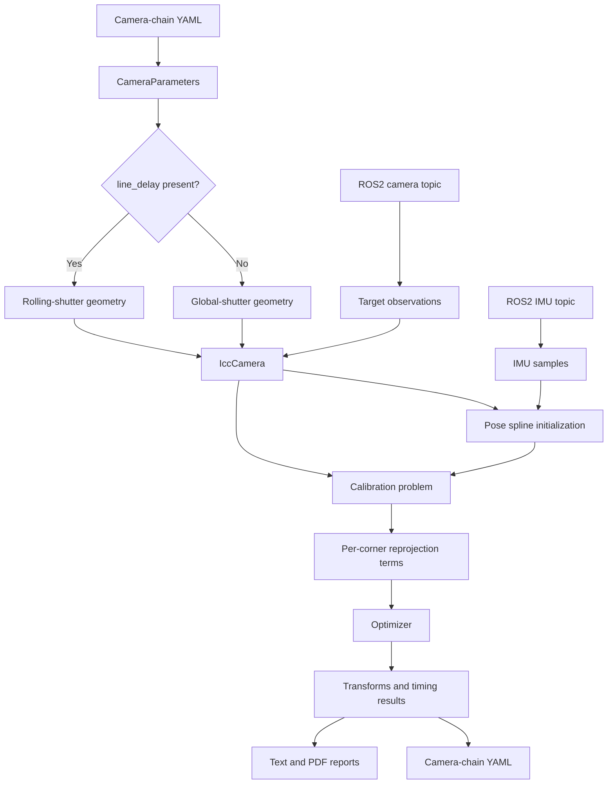

# Architecture

## Calibration model

A global-shutter image uses one exposure time for every corner. A rolling-shutter image uses one exposure time for each image row.

Let $t_f$ denote the corrected frame time. Let $v_k$ denote the row for corner $k$.

Let $v_c$ denote the center row. Let $d_l$ denote the line delay in seconds per row.

The corner time is:

$$
t_k = t_f + (v_k - v_c)d_l
$$

The corrected frame time includes the camera-to-IMU shift:

$$
t_f = t_{image} + \Delta t_{cam\rightarrow imu}
$$

The center-row subtraction keeps the image timestamp as the temporal reference. It also reduces coupling between time shift and line delay.

The body pose spline supplies the body pose at $t_k$. The camera pose follows from the camera-to-body transform:

$$
T_{cw}(t_k) = T_{cb}T_{bw}(t_k)
$$

The reprojection residual is:

$$
r_k = z_k - \pi\left(T_{cw}(t_k)p_k;\theta,\delta\right)
$$

Here, $z_k$ is the detected corner. The vector $\theta$ contains projection parameters.

The vector $\delta$ contains distortion parameters. The point $p_k$ is the known target point.

## Design variables

The calibration problem contains these camera design variables:

| Variable | Size | Default state |
|---|---:|---|
| IMU-to-camera transform for `cam0` | 6 | Active |
| Camera-chain transform | 6 per additional camera | Fixed unless requested |
| Camera-to-IMU time shift | 1 per camera | Active unless disabled |
| Line delay | 1 per rolling-shutter camera | Fixed unless requested |
| Projection parameters | Model specific | Fixed unless requested |
| Distortion parameters | Model specific | Fixed unless requested |

The pose spline and IMU variables keep their current behavior.

## Data flow

## Camera factory boundary

`kalibr_common.ConfigReader.AslamCamera` is the central factory. It must select the shutter type from camera configuration data.

The factory must return one consistent camera bundle. The bundle must expose these members:

- `geometry` for target extraction and projection.
- `frameType` for reprojection frames.
- `keypointType` for target corners.
- `reprojectionErrorType` for the optimizer.
- `dv` for projection, distortion, and shutter design variables.
- `shutterType` for global-shutter and rolling-shutter branches.

The current factory exposes only the first four members. It also creates only global-shutter geometry.

## Observation timing

`IccCamera.addCameraErrorTerms()` must compute time for each corner. It must not reuse one pose for the complete frame.

The method first computes the corrected frame time. It then adds the corner offset from the camera design variable.

The method subtracts the center-row offset. This operation preserves the frame timestamp reference.

The pose spline must include every possible corner time. The configured padding must cover both time-shift and shutter changes.

## Error selection

A global-shutter camera uses the current simple reprojection error. A rolling-shutter camera uses the shutter-aware error signature.

The camera-only `RsCalibrator` uses an adaptive covariance error. The exemplar camera-IMU path uses the model-specific rolling-shutter reprojection error.

Use one error policy across calibration and diagnostics. Otherwise, the optimizer and report can show different predictions.

## Initialization

A rolling-shutter optimizer needs a nonzero line-delay estimate. A zero value can weaken the first optimizer step.

If calibration requests line-delay estimation, initialize the value from image rate and image height:

$$
d_l^{0} = \frac{1}{f_{camera}N_{rows}}
$$

This estimate assumes that one frame period covers one sensor readout. It is only an initial estimate.

Prefer the YAML value when the file contains a calibrated line delay. Do not replace a valid value without an explicit request.

## Configuration units

Store `line_delay` in seconds per row. This unit matches the shutter model and `RsCalibrator.py`.

Convert to nanoseconds only at an exporter boundary that requires nanoseconds. The maplab exporter already names that unit explicitly.

The exemplar writes nanoseconds through `setLineDelay()`. That behavior conflicts with the camera-only calibrator and requires correction.

## Observability

Line delay and camera-to-IMU time shift can correlate. Intrinsics can also correlate with motion and target distance.

Use motion with rotation about multiple axes. Cover the full image height with detected corners.

Use sharp images and accurate timestamps. A narrow row range does not constrain line delay.

## Global-shutter compatibility

If `line_delay` is absent, construct the existing global-shutter geometry. Ignore `--estimate-line-delay` with a clear error.

If `line_delay` equals zero, reject the rolling-shutter configuration. Zero does not identify a useful rolling-shutter model.

If the camera model lacks a rolling-shutter binding, reject the configuration before target extraction.
