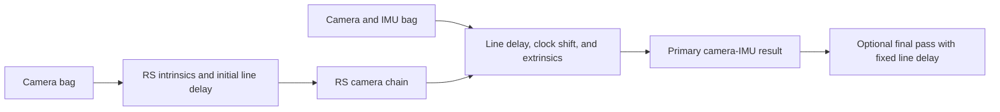

# Rolling-Shutter Camera and IMU Calibration

# Rolling-Shutter Camera and IMU Calibration

This guide describes the staged calibration flow for one rolling-shutter camera and one IMU.

The workflow estimates two different timing values:

- `line_delay`: Time between adjacent image rows, in seconds per row.
- `timeshift_cam_imu`: Time offset between the camera and IMU clocks, in seconds.

The camera-to-IMU convention is:

$$
t_{imu} = t_{cam} + \text{timeshift\_cam\_imu}
$$

The total sensor readout time is:

$$
t_{readout} = \text{line\_delay} \times \text{image height}
$$

## ROS 2 command choice

The earlier installation and ROS 1 bag blockers are resolved.

The package now installs:

- `kalibr_calibrate_rs_cameras`
- `kalibr_calibrate_imu_camera`
- `kalibr_rs_camera_calibration`

This guide uses `ros2 run` because it starts the installed calibration executables.

`ros2 launch` starts a launch description that wraps one or more executables. It does not replace an executable.

The package does not contain `calibrate_rs_cameras.launch.py`. The existing camera-IMU launch does not expose these required options:

- `--estimate-line-delay`
- `--timeoffset-padding`
- `--max-iter`

Therefore, the current launch files cannot run this complete workflow. Use the verified `ros2 run` commands below.

The current host requires these environment fixes before the commands run:

- NumPy 2.4.2 from `/usr/local` overrides system NumPy 1.26.4. Prepend the system path.
- `igraph` is not installed. Install it with pip.
- The `libkalibr_errorterms_python.so` binding installs under the package `lib/` directory instead of the Python site-packages tree. Add that directory to the Python path.

The preparation steps below resolve all three issues.

One implementation limitation remains. A final pass cannot fix `timeshift_cam_imu` at the Stage 2 value.

## Supported calibration flow

The implementation does not provide three fully isolated optimizations.

1. Stage 1 estimates intrinsics, distortion, line delay, and the camera trajectory.
2. Stage 2 estimates both timing values and camera-to-IMU extrinsics together.
3. Stage 3 can fix line delay, but it must re-estimate the camera-to-IMU time shift.

Use the Stage 2 result as the primary calibration result. Use Stage 3 only as an optional final pass.



## 1. Prepare the workspace

1. Open the repository root.

   ```bash
   cd /home/arunabh/kalibr_ros2
   ```

2. Install the dependencies declared by the packages.

   ```bash
   rosdep install --from-paths src --ignore-src -r -y
   ```

3. Install `igraph` for multi-camera graph support.

   ```bash
   pip install --break-system-packages igraph
   ```

4. Build the workspace.

   ```bash
   ./build_workspace.sh
   ```

5. Source the workspace.

   ```bash
   source install/setup.bash
   ```

6. Set the Python path to prefer system packages and expose the error-term binding.

   ```bash
   export PYTHONPATH="/usr/lib/python3/dist-packages:$PWD/install/kalibr_imu_camera/lib:${PYTHONPATH}"
   ```

7. Verify the Python runtime dependencies.

   ```bash
   python3 -c "import numpy, cv2, cv_bridge, igraph; print(numpy.__version__, cv2.__version__)"
   ```

   NumPy must report the system 1.26.4 version.

8. Verify the installed commands.

   ```bash
   ros2 pkg executables kalibr_imu_camera
   ```

   The output must include:

   ```text
   kalibr_imu_camera kalibr_calibrate_cameras
   kalibr_imu_camera kalibr_calibrate_imu_camera
   kalibr_imu_camera kalibr_calibrate_rs_cameras
   ```

9. Verify the rolling-shutter command.

   ```bash
   ros2 run kalibr_imu_camera kalibr_calibrate_rs_cameras --help
   ```

10. Verify the camera-IMU command.

    ```bash
    ros2 run kalibr_imu_camera kalibr_calibrate_imu_camera --help
    ```

If a verification command reports an error, do not continue.

## 2. Prepare the configuration files

Use these repository examples as templates:

- `src/kalibr_imu_camera/config/target_april_example.yaml`
- `src/kalibr_imu_camera/config/imu_example.yaml`
- `src/kalibr_imu_camera/config/camchain_example.yaml`

Create a work directory outside the source tree.

```bash
mkdir -p calibration/config calibration/data
cp src/kalibr_imu_camera/config/target_april_example.yaml calibration/config/target.yaml
cp src/kalibr_imu_camera/config/imu_example.yaml calibration/config/imu.yaml
```

### Target configuration

Measure the printed target. Then enter the measured values in `calibration/config/target.yaml`.

```yaml
target_type: aprilgrid
tagCols: 6
tagRows: 6
tagSize: 0.088
tagSpacing: 0.3
```

`tagSize` uses meters. `tagSpacing` is the gap divided by the tag size.

### IMU configuration

Enter measured or characterized IMU noise values in `calibration/config/imu.yaml`.

```yaml
accelerometer_noise_density: 0.006
accelerometer_random_walk: 0.0002
gyroscope_noise_density: 0.0004
gyroscope_random_walk: 4.0e-06
update_rate: 200.0
rostopic: /imu0
```

Set `rostopic` to the topic in the calibration bag. Set `update_rate` to the actual IMU rate.

## 3. Stage 1: calibrate rolling-shutter intrinsics

This stage estimates projection intrinsics, distortion, line delay, and a continuous camera trajectory.

Supported rolling-shutter models are:

- `pinhole-radtan-rs`
- `pinhole-equi-rs`
- `omni-radtan-rs`

### Record the camera bag

1. Start the camera driver.

2. Record the raw image topic.

   ```bash
   ros2 bag record /cam0/image_raw -o calibration/data/rs_intrinsics
   ```

3. Move the target across the full image area.

4. Tilt the target about multiple axes.

5. Include smooth camera or target motion for rolling-shutter observability.

6. Avoid motion blur and target detection loss.

7. After the target covers the image edges and corners, stop the recorder.

### Run the intrinsic calibration

Replace `20` with the approximate camera frame rate.

```bash
ros2 run kalibr_imu_camera kalibr_calibrate_rs_cameras \
  --model pinhole-radtan-rs \
  --frame-rate 20 \
  --bag calibration/data/rs_intrinsics \
  --topic /cam0/image_raw \
  --target calibration/config/target.yaml \
  --inverse-feature-variance 1.0 \
  --max-iter 30
```

If you must inspect target detections, add `--show-extraction`.

The command writes:

```text
calibration/data/rs_intrinsics-camchain.yaml
```

Verify that `cam0` contains these fields:

```yaml
cam0:
  camera_model: pinhole
  intrinsics: [fx, fy, cx, cy]
  distortion_model: radtan
  distortion_coeffs: [k1, k2, p1, p2]
  resolution: [width, height]
  rostopic: /cam0/image_raw
  line_delay: 0.00001
```

Verify that `line_delay` is a positive float. The field identifies the camera as a rolling-shutter camera.

## 4. Stage 2: refine timing against the IMU

This stage jointly estimates these values:

- Rolling-shutter `line_delay`.
- Camera-to-IMU `timeshift_cam_imu`.
- Camera-to-IMU `T_cam_imu`.
- The body trajectory, gravity direction, and IMU bias splines.

Camera intrinsics and distortion remain fixed at their Stage 1 values.

### Record the camera and IMU bag

1. Start the camera and IMU drivers.

2. Record both raw topics in one bag.

   ```bash
   ros2 bag record /cam0/image_raw /imu0 -o calibration/data/rs_timing
   ```

3. Move the rigid camera-IMU assembly about all three rotation axes.

4. Add translations along multiple directions.

5. Keep the target visible during most of the sequence.

6. Avoid impacts, vibration, motion blur, and dropped data.

7. After the sequence contains varied motion, stop the recorder.

### Run the timing calibration

Do not add `--no-time-calibration`. Temporal calibration is active by default.

```bash
ros2 run kalibr_imu_camera kalibr_calibrate_imu_camera \
  --bag calibration/data/rs_timing \
  --cams calibration/data/rs_intrinsics-camchain.yaml \
  --imu calibration/config/imu.yaml \
  --target calibration/config/target.yaml \
  --estimate-line-delay \
  --timeoffset-padding 0.03 \
  --max-iter 30 \
  --dont-show-report
```

If the expected clock offset exceeds 30 milliseconds, increase `--timeoffset-padding`.

The command writes:

```text
calibration/data/rs_timing-camchain-imucam.yaml
calibration/data/rs_timing-imu.yaml
calibration/data/rs_timing-results-imucam.txt
calibration/data/rs_timing-report-imucam.pdf
```

Verify these fields in `rs_timing-camchain-imucam.yaml`:

- `line_delay`
- `timeshift_cam_imu`
- `T_cam_imu`

Use this YAML file as the primary calibration result.

## 5. Stage 3: run an optional final extrinsic pass

This stage fixes the Stage 2 line delay. It re-estimates the camera-to-IMU clock shift and extrinsics.

The source does not load `timeshift_cam_imu` as a fixed prior. Therefore, a fully fixed-timing extrinsic pass is unavailable.

Do not use `--no-time-calibration` for this pass. That option fixes the active clock correction at zero.

Record a second dataset with a different bag name. A different name prevents output file replacement.

```bash
ros2 bag record /cam0/image_raw /imu0 -o calibration/data/rs_extrinsics
```

Use the same varied six-axis motion from Stage 2.

Run the final pass without `--estimate-line-delay`.

```bash
ros2 run kalibr_imu_camera kalibr_calibrate_imu_camera \
  --bag calibration/data/rs_extrinsics \
  --cams calibration/data/rs_timing-camchain-imucam.yaml \
  --imu calibration/config/imu.yaml \
  --target calibration/config/target.yaml \
  --timeoffset-padding 0.03 \
  --max-iter 30 \
  --dont-show-report
```

The command writes:

```text
calibration/data/rs_extrinsics-camchain-imucam.yaml
calibration/data/rs_extrinsics-imu.yaml
calibration/data/rs_extrinsics-results-imucam.txt
calibration/data/rs_extrinsics-report-imucam.pdf
```

After the result passes the checks below, use `rs_extrinsics-camchain-imucam.yaml`.

## 6. Verify the result

1. Verify that the optimizer finishes without a numerical failure.

2. Verify that most target observations produce valid corner detections.

3. Compare the reprojection error before and after optimization.

4. Verify that `line_delay` remains positive and physically plausible.

5. Calculate the total readout time from the image height.

6. Compare `timeshift_cam_imu` across independent datasets.

7. Compare `T_cam_imu` across independent datasets.

8. If repeated datasets produce large parameter changes, reject the result.

9. Keep the Stage 1, Stage 2, and Stage 3 YAML files with their source bags.

## Output field meanings

| Field | Meaning | Unit |
|---|---|---|
| `intrinsics` | Camera projection parameters | pixels, plus model-specific values |
| `distortion_coeffs` | Lens distortion parameters | model-specific |
| `line_delay` | Delay between adjacent image rows | seconds per row |
| `timeshift_cam_imu` | Camera timestamp to IMU timestamp offset | seconds |
| `T_cam_imu` | Transform from the IMU frame to the camera frame | homogeneous transform |

## Source references

- `src/kalibr_imu_camera/python/kalibr_calibrate_rs_cameras`
- `src/kalibr_imu_camera/python/kalibr_rs_camera_calibration/RsCalibrator.py`
- `src/kalibr_imu_camera/python/kalibr_calibrate_imu_camera`
- `src/kalibr_imu_camera/python/kalibr_imu_camera_calibration/IccSensors.py`
- `src/kalibr_imu_camera/python/kalibr_imu_camera_calibration/IccCalibrator.py`
- `src/kalibr_imu_camera/python/kalibr_common/ConfigReader.py`
- `src/kalibr_imu_camera/CMakeLists.txt`
